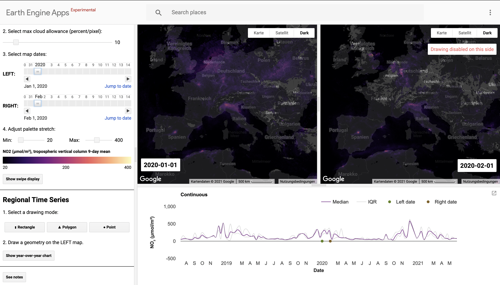

# Welcome to awesome-earth-engine-apps

An awesome list of all (1.943) available [Google Earth Engine Apps](https://developers.google.com/earth-engine/guides/apps) and user-specific App Galleries.  No Earth Engine account is required to view or interact with a published App.

  
&nbsp; &nbsp; &nbsp; &nbsp;
  

## Overview

The list is structured as follows:

* John Doe App Gallery
  + Individual Awesome App

## A
* [aaraney](https://aaraney.users.earthengine.app)
  + [ecoregion-histogrammer](https://aaraney.users.earthengine.app/view/ecoregion-histogrammer)
* [aasareansah](https://aasareansah.users.earthengine.app)
  + [Zoom Box_Kumasi](https://aasareansah.users.earthengine.app/view/zoom-boxkumasi)
* [abkdom](https://abkdom.users.earthengine.app)
  + [ABK_APP](https://abkdom.users.earthengine.app/view/abkapp)
* [abocin](https://abocin.users.earthengine.app)
  + [AccessibilityToHospitals](https://abocin.users.earthengine.app/view/accessibilitytohospitals) &#8226; [Air Quality](https://abocin.users.earthengine.app/view/air-quality) &#8226; [Damage Assessment Floods UN](https://abocin.users.earthengine.app/view/damage-assessment-floods-un) &#8226; [EcoVrede Analysis](https://abocin.users.earthengine.app/view/ecovrede-analysis) &#8226; [EcoVrede ToolKit](https://abocin.users.earthengine.app/view/ecovrede-toolkit) &#8226; [ForestHealth](https://abocin.users.earthengine.app/view/foresthealth) &#8226; [Water Quality](https://abocin.users.earthengine.app/view/water-quality)
* [addielloyd](https://addielloyd.users.earthengine.app)
  + [Visualizing Changes in Global NDSI Snow Cover](https://addielloyd.users.earthengine.app/view/visualizing-changes-in-global-ndsi-snow-cover)
* [adiarray](https://adiarray.users.earthengine.app)
  + [lay1](https://adiarray.users.earthengine.app/view/lay1) &#8226; [tes1](https://adiarray.users.earthengine.app/view/tes1)
* [adiivascu14](https://adiivascu14.users.earthengine.app)
  + [MyTestApp](https://adiivascu14.users.earthengine.app/view/mytestapp)
* [adrrod44](https://adrrod44.users.earthengine.app)
  + [Deteccion_de_Cambios](https://adrrod44.users.earthengine.app/view/detecciondecambios) &#8226; [Land Superfice Temperature Yasuni Ecuador](https://adrrod44.users.earthengine.app/view/land-superfice-temperature-yasuni-ecuador) &#8226; [Mapa de cambios](https://adrrod44.users.earthengine.app/view/mapa-de-cambios) &#8226; [Parametros SAR](https://adrrod44.users.earthengine.app/view/parametros-sar)
* [ael2014](https://ael2014.users.earthengine.app)
  + [Sentinel 2 Multispectral](https://ael2014.users.earthengine.app/view/sentinel-2-multispectral)
* [ag](https://ag.users.earthengine.app)
  + [glaciertimelapse](https://ag.users.earthengine.app/view/glaciertimelapse)
* [agilfahrezi](https://agilfahrezi.users.earthengine.app)
  + [Peta Index Turunan Data Landsat 8](https://agilfahrezi.users.earthengine.app/view/peta-index-turunan-data-landsat-8)
* [ahokelsey](https://ahokelsey.users.earthengine.app)
  + [AKClimatePlans](https://ahokelsey.users.earthengine.app/view/akclimateplans) &#8226; [WesternBalkansIWI](https://ahokelsey.users.earthengine.app/view/westernbalkansiwi)
* [ahudson2](https://ahudson2.users.earthengine.app)
  + [GLAD surface water dynamics 1999-2020](https://ahudson2.users.earthengine.app/view/glad-surface-water-dynamics-1999-2018)
* [akarbasi](https://akarbasi.users.earthengine.app)
  + [Zoom Box](https://akarbasi.users.earthengine.app/view/zoom-box)
* [akbarnugroho](https://akbarnugroho.users.earthengine.app)
  + [Split panel CO](https://akbarnugroho.users.earthengine.app/view/split-panel-co) &#8226; [Split panel NO2](https://akbarnugroho.users.earthengine.app/view/split-panel-no2) &#8226; [Time series inspector CO](https://akbarnugroho.users.earthengine.app/view/time-series-inspector-co) &#8226; [Time series inspector NO2](https://akbarnugroho.users.earthengine.app/view/time-series-inspector-no2)
* [alberta-sentinel-analysis-v20](https://alberta-sentinel-analysis-v20.users.earthengine.app)
  + [OpenWaterApp2017](https://Alberta_Sentinel_analysis_v20.users.earthengine.app/view/openwaterapp2017) &#8226; [OpenWater_PGNR](https://Alberta_Sentinel_analysis_v20.users.earthengine.app/view/openwaterpgnr) &#8226; [PGNR Wetland](https://Alberta_Sentinel_analysis_v20.users.earthengine.app/view/pgnr-wetland) &#8226; [Wetland_App_Alberta](https://Alberta_Sentinel_analysis_v20.users.earthengine.app/view/wetlandappalberta) &#8226; [WetlandAppPilot](https://Alberta_Sentinel_analysis_v20.users.earthengine.app/view/wetlandapppilot) &#8226; [Wetland_update](https://Alberta_Sentinel_analysis_v20.users.earthengine.app/view/wetlandupdate)
* [alejandromarambio](https://alejandromarambio.users.earthengine.app)
  + [areas verdes 2016 vs 2018](https://alejandromarambio.users.earthengine.app/view/areas-verdes-2016-vs-2018) &#8226; [areas verdes 2019](https://alejandromarambio.users.earthengine.app/view/areas-verdes-2019) &#8226; [deforestacion 2000 2018](https://alejandromarambio.users.earthengine.app/view/deforestacion-2000-2018) &#8226; [Land Art](https://alejandromarambio.users.earthengine.app/view/land-art) &#8226; [Land Monitoring](https://alejandromarambio.users.earthengine.app/view/land-monitoring) &#8226; [poet oaxaca](https://alejandromarambio.users.earthengine.app/view/poet-oaxaca) &#8226; [satelite 2000 2019](https://alejandromarambio.users.earthengine.app/view/satelite-2000-2019) &#8226; [VH_CambiosSuelo](https://alejandromarambio.users.earthengine.app/view/vhcambiossuelo) &#8226; [VH_DinamicaAgua](https://alejandromarambio.users.earthengine.app/view/villahermosa)
* [alemlakes](https://alemlakes.users.earthengine.app)
  + [glad-mcgill](https://alemlakes.users.earthengine.app/view/glad-mcgill) &#8226; [UI app](https://alemlakes.users.earthengine.app/view/ui-app)
* [alexanderquevedo](https://alexanderquevedo.users.earthengine.app)
  + [incendios_Jalisco](https://alexanderquevedo.users.earthengine.app/view/incendiosjalisco)
* [alexchunet](https://alexchunet.users.earthengine.app)
  + [bukavu_mnt](https://alexchunet.users.earthengine.app/view/bukavumnt) &#8226; [dakar_2012](https://alexchunet.users.earthengine.app/view/dakar2012) &#8226; [dakar_2020](https://alexchunet.users.earthengine.app/view/dakar2020) &#8226; [forest_change_2020](https://alexchunet.users.earthengine.app/view/forestchange2020) &#8226; [kampala_slope](https://alexchunet.users.earthengine.app/view/kampalaslope) &#8226; [lac-taabo](https://alexchunet.users.earthengine.app/view/lac-taabo) &#8226; [multispectral_senegal](https://alexchunet.users.earthengine.app/view/multispectralsenegal) &#8226; [serbia_ac](https://alexchunet.users.earthengine.app/view/serbiaac)
* [alkindigifty](https://alkindigifty.users.earthengine.app)
  + [Genangan Banjir menggunakan NDWI](https://alkindigifty.users.earthengine.app/view/genangan-banjir-menggunakan-ndwi)
* [amalia22cristina](https://amalia22cristina.users.earthengine.app)
  + [Application-Final](https://amalia22cristina.users.earthengine.app/view/application-final) &#8226; [Application_Final](https://amalia22cristina.users.earthengine.app/view/applicationfinal) &#8226; [Application_v1](https://amalia22cristina.users.earthengine.app/view/applicationv1) &#8226; [Application_v2](https://amalia22cristina.users.earthengine.app/view/applicationv2) &#8226; [Application_v3](https://amalia22cristina.users.earthengine.app/view/applicationv3) &#8226; [Application](https://amalia22cristina.users.earthengine.app/view/applicationv4)
* [amerylst](https://amerylst.users.earthengine.app)
  + [REMAL8compare](https://AmeryLST.users.earthengine.app/view/remal8compare)
* [amreshcherry](https://amreshcherry.users.earthengine.app)
  + [Jalgaon-Raver2021](https://amreshcherry.users.earthengine.app/view/jalgaon-raver2021)
* [andersonmuchawona](https://andersonmuchawona.users.earthengine.app)
  + [Zimbabwe 1992 Land Cover Map](https://andersonmuchawona.users.earthengine.app/view/zimbabwe-1992-land-cover-map) &#8226; [Zimbabwe 2017 land Cover map](https://andersonmuchawona.users.earthengine.app/view/zimbabwe-2017-land-cover-map)
* [andreatassi23](https://andreatassi23.users.earthengine.app)
  + [Fire_on_RiservaDelloZingaro](https://andreatassi23.users.earthengine.app/view/fireonriservadellozingaro) &#8226; [NDVI_TimeSeries](https://andreatassi23.users.earthengine.app/view/ndvitimeseries)
* [andreim](https://andreim.users.earthengine.app/)
  + [bfastmonitor](https://andreim.users.earthengine.app/view/bfastmonitor)
* [andreydara](https://andreydara.users.earthengine.app)
  + [GrazingPressure2007](https://andreydara.users.earthengine.app/view/grazingpressure2007) &#8226; [GrazingPressure3](https://andreydara.users.earthengine.app/view/grazingpressure3)
* [anighosh](https://anighosh.users.earthengine.app)
  + [biogeo time series modis](https://anighosh.users.earthengine.app/view/biogeo-time-series-modis)
* [anisomadas](https://anisomadas.users.earthengine.app)
  + [test_app](https://anisomadas.users.earthengine.app/view/testapp) &#8226; [Test_MSAVI](https://anisomadas.users.earthengine.app/view/testmsavi)
* [annaban5](https://annaban5.users.earthengine.app)
  + [PopulationDensity](https://annaban5.users.earthengine.app/view/populationdensity)
* [annalisertaylor](https://annalisertaylor.users.earthengine.app)
  + [G4G Test App](https://annalisertaylor.users.earthengine.app/view/g4g-test-app)
* [anthonypjkent](https://anthonypjkent.users.earthengine.app)
  + [Wash Bay Map](https://anthonypjkent.users.earthengine.app/view/wash-bay-map)
* [antonbiatov](https://antonbiatov.users.earthengine.app)
  + [Rodogosha_burned_2020](https://antonbiatov.users.earthengine.app/view/rodogoshaburned2020)
* [app-data-i](https://app-data-i.users.earthengine.app)
  + [Data_Clima_BZ](https://APP_DATA_I.users.earthengine.app/view/dataclimabz) &#8226; [Data_Clima_CH](https://APP_DATA_I.users.earthengine.app/view/dataclimach) &#8226; [Data_Clima_CR](https://APP_DATA_I.users.earthengine.app/view/dataclimacr) &#8226; [Data_Clima_ES](https://APP_DATA_I.users.earthengine.app/view/dataclimaes) &#8226; [Data_Clima_GT](https://APP_DATA_I.users.earthengine.app/view/dataclimagt) &#8226; [Data_Clima_HN](https://APP_DATA_I.users.earthengine.app/view/dataclimahn) &#8226; [Data_Clima_NC](https://APP_DATA_I.users.earthengine.app/view/dataclimanc) &#8226; [Data_Clima_PN](https://APP_DATA_I.users.earthengine.app/view/dataclimapn) &#8226; [Data_Clima_Proyecto_Beneficios_Ecosistemico](https://APP_DATA_I.users.earthengine.app/view/dataclimaproyectobeneficiosecosistemico) &#8226; [Data_Clima_RD](https://APP_DATA_I.users.earthengine.app/view/dataclimard) &#8226; [Data_Fuego_BZ](https://APP_DATA_I.users.earthengine.app/view/datafuegobz) &#8226; [Data_Fuego_CH](https://APP_DATA_I.users.earthengine.app/view/datafuegoch) &#8226; [Data_Fuego_CR](https://APP_DATA_I.users.earthengine.app/view/datafuegocr) &#8226; [Data_Fuego_ES](https://APP_DATA_I.users.earthengine.app/view/datafuegoes) &#8226; [Data_Fuego_HN](https://APP_DATA_I.users.earthengine.app/view/datafuegohn) &#8226; [Data_Fuego_NC](https://APP_DATA_I.users.earthengine.app/view/datafuegonc) &#8226; [Data_Fuego_PN](https://APP_DATA_I.users.earthengine.app/view/datafuegopn) &#8226; [Data_Fuego_RD](https://APP_DATA_I.users.earthengine.app/view/datafuegord)
* [arcgistim](https://arcgistim.users.earthengine.app)
  + [KRCS Baringo 11th August Flood Monitoring Tool](https://arcgistim.users.earthengine.app/view/krcs-baringo-11th-august-flood-monitoring-tool) &#8226; [Sentinel2](https://arcgistim.users.earthengine.app/view/sentinel2)
* [ariverab](https://ariverab.users.earthengine.app)
  + [fip_forestcover_classification](https://ariverab.users.earthengine.app/view/fipforestcoverclassification)
* [arjenhaag](https://arjenhaag.users.earthengine.app)
  + [Borders and Rivers](https://arjenhaag.users.earthengine.app/view/borders-and-rivers) &#8226; [Cambodia Floods October 2020](https://arjenhaag.users.earthengine.app/view/cambodia-floods-october-2020) &#8226; [Cambodia Floods October 2020 - animations](https://arjenhaag.users.earthengine.app/view/cambodia-floods-october-2020---animations) &#8226; [ESA WW SWD RR](https://arjenhaag.users.earthengine.app/view/esa-ww-swd-rr) &#8226; [Landsat Surface Water](https://arjenhaag.users.earthengine.app/view/landsat-surface-water) &#8226; [Nederland in de sneeuw](https://arjenhaag.users.earthengine.app/view/nederland-in-de-sneeuw) &#8226; [ParTerra](https://arjenhaag.users.earthengine.app/view/parterra)
* [arlestaboada](https://arlestaboada.users.earthengine.app)
  + [animacionanp](https://arlestaboada.users.earthengine.app/view/animacionanp) &#8226; [Cerro_milloc](https://arlestaboada.users.earthengine.app/view/cerromilloc) &#8226; [chirps](https://arlestaboada.users.earthengine.app/view/chirps) &#8226; [deforestacion](https://arlestaboada.users.earthengine.app/view/deforestacion) &#8226; [Ecosistema del Lago Chinchaycocha ](https://arlestaboada.users.earthengine.app/view/ecosistema-del-lago-chinchaycocha) &#8226; [exportprueba](https://arlestaboada.users.earthengine.app/view/exportprueba) &#8226; [ImagenesDeDron](https://arlestaboada.users.earthengine.app/view/imagenesdedron) &#8226; [La pampa-Tambopata](https://arlestaboada.users.earthengine.app/view/la-pampa-update) &#8226; [lansatexport](https://arlestaboada.users.earthengine.app/view/lansatexport) &#8226; [Llalimayo ](https://arlestaboada.users.earthengine.app/view/llalimayo) &#8226; [Mataracocha](https://arlestaboada.users.earthengine.app/view/mataracocha) &#8226; [pastizales](https://arlestaboada.users.earthengine.app/view/pastizales) &#8226; [Precipitacion](https://arlestaboada.users.earthengine.app/view/precipitacion-enero) &#8226; [Lago Chinchaycocha](https://arlestaboada.users.earthengine.app/view/prueba) &#8226; [Rumialba](https://arlestaboada.users.earthengine.app/view/rumialba) &#8226; [Rumialba-ndvi](https://arlestaboada.users.earthengine.app/view/rumialba-ndvi) &#8226; [RUSLE](https://arlestaboada.users.earthengine.app/view/rusle) &#8226; [Curicocha-llamacocha](https://arlestaboada.users.earthengine.app/view/shape) &#8226; [tambopatapampa](https://arlestaboada.users.earthengine.app/view/tambopatapampa)
* [arpitashalini4](https://arpitashalini4.users.earthengine.app)
  + [Tracking India Vaccine Doses](https://arpitashalini4.users.earthengine.app/view/tracking-india-vaccine-doses)
* [arunmuralicm](https://arunmuralicm.users.earthengine.app)
  + [Data visualisation](https://arunmuralicm.users.earthengine.app/view/data-visualisation) &#8226; [Dataexplorer](https://arunmuralicm.users.earthengine.app/view/dataexplorer) &#8226; [forgovdataportal](https://arunmuralicm.users.earthengine.app/view/forgovdataportal) &#8226; [forgovsample](https://arunmuralicm.users.earthengine.app/view/forgovsample) &#8226; [ICRAF_sample](https://arunmuralicm.users.earthengine.app/view/icrafsample) &#8226; [Precipitation](https://arunmuralicm.users.earthengine.app/view/precipitation)
* [aryo](https://aryo.users.earthengine.app)
  + [COVID-19 Bogor City](https://aryo.users.earthengine.app/view/covid-19-bogor-city)
* [ashishgeo10](https://ashishgeo10.users.earthengine.app)
  + [NDVI_MADAGASCAR](https://ashishgeo10.users.earthengine.app/view/ndvimadagascar)
* [asivitskissce](https://asivitskissce.users.earthengine.app)
  + [tashicholing_S2_classification(GT)](https://asivitskissce.users.earthengine.app/view/tashicholings2classificationgt)
* [astokes2](https://astokes2.users.earthengine.app)
  + [Interactive Samburu Drought](https://astokes2.users.earthengine.app/view/interactive-samburu-drought) &#8226; [NDVI Anomaly Slider](https://astokes2.users.earthengine.app/view/ndvi-anomaly-slider)
* [athiyakautsary](https://athiyakautsary.users.earthengine.app)
  + [banjirthailand](https://athiyakautsary.users.earthengine.app/view/banjirthailand) &#8226; [dNBRSumSel](https://athiyakautsary.users.earthengine.app/view/dnbrsumsel) &#8226; [klorofil a](https://athiyakautsary.users.earthengine.app/view/klorofil-a) &#8226; [LST_Bandung](https://athiyakautsary.users.earthengine.app/view/lstbandung) &#8226; [temperatur-daerah-indonesia](https://athiyakautsary.users.earthengine.app/view/temperatur-daerah-indonesia) &#8226; [temperatur-daerah-wakatobi](https://athiyakautsary.users.earthengine.app/view/temperatur-daerah-wakatobi)
* [aureliopereira1234](https://aureliopereira1234.users.earthengine.app)
  + [add](https://aureliopereira1234.users.earthengine.app/view/add) &#8226; [ndvi](https://aureliopereira1234.users.earthengine.app/view/ndvi)
* [avvaler](https://avvaler.users.earthengine.app)
  + [PermKraiCarbon](https://avvaler.users.earthengine.app/view/permkraicarbon)
* [aziza](https://aziza.users.earthengine.app)
  + [Agricultural_GIS](https://aziza.users.earthengine.app/view/agriculturalgis)
* [azkidna](https://azkidna.users.earthengine.app)
  + [spatial join](https://azkidna.users.earthengine.app/view/spatial-join)
## B
* [baldassarre](https://baldassarre.users.earthengine.app)
  + [srd](https://baldassarre.users.earthengine.app/view/srd) &#8226; [SRD Forest Monitoring](https://baldassarre.users.earthengine.app/view/srd-forest-monitoring)
* [basic-scripts](https://basic-scripts.users.earthengine.app)
  + [linkedMaps](https://Basic_Scripts.users.earthengine.app/view/linkedmaps)
* [bassantsara](https://bassantsara.users.earthengine.app)
  + [test](https://bassantsara.users.earthengine.app/view/test)
* [bastinjf-climate](https://bastinjf-climate.users.earthengine.app)
  + [FSC_ForestFocus_difference](https://bastinjf_climate.users.earthengine.app/view/fscforestfocusdifference) &#8226; [FSC_ForestFocus_restoration_potential](https://bastinjf_climate.users.earthengine.app/view/fscforestfocusrestorationpotential) &#8226; [FSC_ForestFocus_Variance](https://bastinjf_climate.users.earthengine.app/view/fscforestfocusvariance)
* [bedina92](https://bedina92.users.earthengine.app)
  + [Pizol](https://bedina92.users.earthengine.app/view/pizol)
* [benardonyango16](https://benardonyango16.users.earthengine.app)
  + [floodapp](https://benardonyango16.users.earthengine.app/view/floodapp) &#8226; [testing2](https://benardonyango16.users.earthengine.app/view/testing2)
* [benitezrcamilo](https://benitezrcamilo.users.earthengine.app)
  + [Clasificación PNSL](https://benitezrcamilo.users.earthengine.app/view/clasificacin-pnsl) &#8226; [Palmas Area 3](https://benitezrcamilo.users.earthengine.app/view/palmas-area-3) &#8226; [PN San Luis](https://benitezrcamilo.users.earthengine.app/view/pn-san-luis) &#8226; [Urbanization in Asuncion](https://benitezrcamilo.users.earthengine.app/view/urbanization-in-asuncion)
* [besterroz](https://besterroz.users.earthengine.app)
  + [testing](https://BesterRoz.users.earthengine.app/view/testing)
* [bidushi97pandey](https://bidushi97pandey.users.earthengine.app)
  + [LST pune](https://bidushi97pandey.users.earthengine.app/view/lst-pune)
* [bildadchege2](https://bildadchege2.users.earthengine.app)
  + [Kibiku test](https://bildadchege2.users.earthengine.app/view/kibiku-test)
* [biplov](https://biplov.users.earthengine.app)
  + [CEO-CE-GEE](https://biplov.users.earthengine.app/view/ceo-ce-gee) &#8226; [Thresholding&AreaCalculation](https://biplov.users.earthengine.app/view/thresholdingareacalculation)
* [blepsch](https://blepsch.users.earthengine.app)
  + [virginia prism](https://blepsch.users.earthengine.app/view/virginia-prism)
* [blinking02](https://blinking02.users.earthengine.app)
  + [NB Flood Estimate 2](https://blinking02.users.earthengine.app/view/est2) &#8226; [estimate](https://blinking02.users.earthengine.app/view/estimate) &#8226; [good1](https://blinking02.users.earthengine.app/view/good1) &#8226; [NB Flood Estimate 5](https://blinking02.users.earthengine.app/view/nb-flood-estimate-5) &#8226; [NB Flood Estimate and Simulation](https://blinking02.users.earthengine.app/view/nb-flood-estimate-and-simulation) &#8226; [Simu1](https://blinking02.users.earthengine.app/view/simu1) &#8226; [test2](https://blinking02.users.earthengine.app/view/test2) &#8226; [test5](https://blinking02.users.earthengine.app/view/test5)
* [boombhupathi999](https://boombhupathi999.users.earthengine.app)
  + [The Samphar Salt Lake](https://boombhupathi999.users.earthengine.app/view/the-samphar-salt-lake)
* [brdwoodward](https://brdwoodward.users.earthengine.app)
  + [CZU Lightning Complex](https://brdwoodward.users.earthengine.app/view/czu-lightning-complex)
* [brendonraw](https://brendonraw.users.earthengine.app)
  + [NDVIExample](https://brendonraw.users.earthengine.app/view/ndviexample)
* [breno-malheiros](https://breno-malheiros.users.earthengine.app)
  + [NDVI São Carlos](https://breno_malheiros.users.earthengine.app/view/ndvi-so-carlos) &#8226; [Urb Verde Beta](https://breno_malheiros.users.earthengine.app/view/urb-verde-beta)
* [brianneesby](https://brianneesby.users.earthengine.app)
  + [SeeChangeWithZoomBox](https://brianneesby.users.earthengine.app/view/seechangewithzoombox) &#8226; [testapp](https://brianneesby.users.earthengine.app/view/testapp)
* [bruzorek](https://bruzorek.users.earthengine.app)
  + [Araucaria mixed forest](https://bruzorek.users.earthengine.app/view/araucaria-mixed-forest)
* [bryceberrett](https://bryceberrett.users.earthengine.app)
  + [Contour Maker NASADEM SRTM](https://bryceberrett.users.earthengine.app/view/contour-maker-nasadem-srtm) &#8226; [Evacuation Planning App (Tsunamis) 1.0 (Beta)](https://bryceberrett.users.earthengine.app/view/evacuation-planning-app-tsunamis-1) &#8226; [Saint Vincent Volcano Update April 2021 Eruption](https://bryceberrett.users.earthengine.app/view/saint-vincent-volcano-update-april-2021-eruption) &#8226; [Solomon Islands Classification](https://bryceberrett.users.earthengine.app/view/solomon-island-classification)
* [bsweet22](https://bsweet22.users.earthengine.app)
  + [Mapping Water Occurrence in the Big Hole Watershed, MT ](https://bsweet22.users.earthengine.app/view/mapping-water-occurrence-in-the-big-hole-watershed-mt) &#8226; [Sentinel-2 Visualizations for the Big Hole Watershed, MT](https://bsweet22.users.earthengine.app/view/sentinel-2-visualizations-for-the-big-hole-watershed-mt)
* [bullocke](https://bullocke.users.earthengine.app)
  + [amazon](https://bullocke.users.earthengine.app/view/amazon) &#8226; [amazonSamples](https://bullocke.users.earthengine.app/view/amazonsamples) &#8226; [CODED Results Indonesia](https://bullocke.users.earthengine.app/view/coded-indonesia) &#8226; [IPCC Classification](https://bullocke.users.earthengine.app/view/ipcc-classification) &#8226; [Landsat Slider](https://bullocke.users.earthengine.app/view/landsat-slider) &#8226; [landsatExplorer](https://bullocke.users.earthengine.app/view/landsatexplorer)
* [bw-chen1223](https://bw-chen1223.users.earthengine.app)
  + [Bloom Extraction](https://bw_chen1223.users.earthengine.app/view/bloom-extraction)
* [bwilder95](https://bwilder95.users.earthengine.app)
  + [CIMIS sites (Feb 2021)](https://bwilder95.users.earthengine.app/view/cimis-sites-feb-2021) &#8226; [Holy Fire Vegetation Recovery](https://bwilder95.users.earthengine.app/view/holy-fire-vegetation-recovery) &#8226; [The 800-mm isohyet: Health and hope (for U.S.)](https://bwilder95.users.earthengine.app/view/the-800-mm-isohyet-health-and-hope-for-us) &#8226; [UI-Best-Practice-Test-App](https://bwilder95.users.earthengine.app/view/ui-best-practice-test-app)
* [bzgeo](https://bzgeo.users.earthengine.app)
  + [bz-cbc-defor-1984-2019-1](https://bzgeo.users.earthengine.app/view/bz-cbc-defor-1984-2019-1) &#8226; [bz-cbc-forest-cover-pt1](https://bzgeo.users.earthengine.app/view/bz-cbc-forest-cover-pt1) &#8226; [bz-cbc-forest-cover-pt2](https://bzgeo.users.earthengine.app/view/bz-cbc-forest-cover-pt2) &#8226; [bz-chiquibul-fires-2020-1](https://bzgeo.users.earthengine.app/view/bz-chiquibul-fires-2020-1) &#8226; [bz-chiquibul-fires-2020-2](https://bzgeo.users.earthengine.app/view/bz-chiquibul-fires-2020-2) &#8226; [bz-forest-cover-modis-pt1](https://bzgeo.users.earthengine.app/view/bz-forest-cover-modis-pt1) &#8226; [bz-forest-cover-modis-pt2](https://bzgeo.users.earthengine.app/view/bz-forest-cover-modis-pt2) &#8226; [bz-forest-cover-modis-pt3](https://bzgeo.users.earthengine.app/view/bz-forest-cover-modis-pt3) &#8226; [bz-landsat-s2](https://bzgeo.users.earthengine.app/view/bz-landsat-s2) &#8226; [bz-modis-viewer-2000-2019](https://bzgeo.users.earthengine.app/view/bz-modis-viewer-2000-2019) &#8226; [bz-phenology-modis-2018-2019](https://bzgeo.users.earthengine.app/view/bz-phenology-modis-2018-2019) &#8226; [bz-s1-multitemp](https://bzgeo.users.earthengine.app/view/bz-s1-multitemp) &#8226; [bz-s1-multitemp-asc](https://bzgeo.users.earthengine.app/view/bz-s1-multitemp-asc) &#8226; [bz-s2-20190420](https://bzgeo.users.earthengine.app/view/bz-s2-20190420) &#8226; [bz-s2-20190420-v2](https://bzgeo.users.earthengine.app/view/bz-s2-20190420-v2) &#8226; [bz-s2-20190420-v3](https://bzgeo.users.earthengine.app/view/bz-s2-20190420-v3) &#8226; [bzr-forest-cover-pt1](https://bzgeo.users.earthengine.app/view/bzr-forest-cover-pt1) &#8226; [bzr-forest-cover-pt2](https://bzgeo.users.earthengine.app/view/bzr-forest-cover-pt2) &#8226; [bzr-forest-cover-pt3](https://bzgeo.users.earthengine.app/view/bzr-forest-cover-pt3) &#8226; [cam-imagenes-modis-2000-2019-v0](https://bzgeo.users.earthengine.app/view/cam-imagenes-modis-2000-2019-v0) &#8226; [cam-imagenes-modis-2000-2019-v1](https://bzgeo.users.earthengine.app/view/cam-imagenes-modis-2000-2019-v1) &#8226; [cam-mbc-imagenes-modis-2000-2019-v0](https://bzgeo.users.earthengine.app/view/cam-mbc-imagenes-modis-2000-2019-v0) &#8226; [cam-mbc-imagenes-modis-2000-2019-v1](https://bzgeo.users.earthengine.app/view/cam-mbc-imagenes-modis-2000-2019-v1) &#8226; [date-mcd43a4](https://bzgeo.users.earthengine.app/view/date-mcd43a4) &#8226; [gt-atitlan-viewer-s2](https://bzgeo.users.earthengine.app/view/gt-atitlan-viewer-s2) &#8226; [gt-atitlan-viewer-s2-1](https://bzgeo.users.earthengine.app/view/gt-atitlan-viewer-s2-1) &#8226; [gt-peten-s1-multitemp](https://bzgeo.users.earthengine.app/view/gt-peten-s1-multitemp)
## C
* [cagutierrezra](https://cagutierrezra.users.earthengine.app)
  + [Hidroituango](https://cagutierrezra.users.earthengine.app/view/hidroituango)
* [canal](https://canal.users.earthengine.app)
  + [arlestaboada animacion](https://canal.users.earthengine.app/view/arlestaboada-animacion) &#8226; [cambio](https://canal.users.earthengine.app/view/cambio) &#8226; [deforestacion](https://canal.users.earthengine.app/view/deforestacion) &#8226; [lch](https://canal.users.earthengine.app/view/lch) &#8226; [lch-final](https://canal.users.earthengine.app/view/lch-final) &#8226; [lch_bandas](https://canal.users.earthengine.app/view/lchbandas) &#8226; [lch_sentinel](https://canal.users.earthengine.app/view/lchsentinel) &#8226; [territorio](https://canal.users.earthengine.app/view/territorio) &#8226; [tragadero y paca](https://canal.users.earthengine.app/view/tragadero-y-paca)
* [caralyngorman](https://caralyngorman.users.earthengine.app)
  + [Camp Fire Sliding Map 3-9-19](https://caralyngorman.users.earthengine.app/view/camp-fire-sliding-map-3-9-19) &#8226; [Slider original version](https://caralyngorman.users.earthengine.app/view/slider-original-version)
* [carloshumbertoovsa](https://carloshumbertoovsa.users.earthengine.app)
  + [PrimerAppGEE](https://carloshumbertoovsa.users.earthengine.app/view/primerappgee)
* [carlosnavarrochamical](https://carlosnavarrochamical.users.earthengine.app)
  + [investigacionpasturas](https://carlosnavarrochamical.users.earthengine.app/view/investigacionpasturas) &#8226; [Analisis de imagenes Sentinel 2](https://carlosnavarrochamical.users.earthengine.app/view/monitoreo-de-la-vegetacin-en-el-norte-de-santa-f-mediante-s2) &#8226; [clausuras](https://carlosnavarrochamical.users.earthengine.app/view/ndvi-norte-de-santa-f) &#8226; [Zonas de Recoleccion](https://carlosnavarrochamical.users.earthengine.app/view/zonas-de-recoleccion)
* [cartassol](https://cartassol.users.earthengine.app)
  + [Arida/InspectoresBiofisicos](https://CartasSol.users.earthengine.app/view/aridainspectoresbiofisicos) &#8226; [aRIDA/procesoAmostras](https://CartasSol.users.earthengine.app/view/aridaprocesoamostras) &#8226; [Arida/Vs2](https://CartasSol.users.earthengine.app/view/aridavs2) &#8226; [modelosSTndvi](https://CartasSol.users.earthengine.app/view/modelos) &#8226; [projArida/ReadLayersArida](https://CartasSol.users.earthengine.app/view/projaridareadlayersarida) &#8226; [ReadMapsArida](https://CartasSol.users.earthengine.app/view/readmapsarida) &#8226; [viewLayerArida](https://CartasSol.users.earthengine.app/view/viewlayerarida)
* [cartografia2016ud](https://cartografia2016ud.users.earthengine.app)
  + [ANALISIS MULTITEMPORAL REP BETANIA](https://cartografia2016ud.users.earthengine.app/view/analisis-multitemporal-rep-betania) &#8226; [ANALISIS RETAMO ESPINOSO](https://cartografia2016ud.users.earthengine.app/view/anlaisis-retamo-espinoso) &#8226; [CARACTERIZACION INDICES ESPECTRALES](https://cartografia2016ud.users.earthengine.app/view/caracterizacion-indices-espectrales) &#8226; [CLASIFICACION SUPERVISADA ( BOSQUES)](https://cartografia2016ud.users.earthengine.app/view/clasificacion-supervisada--bosques) &#8226; [DEFORESTACION AMAZONAS](https://cartografia2016ud.users.earthengine.app/view/deforestacion-amazonas) &#8226; [EMBALSE BETANIA](https://cartografia2016ud.users.earthengine.app/view/embalse-betania) &#8226; [GUCHIPAS](https://cartografia2016ud.users.earthengine.app/view/guchipas) &#8226; [PROYECTO GEOESPACIAL SILVANIA CUNDINAMARCA](https://cartografia2016ud.users.earthengine.app/view/proyecto-geoespacial-silvania-cundinamarca) &#8226; [SEGUIMIENTO CAFE](https://cartografia2016ud.users.earthengine.app/view/seguimiento-cafe) &#8226; [SEGUIMIENTO_AGUACATE](https://cartografia2016ud.users.earthengine.app/view/seguimientoaguacate)
* [ccarl017](https://ccarl017.users.earthengine.app)
  + [MidOceanRidgeBathymetry](https://ccarl017.users.earthengine.app/view/midoceanridgebathymetry) &#8226; [OverwashFan](https://ccarl017.users.earthengine.app/view/overwashfan) &#8226; [VirginiaTopography](https://ccarl017.users.earthengine.app/view/virginiatopography)
* [celiohelder](https://celiohelder.users.earthengine.app)
  + [Liberia LCM 2000 - 2018](https://celiohelder.users.earthengine.app/view/liberia-lcm-2000---2018)
* [cesarnon](https://cesarnon.users.earthengine.app)
  + [CACILM_LTI_2001_2018](https://cesarnon.users.earthengine.app/view/cacilmlti) &#8226; [LTI-Turkistan](https://cesarnon.users.earthengine.app/view/lti-turkistan) &#8226; [LTI_CalYear_2000_2018_Ethiopia](https://cesarnon.users.earthengine.app/view/ltipheno) &#8226; [LTIphenoWorld](https://cesarnon.users.earthengine.app/view/ltiphenoworld) &#8226; [LTI_UpperSakarya](https://cesarnon.users.earthengine.app/view/ltiuppersakarya) &#8226; [NicaraguaDef](https://cesarnon.users.earthengine.app/view/nicaraguadef) &#8226; [Nivel 2.5](https://cesarnon.users.earthengine.app/view/nivel-25) &#8226; [PaloSanto_mapas](https://cesarnon.users.earthengine.app/view/palosantomapas) &#8226; [LandCoverTest](https://cesarnon.users.earthengine.app/view/tendenciasndvi)
* [charisgretler](https://charisgretler.users.earthengine.app)
  + [Okavango Delta Flood Masks](https://charisgretler.users.earthengine.app/view/okavango-delta-flood-masks)
* [charliebettigole](https://charliebettigole.users.earthengine.app)
  + [advanced_032421](https://CharlieBettigole.users.earthengine.app/view/advanced032421) &#8226; [diamondcross](https://CharlieBettigole.users.earthengine.app/view/diamondcross) &#8226; [SnowFinder](https://CharlieBettigole.users.earthengine.app/view/snowfinder) &#8226; [Stratifi Beta v2.1](https://CharlieBettigole.users.earthengine.app/view/stratifi-beta-v21) &#8226; [Stratifi Beta v1.0](https://CharlieBettigole.users.earthengine.app/view/stratifiwymtutcaoktxny)
* [chengyan2017](https://chengyan2017.users.earthengine.app)
  + [S1_S2_phenoCam_timeSeries](https://chengyan2017.users.earthengine.app/view/s1s2camts)
* [chengyun1431](https://chengyun1431.users.earthengine.app)
  + [Icesheet-melt](https://chengyun1431.users.earthengine.app/view/icesheet-melt)
* [chrisvandiemen](https://chrisvandiemen.users.earthengine.app)
  + [waterchange](https://chrisvandiemen.users.earthengine.app/view/waterchange)
* [class9](https://class9.users.earthengine.app)
  + [no2_vis](https://class9.users.earthengine.app/view/no2vis)
* [claumao](https://claumao.users.earthengine.app)
  + [NDVI_MILHO_Sentinel2](https://claumao.users.earthengine.app/view/ndvimilhosentinel2)
* [cmscheip](https://cmscheip.users.earthengine.app)
  + [HazMapper](https://cmscheip.users.earthengine.app/view/hazmapper)
* [cnilsen](https://cnilsen.users.earthengine.app)
  + [Stream Buffer Inspector](https://cnilsen.users.earthengine.app/view/ljbuffers)
* [collectearth](https://collectearth.users.earthengine.app)
  + [Collect Earth Grid Generator](https://collectearth.users.earthengine.app/view/collect-earth-grid-generator) &#8226; [Emergency Compare](https://collectearth.users.earthengine.app/view/emergency-compare) &#8226; [Collect Earth - Plot Imagery and Statistics](https://collectearth.users.earthengine.app/view/plot)
* [collinsasegaca](https://collinsasegaca.users.earthengine.app)
  + [Forest_musk_generation](https://collinsasegaca.users.earthengine.app/view/forestmuskgeneration)
* [coopshen](https://coopshen.users.earthengine.app)
  + [Flooding](https://coopshen.users.earthengine.app/view/flooding)
* [corneliussenf](https://corneliussenf.users.earthengine.app/)
  + [european-disturbance-map](https://corneliussenf.users.earthengine.app/view/european-disturbance-map)
* [cpwaldman](https://cpwaldman.users.earthengine.app)
  + [App_v0.1](https://cpwaldman.users.earthengine.app/view/appv01) &#8226; [prueba](https://cpwaldman.users.earthengine.app/view/prueba) &#8226; [Prueba 4](https://cpwaldman.users.earthengine.app/view/prueba-4) &#8226; [prueba2](https://cpwaldman.users.earthengine.app/view/prueba2) &#8226; [prueba3](https://cpwaldman.users.earthengine.app/view/prueba3)
* [craigds](https://craigds.users.earthengine.app)
  + [Aarey Forest](https://craigds.users.earthengine.app/view/aarey-forest) &#8226; [mithi-watershed](https://craigds.users.earthengine.app/view/mithi-watershed)
* [crivard](https://crivard.users.earthengine.app)
  + [gppchange](https://crivard.users.earthengine.app/view/gppchange) &#8226; [Rangelands Explorer](https://crivard.users.earthengine.app/view/rangelands-explorer)
* [csaybar](https://csaybar.users.earthengine.app)
  + [csaa](https://csaybar.users.earthengine.app/view/csaa)
* [cyr9699](https://cyr9699.users.earthengine.app)
  + [SDG](https://cyr9699.users.earthengine.app/view/sdg)
* [czhang11](https://czhang11.users.earthengine.app)
  + [AgKit4EE CDL Explorer](https://czhang11.users.earthengine.app/view/agkit4ee-cdl-explorer) &#8226; [AgKit4EE Crop Frequency Explorer](https://czhang11.users.earthengine.app/view/agkit4ee-crop-frequency-explorer) &#8226; [Grassland Explorer Demo](https://czhang11.users.earthengine.app/view/grassland-explorer-demo)
## D
* [dag](https://dag.users.earthengine.app)
  + [Airstrips](https://dag.users.earthengine.app/view/airstrips) &#8226; [Goodbye World](https://dag.users.earthengine.app/view/goodbye-world) &#8226; [Linked Maps](https://dag.users.earthengine.app/view/linked-maps) &#8226; [Okavango](https://dag.users.earthengine.app/view/okavango)
* [dandy](https://dandy.users.earthengine.app)
  + [app-1](https://dandy.users.earthengine.app/view/app-1) &#8226; [app-2](https://dandy.users.earthengine.app/view/app-2) &#8226; [app-3](https://dandy.users.earthengine.app/view/app-3)
* [dareyt](https://dareyt.users.earthengine.app)
  + [Koppen_Geiger](https://dareyt.users.earthengine.app/view/koppengeiger) &#8226; [Koppen_Geiger2](https://dareyt.users.earthengine.app/view/koppengeiger2) &#8226; [SCF Sens Slope](https://dareyt.users.earthengine.app/view/scf-sens-slope) &#8226; [SWE_diff](https://dareyt.users.earthengine.app/view/swediff)
* [datasetbanjir](https://datasetbanjir.users.earthengine.app)
  + [LST_JABAR(1)](https://datasetbanjir.users.earthengine.app/view/lstjabar1)
* [davidparastatidis](https://davidparastatidis.users.earthengine.app)
  + [MODIS LST -Timeseries Inspector](https://davidparastatidis.users.earthengine.app/view/modis-lst--timeseries-inspector) &#8226; [EOVALUE NBS monitoring application](https://davidparastatidis.users.earthengine.app/view/sentinel-2-nbs-monitoring-application)
* [davidtheobald8](https://davidtheobald8.users.earthengine.app)
  + [cat-disease-risk](https://DavidTheobald8.users.earthengine.app/view/cat-disease-risk) &#8226; [EE App Global Human Modification](https://DavidTheobald8.users.earthengine.app/view/ee-app-global-human-modification) &#8226; [Global Human Modification Change](https://DavidTheobald8.users.earthengine.app/view/global-human-modification-change) &#8226; [landscape permeability BoJeffCo](https://DavidTheobald8.users.earthengine.app/view/landscape-permeability-bojeffco) &#8226; [US Ecological Integrity](https://DavidTheobald8.users.earthengine.app/view/us-ecological-integrity)
* [debcysjec](https://debcysjec.users.earthengine.app)
  + [geofra-module1](https://debcysjec.users.earthengine.app/view/geofra-module1) &#8226; [geofra-module2](https://debcysjec.users.earthengine.app/view/geofra-module2) &#8226; [geofra-module3](https://debcysjec.users.earthengine.app/view/geofra-module3) &#8226; [geofra-module5](https://debcysjec.users.earthengine.app/view/geofra-module5) &#8226; [ipccAndKapos](https://debcysjec.users.earthengine.app/view/ipccandkapos) &#8226; [samplesInCountry](https://debcysjec.users.earthengine.app/view/samplesincountry) &#8226; [Samples in USA](https://debcysjec.users.earthengine.app/view/samplesinusa)
* [dededirgahayu11](https://dededirgahayu11.users.earthengine.app)
  + [AwalTanam](https://dededirgahayu11.users.earthengine.app/view/awaltanam) &#8226; [DD_Provitas_V1](https://dededirgahayu11.users.earthengine.app/view/ddprovitasv1) &#8226; [FasePadi_V1](https://dededirgahayu11.users.earthengine.app/view/fasepadiv1) &#8226; [ProduktivitasChange](https://dededirgahayu11.users.earthengine.app/view/produktivitaschange) &#8226; [Provitas2](https://dededirgahayu11.users.earthengine.app/view/provitas2) &#8226; [Provitas_V1](https://dededirgahayu11.users.earthengine.app/view/provitasv1) &#8226; [Provitas_V2](https://dededirgahayu11.users.earthengine.app/view/provitasv2) &#8226; [SST_MODIS](https://dededirgahayu11.users.earthengine.app/view/sstmodis) &#8226; [SurveyRiau20](https://dededirgahayu11.users.earthengine.app/view/surveyriau20)
* [defendersofwildlifegis](https://defendersofwildlifegis.users.earthengine.app)
  + [CompViz](https://defendersofwildlifeGIS.users.earthengine.app/view/compviz)
* [delaralfonso](https://delaralfonso.users.earthengine.app)
  + [Argentinean Pampas real-time surface water](https://delaralfonso.users.earthengine.app/view/agua-en-superficie) &#8226; [Real-time Water detection CBA-Argentina](https://delaralfonso.users.earthengine.app/view/cba-agua-en-superficie) &#8226; [2021 Wheat Trials NDVI L8&S2](https://delaralfonso.users.earthengine.app/view/wheat-trials-ndvi) &#8226; [2021 Wheat Trials EVI MODIS](https://delaralfonso.users.earthengine.app/view/wheattrials-evi-modis)
* [delicktang](https://delicktang.users.earthengine.app)
  + [Sentinel 2 AtmCorrection (Linked Maps)](https://delicktang.users.earthengine.app/view/sentinel-2-atmcorrection-linked-maps)
* [derickongeri](https://derickongeri.users.earthengine.app)
  + [FIREMAPPER](https://derickongeri.users.earthengine.app/view/firemapper) &#8226; [Forestmaskapp](https://derickongeri.users.earthengine.app/view/forestmaskapp) &#8226; [SAR-FOREST MONITORING TOOL](https://derickongeri.users.earthengine.app/view/sar-forest-monitoring-tool)
* [dghosh616](https://dghosh616.users.earthengine.app)
  + [app](https://dghosh616.users.earthengine.app/view/app) &#8226; [app1](https://dghosh616.users.earthengine.app/view/app1) &#8226; [ndvi](https://dghosh616.users.earthengine.app/view/ndvi)
* [dhallruchika20](https://dhallruchika20.users.earthengine.app)
  + [sample](https://dhallruchika20.users.earthengine.app/view/sample)
* [dhruvmehrotra3](https://dhruvmehrotra3.users.earthengine.app)
  + [earther-time-series](https://dhruvmehrotra3.users.earthengine.app/view/earther-time-series)
* [diegopons06](https://diegopons06.users.earthengine.app)
  + [agua en superfice 01/04/2019](https://diegopons06.users.earthengine.app/view/agua-en-superfice-01042019) &#8226; [AmazonasFire](https://diegopons06.users.earthengine.app/view/amazonasfire) &#8226; [decreto_465_2019](https://diegopons06.users.earthengine.app/view/decreto4652019) &#8226; [frecuencia_agua_CBA](https://diegopons06.users.earthengine.app/view/frecuenciaaguacba) &#8226; [incendio_chubut](https://diegopons06.users.earthengine.app/view/incendiochubut) &#8226; [incendios_chaco_septiembre_2020](https://diegopons06.users.earthengine.app/view/incendioschacoseptiembre2020) &#8226; [Inundacion_COFECYT_nucleo](https://diegopons06.users.earthengine.app/view/inundacioncofecytnucleo) &#8226; [inundacion_Cofecyt_UNSPIDER_V1](https://diegopons06.users.earthengine.app/view/inundacioncofecytunspiderv1) &#8226; [myndvi](https://diegopons06.users.earthengine.app/view/myndvi) &#8226; [ndvi_manfredi](https://diegopons06.users.earthengine.app/view/ndvimanfredi) &#8226; [NO2](https://diegopons06.users.earthengine.app/view/no2)
* [diegosilva](https://diegosilva.users.earthengine.app)
  + [ANALISE-CAR-PRODES](https://diegosilva.users.earthengine.app/view/analise-car-prodes) &#8226; [classification_ngm](https://diegosilva.users.earthengine.app/view/classificationngm) &#8226; [mosaics_ngm](https://diegosilva.users.earthengine.app/view/mosaicsngm) &#8226; [mosaics_ngm_beta](https://diegosilva.users.earthengine.app/view/mosaicsngmbeta)
* [diegovalencia](https://diegovalencia.users.earthengine.app)
  + [landcoverPNLC](https://diegovalencia.users.earthengine.app/view/landcoverpnlc) &#8226; [landcoverRNRCL](https://diegovalencia.users.earthengine.app/view/landcoverrnrcl)
* [digdgeografo](https://digdgeografo.users.earthengine.app)
  + [NDVI](https://digdgeografo.users.earthengine.app/view/ndvi) &#8226; [NDVI and EVI Landsat Time Series](https://digdgeografo.users.earthengine.app/view/ndvi-and-evi-landsat-time-series) &#8226; [ndvitimelapse](https://digdgeografo.users.earthengine.app/view/ndvitimelapse)
* [diimanut](https://diimanut.users.earthengine.app)
  + [diego-teste](https://diimanut.users.earthengine.app/view/diego-teste)
* [dilmillano](https://dilmillano.users.earthengine.app)
  + [Cambio Multitemporal 2000-2020 (Satélite Landsat)](https://dilmillano.users.earthengine.app/view/cambio-multitemporal-2000-2020-satlite-landsat) &#8226; [Cambio Multitemporal 2015-2021 (Satélite Planet)](https://dilmillano.users.earthengine.app/view/cambio-multitemporal-2015-2021-satlite-planet) &#8226; [Cambio multitemporal sector el Ocaso 1985-2020 (NDVI)](https://dilmillano.users.earthengine.app/view/cambio-multitemporal-sector-el-ocaso-1985-2020-ndvi) &#8226; [Cundinamarca2020](https://dilmillano.users.earthengine.app/view/cundinamarca2020) &#8226; [Ocaso2000](https://dilmillano.users.earthengine.app/view/ocaso2000) &#8226; [Ocaso2020](https://dilmillano.users.earthengine.app/view/ocaso2020)
* [dingweic129](https://dingweic129.users.earthengine.app)
  + [APP2.22lunwen](https://dingweic129.users.earthengine.app/view/app222lunwen) &#8226; [dalunwen3.22](https://dingweic129.users.earthengine.app/view/dalunwen322)
* [dinukemunasinghe](https://dinukemunasinghe.users.earthengine.app)
  + [EcoExplorer](https://dinukemunasinghe.users.earthengine.app/view/ecoexplorer)
* [dongformis](https://dongformis.users.earthengine.app)
  + [pfes](https://dongformis.users.earthengine.app/view/pfes)
* [dongora](https://dongora.users.earthengine.app)
  + [OOGR_draft1](https://dongora.users.earthengine.app/view/oogrdraft1)
* [drhburningham](https://drhburningham.users.earthengine.app)
  + [DebenInletFCC](https://drhburningham.users.earthengine.app/view/debeninlet) &#8226; [DebenInletRGB](https://drhburningham.users.earthengine.app/view/debeninletrgb) &#8226; [DebenInletYear](https://drhburningham.users.earthengine.app/view/debeninletyear) &#8226; [OrfordInletFCC](https://drhburningham.users.earthengine.app/view/orfordinlet) &#8226; [OrfordInletRGB](https://drhburningham.users.earthengine.app/view/orfordinletrgb) &#8226; [OrfordInletYear](https://drhburningham.users.earthengine.app/view/orfordinletyear) &#8226; [SheskinmoreFCC](https://drhburningham.users.earthengine.app/view/sheskinmorefcc) &#8226; [SheskinmoreRGB](https://drhburningham.users.earthengine.app/view/sheskinmorergb) &#8226; [SSuffolkS1SAR](https://drhburningham.users.earthengine.app/view/ssuffolks1sar)
* [dtn1753160001](https://dtn1753160001.users.earthengine.app)
  + [Tải ảnh Sentinel 2 theo tâm bản đồ](https://dtn1753160001.users.earthengine.app/view/download)
* [dugalh](https://dugalh.users.earthengine.app)
  + [Thicket Aboveground Carbon](https://dugalh.users.earthengine.app/view/thicket-aboveground-carbon)
* [duynguyen](https://duynguyen.users.earthengine.app)
  + [SSM_SBI](https://duynguyen.users.earthengine.app/view/ssmsbi) &#8226; [temp](https://duynguyen.users.earthengine.app/view/temp)
* [dyhammon](https://dyhammon.users.earthengine.app)
  + [Gis presentation](https://dyhammon.users.earthengine.app/view/gis-presentation)
* [dylanhatlas](https://dylanhatlas.users.earthengine.app)
  + [Zoom Box](https://dylanhatlas.users.earthengine.app/view/zoom-box)
## E
* [e41171697](https://e41171697.users.earthengine.app)
  + [Populasi](https://e41171697.users.earthengine.app/view/populasi) &#8226; [Test](https://e41171697.users.earthengine.app/view/test)
* [earthengineedu](https://earthengineedu.users.earthengine.app)
  + [Agricultural_Monitoring](https://earthengineedu.users.earthengine.app/view/agriculturalmonitoring) &#8226; [Amazon Deforestation & Biomass Mapping](https://earthengineedu.users.earthengine.app/view/amazon-deforestation--biomass-mapping) &#8226; [Amazon Deforestation & Biomass Mapping French](https://earthengineedu.users.earthengine.app/view/amazon-deforestation--biomass-mapping-french) &#8226; [Amazon Deforestation & Biomass Mapping Portuguese](https://earthengineedu.users.earthengine.app/view/amazon-deforestation--biomass-mapping-portuguese) &#8226; [Amazon Forest Fires](https://earthengineedu.users.earthengine.app/view/amazon-forest-fires) &#8226; [Amazon Forest Fires French](https://earthengineedu.users.earthengine.app/view/amazon-forest-fires-french) &#8226; [Amazon Forest Fires Portuguese](https://earthengineedu.users.earthengine.app/view/amazon-forest-fires-portuguese) &#8226; [Amazon Forest Fires Spanish ](https://earthengineedu.users.earthengine.app/view/amazon-forest-fires-spanish) &#8226; [AustralianFires](https://earthengineedu.users.earthengine.app/view/australianfires) &#8226; [Corona_Conflict](https://earthengineedu.users.earthengine.app/view/coronaconflict) &#8226; [Global Water Change Portuguese](https://earthengineedu.users.earthengine.app/view/global-water-change-portuguese) &#8226; [Human Impact Explorer](https://earthengineedu.users.earthengine.app/view/human-impact-explorer) &#8226; [Human Impact Explorer French](https://earthengineedu.users.earthengine.app/view/human-impact-explorer-french) &#8226; [Human Impact Explorer Portuguese](https://earthengineedu.users.earthengine.app/view/human-impact-explorer-portuguese) &#8226; [Human Impact Explorer Spanish](https://earthengineedu.users.earthengine.app/view/human-impact-explorer-spanish) &#8226; [Population Explorer](https://earthengineedu.users.earthengine.app/view/population-explorer) &#8226; [Population Explorer French](https://earthengineedu.users.earthengine.app/view/population-explorer-french) &#8226; [Population Explorer Spanish](https://earthengineedu.users.earthengine.app/view/population-explorer-spanish) &#8226; [Global Water Change](https://earthengineedu.users.earthengine.app/view/surface-water-change) &#8226; [Urbanization](https://earthengineedu.users.earthengine.app/view/urbanization) &#8226; [Urbanization French](https://earthengineedu.users.earthengine.app/view/urbanization-french) &#8226; [Urbanization Portuguese](https://earthengineedu.users.earthengine.app/view/urbanization-portuguese) &#8226; [Urbanization Spanish](https://earthengineedu.users.earthengine.app/view/urbanization-spanish)
* [ecatcom1](https://ecatcom1.users.earthengine.app)
  + [2CMV_Explorer](https://ecatcom1.users.earthengine.app/view/cmvexplorer)
* [edersantibanhez](https://edersantibanhez.users.earthengine.app)
  + [Deforestacion_en_Robore](https://edersantibanhez.users.earthengine.app/view/deforestacionenrobore) &#8226; [incendios3dias](https://edersantibanhez.users.earthengine.app/view/incendios3dias) &#8226; [incendios3diasv3](https://edersantibanhez.users.earthengine.app/view/incendios3diasv3) &#8226; [incendios_mes](https://edersantibanhez.users.earthengine.app/view/incendiosmes) &#8226; [incendiosUltimos2dias](https://edersantibanhez.users.earthengine.app/view/incendiosultimos2dias) &#8226; [mapa](https://edersantibanhez.users.earthengine.app/view/mapa)
* [edtrochim](https://edtrochim.users.earthengine.app)
  + [Permafrost_Surface_Water](https://edtrochim.users.earthengine.app/view/permafrostsurfacewater)
* [eduardo2188](https://eduardo2188.users.earthengine.app)
  + [borrar](https://eduardo2188.users.earthengine.app/view/borrar) &#8226; [cañete](https://eduardo2188.users.earthengine.app/view/caete) &#8226; [cañete2](https://eduardo2188.users.earthengine.app/view/caete2) &#8226; [compuestos](https://eduardo2188.users.earthengine.app/view/compuestos) &#8226; [CompuestosLandsat](https://eduardo2188.users.earthengine.app/view/compuestoslandsat) &#8226; [Cuenca Cañete/Mala](https://eduardo2188.users.earthengine.app/view/cuenca-caetemala) &#8226; [FrecuenciaLandsat](https://eduardo2188.users.earthengine.app/view/frecuencialandsat) &#8226; [NO2 Lima](https://eduardo2188.users.earthengine.app/view/fyryjrj) &#8226; [Glaciares_Estudio](https://eduardo2188.users.earthengine.app/view/glaciaresestudio) &#8226; [2.- Imágenes con errores](https://eduardo2188.users.earthengine.app/view/imagenes-con-errores) &#8226; [Monitoreo glaciares](https://eduardo2188.users.earthengine.app/view/monitoreo-glaciares) &#8226; [Mosaicos 1985 - 2000](https://eduardo2188.users.earthengine.app/view/mosaicos-1985---2000) &#8226; [Serie de Tiempo INDEFO 1985 - 2000](https://eduardo2188.users.earthengine.app/view/serie-de-tiempo-indefo-1985---2000) &#8226; [Validacion_puntos](https://eduardo2188.users.earthengine.app/view/validacionpuntos) &#8226; [Visor Mosaicos ](https://eduardo2188.users.earthengine.app/view/visor-mosaicos)
* [eduardomorenogil](https://eduardomorenogil.users.earthengine.app)
  + [RPI Engine](https://eduardomorenogil.users.earthengine.app/view/rpi-engine)
* [edwinosei1995](https://edwinosei1995.users.earthengine.app)
  + [LULC](https://edwinosei1995.users.earthengine.app/view/lulc)
* [eeproject](https://eeproject.users.earthengine.app)
  + [RivWidthCloud validation](https://eeProject.users.earthengine.app/view/rivwidthcloud-validation)
* [eeyale](https://eeyale.users.earthengine.app)
  + [Test App](https://eeyale.users.earthengine.app/view/test-app)
* [eip](https://eip.earthengine.app/)
  + [air-quality-explorer-v1](https://eip.earthengine.app/view/air-quality-explorer-v1) &#8226; [waterexplorer](https://eip.earthengine.app/view/waterexplorer)
* [eladente](https://eladente.users.earthengine.app)
  + [PatchiV1](https://eladente.users.earthengine.app/view/patchiv1)
* [elnashar](https://elnashar.users.earthengine.app)
  + [SynthesizedET](https://Elnashar.users.earthengine.app/view/synthesizedet)
* [emaprlab](https://emaprlab.users.earthengine.app)
  + [CCDC Inspector](https://emaprlab.users.earthengine.app/view/ccdc-inspector) &#8226; [Landsat RGB Band Combos](https://emaprlab.users.earthengine.app/view/landsat-8-rgb-band-combos) &#8226; [LT-GEE Change Mapper ](https://emaprlab.users.earthengine.app/view/lt-gee-change-mapper) &#8226; [LT-GEE Fitted Index Delta RGB Mapper](https://emaprlab.users.earthengine.app/view/lt-gee-fitted-index-delta-rgb-mapper) &#8226; [LT-GEE Pixel Time Series](https://emaprlab.users.earthengine.app/view/lt-gee-pixel-time-series) &#8226; [LT-GEE Time Series Animator](https://emaprlab.users.earthengine.app/view/lt-gee-time-series-animator)
* [emilioaguilarcubilla](https://emilioaguilarcubilla.users.earthengine.app)
  + [Prueba](https://emilioaguilarcubilla.users.earthengine.app/view/prueba)
* [engcnalmeida](https://engcnalmeida.users.earthengine.app)
  + [climbrasilv1.0](https://engcnalmeida.users.earthengine.app/view/climbrasil) &#8226; [testClimPrecBrasil](https://engcnalmeida.users.earthengine.app/view/testclimprecbrasil)
* [engsoaresfilho](https://engsoaresfilho.users.earthengine.app)
  + [TerritoryAnalysis](https://engsoaresfilho.users.earthengine.app/view/territoryanalysis)
* [eopokukwarteng](https://eopokukwarteng.users.earthengine.app)
  + [ernest](https://eopokukwarteng.users.earthengine.app/view/bbb) &#8226; [Land degradation](https://eopokukwarteng.users.earthengine.app/view/land-degradation) &#8226; [locust monitoring](https://eopokukwarteng.users.earthengine.app/view/locust-monitoring) &#8226; [visualizationdemo](https://eopokukwarteng.users.earthengine.app/view/visualizationdemo)
* [ericjensen41-default](https://ericjensen41-default.users.earthengine.app)
  + [Sagebrush Fire Count](https://ericjensen41_default.users.earthengine.app/view/sagebrush-fire-count) &#8226; [Sagebrush Fire Slider](https://ericjensen41_default.users.earthengine.app/view/sagebrush-fire-slider)
* [erikfao](https://erikfao.users.earthengine.app)
  + [erik-rvf](https://erikfao.users.earthengine.app/view/erik-rvf)
* [ermaure](https://ermaure.users.earthengine.app)
  + [GEI_obs](https://ermaure.users.earthengine.app/view/eutrophication) &#8226; [Global Eutrophication Watch](https://ermaure.users.earthengine.app/view/global-eutrophication-watch) &#8226; [GEI](https://ermaure.users.earthengine.app/view/globaleutrophicationinspector) &#8226; [my ocean](https://ermaure.users.earthengine.app/view/my-ocean)
* [esavelye43](https://esavelye43.users.earthengine.app)
  + [DEM](https://esavelye43.users.earthengine.app/view/dem) &#8226; [dem2](https://esavelye43.users.earthengine.app/view/dem2) &#8226; [NDVI Suusmayr](https://esavelye43.users.earthengine.app/view/ndvi-suusmayr) &#8226; [NDVI test](https://esavelye43.users.earthengine.app/view/ndvi-test) &#8226; [NDVI_prj](https://esavelye43.users.earthengine.app/view/ndviprj) &#8226; [tem test](https://esavelye43.users.earthengine.app/view/tem-test) &#8226; [Test temperature](https://esavelye43.users.earthengine.app/view/test-temperature)
* [esrodrigo](https://esrodrigo.users.earthengine.app)
  + [cambio ndvi](https://esrodrigo.users.earthengine.app/view/cambio-ndvi)
* [estimacionesmagyp](https://estimacionesmagyp.users.earthengine.app)
  + [cebollaVBRC](https://estimacionesmagyp.users.earthengine.app/view/cebollavbrc) &#8226; [CitricosRA](https://estimacionesmagyp.users.earthengine.app/view/citricosra) &#8226; [Invernaculos2020](https://estimacionesmagyp.users.earthengine.app/view/invernaculos2020) &#8226; [MapaCultivos_FINA2020-21](https://estimacionesmagyp.users.earthengine.app/view/mapacultivosfina2020-21) &#8226; [MapaCultivos_CampañaF2019](https://estimacionesmagyp.users.earthengine.app/view/mapafinandvi) &#8226; [NuezPecan](https://estimacionesmagyp.users.earthengine.app/view/nuezpecan)
* [etiennekras](https://etiennekras.users.earthengine.app)
  + [NDVI AFRICA](https://etiennekras.users.earthengine.app/view/ndvi-africa)
* [eva-nates](https://eva-nates.users.earthengine.app)
  + [mapApp](https://eva_nates.users.earthengine.app/view/mapapp)
* [everettblakley](https://everettblakley.users.earthengine.app)
  + [NDBR](https://EverettBlakley.users.earthengine.app/view/ndbr)
## F
* [fajri91](https://fajri91.users.earthengine.app)
  + [LULCSumsel](https://fajri91.users.earthengine.app/view/lulcsumsel)
* [famambengue05](https://famambengue05.users.earthengine.app)
  + [famambengue](https://famambengue05.users.earthengine.app/view/rooth)
* [farda](https://farda.users.earthengine.app)
  + [covid-19](https://farda.users.earthengine.app/view/covid-19) &#8226; [Intertidal](https://farda.users.earthengine.app/view/intertidal) &#8226; [Kakao](https://farda.users.earthengine.app/view/kakao) &#8226; [Landcover-ML](https://farda.users.earthengine.app/view/landcover-ml) &#8226; [Muria](https://farda.users.earthengine.app/view/muria)
* [fathan1193](https://fathan1193.users.earthengine.app)
  + [Spatial_Join](https://fathan1193.users.earthengine.app/view/spatialjoin)
* [fbaart](https://fbaart.users.earthengine.app)
  + [AHN Dynamic Colors](https://fbaart.users.earthengine.app/view/ahn-dynamic-colors) &#8226; [Gravity](https://fbaart.users.earthengine.app/view/gravity) &#8226; [Lights Before After](https://fbaart.users.earthengine.app/view/lights-before-after) &#8226; [No City Lights](https://fbaart.users.earthengine.app/view/no-city-lights) &#8226; [Sea-level trend analysis](https://fbaart.users.earthengine.app/view/sea-level-trend-analysis) &#8226; [TPXO Tide](https://fbaart.users.earthengine.app/view/tpxo-tide) &#8226; [Vaklodingen](https://fbaart.users.earthengine.app/view/vaklodingen)
* [februarytar](https://februarytar.users.earthengine.app)
  + [februarytar](https://februarytar.users.earthengine.app/view/belajar)
* [felipegee](https://felipegee.users.earthengine.app)
  + [cloudless s2 TOA](https://felipegee.users.earthengine.app/view/cloudless-s2-toa) &#8226; [confusionmatrix](https://felipegee.users.earthengine.app/view/confusionmatrix)
* [fernandairokawa](https://fernandairokawa.users.earthengine.app)
  + [Teste](https://fernandairokawa.users.earthengine.app/view/teste)
* [fernandotentor](https://fernandotentor.users.earthengine.app)
  + [Alcantarilla_VT](https://fernandotentor.users.earthengine.app/view/alcantarillavt) &#8226; [Clasif_Apagri](https://fernandotentor.users.earthengine.app/view/clasifapagri) &#8226; [Contador_firms](https://fernandotentor.users.earthengine.app/view/contadorfirms) &#8226; [Escuelas ER](https://fernandotentor.users.earthengine.app/view/escuelas-er) &#8226; [firms](https://fernandotentor.users.earthengine.app/view/firms) &#8226; [Firms_Brasil](https://fernandotentor.users.earthengine.app/view/firmsbrasil) &#8226; [GIS UADER Villaguay](https://fernandotentor.users.earthengine.app/view/gis-uader-villaguay) &#8226; [GPM](https://fernandotentor.users.earthengine.app/view/gpm) &#8226; [Granizo_Octubre](https://fernandotentor.users.earthengine.app/view/granizooctubre) &#8226; [granizo_sancor](https://fernandotentor.users.earthengine.app/view/granizosancor) &#8226; [Granizo_sunchales](https://fernandotentor.users.earthengine.app/view/granizosunchales) &#8226; [incendio_rosario](https://fernandotentor.users.earthengine.app/view/incendiorosario) &#8226; [Mapa FMA](https://fernandotentor.users.earthengine.app/view/mapa-fma) &#8226; [MODIS EVI insp](https://fernandotentor.users.earthengine.app/view/modis-evi-insp) &#8226; [Perfil_Altimetrico_VT](https://fernandotentor.users.earthengine.app/view/perfilaltimetricovt)
* [fhuamani](https://fhuamani.users.earthengine.app)
  + [INCENDIO_CUSCO](https://fhuamani.users.earthengine.app/view/incendiocusco) &#8226; [PRUEBA2](https://fhuamani.users.earthengine.app/view/lambayeque) &#8226; [NDVI_LAMB](https://fhuamani.users.earthengine.app/view/ndvilamb) &#8226; [NDVI_MULTI_LAMBAYEQUE](https://fhuamani.users.earthengine.app/view/ndvimultilambayeque) &#8226; [PERUNDVI](https://fhuamani.users.earthengine.app/view/perundvi) &#8226; [PRUEBA](https://fhuamani.users.earthengine.app/view/prueba) &#8226; [PRUEBA1](https://fhuamani.users.earthengine.app/view/prueba1)
* [fikriabdulhalim2204](https://fikriabdulhalim2204.users.earthengine.app)
  + [NDVI Suoh](https://fikriabdulhalim2204.users.earthengine.app/view/ndvi)
* [firsake](https://firsake.users.earthengine.app)
  + [Fire Detector](https://firsake.users.earthengine.app/view/fire-detector) &#8226; [Global Flood](https://firsake.users.earthengine.app/view/global-flood) &#8226; [KWRTP](https://firsake.users.earthengine.app/view/kwrtp) &#8226; [Rwanda LUDSS](https://firsake.users.earthengine.app/view/rwanda-ludss) &#8226; [satellite_image_picker_UNBS](https://firsake.users.earthengine.app/view/satelliteimagepickerunbs)
* [fitoprincipe](https://fitoprincipe.users.earthengine.app)
  + [Snic App](https://fitoprincipe.users.earthengine.app/view/snic-app) &#8226; [stretch](https://fitoprincipe.users.earthengine.app/view/stretch) &#8226; [Validation App](https://fitoprincipe.users.earthengine.app/view/validation-app)
* [fjmesas](https://fjmesas.users.earthengine.app)
  + [RVI](https://fjmesas.users.earthengine.app/view/rvi)
* [florisrc](https://florisrc.users.earthengine.app)
  + [EE App Portuguese Beaches](https://florisrc.users.earthengine.app/view/ee-app-portuguese-beaches-v6)
* [francofrolla](https://francofrolla.users.earthengine.app)
  + [¿Cuánto pasto?](https://francofrolla.users.earthengine.app/view/cuanto-pasto) &#8226; [Explorador Sentinel 2 - Landsat 8 - Landsat 5 ](https://francofrolla.users.earthengine.app/view/explorador-sentinel-2---landsat-8---landsat-5) &#8226; [Explorador Sentinel 2 Landsat 8](https://francofrolla.users.earthengine.app/view/explorador-sentinel-2-landsat-8) &#8226; [ExploraTosca](https://francofrolla.users.earthengine.app/view/exploratosca)
* [franklinlmc](https://franklinlmc.users.earthengine.app)
  + [AFISH_DESCARGA](https://franklinlmc.users.earthengine.app/view/afishdescarga) &#8226; [AMAPFISH_GERENCIA](https://franklinlmc.users.earthengine.app/view/amapfishgerencia) &#8226; [AMAPFISH_USUARIO](https://franklinlmc.users.earthengine.app/view/amapfishusuario) &#8226; [ANALISIS_ESPACIAL_BETA](https://franklinlmc.users.earthengine.app/view/analisisespacialbeta) &#8226; [ANOMALIA_PERU](https://franklinlmc.users.earthengine.app/view/anomaliaperu) &#8226; [ANOMALIA_PP](https://franklinlmc.users.earthengine.app/view/anomaliapp) &#8226; [ANOMALIA_PP_ACUM_V4](https://franklinlmc.users.earthengine.app/view/anomaliappacumv4) &#8226; [ANOMALIA_PP_ACUM_V5](https://franklinlmc.users.earthengine.app/view/anomaliappacumv5) &#8226; [ANOMALIA_PP_PROM_V4](https://franklinlmc.users.earthengine.app/view/anomaliapppromv4) &#8226; [ANOMALIA_PP.V3](https://franklinlmc.users.earthengine.app/view/anomaliappv3) &#8226; [ASEGUIMIENTO_INCENDIO](https://franklinlmc.users.earthengine.app/view/aseguimientoincendio) &#8226; [ASODEGAV2](https://franklinlmc.users.earthengine.app/view/asodegav2) &#8226; [ASODEGAV3](https://franklinlmc.users.earthengine.app/view/asodegav3) &#8226; [ASODEGAV4](https://franklinlmc.users.earthengine.app/view/asodegav4) &#8226; [EANALISIS_ETHEL](https://franklinlmc.users.earthengine.app/view/eanalisisethel) &#8226; [HUMEDAD](https://franklinlmc.users.earthengine.app/view/humedad) &#8226; [map](https://franklinlmc.users.earthengine.app/view/map) &#8226; [MAPFISH_ESTADISTICA](https://franklinlmc.users.earthengine.app/view/mapfishestadistica) &#8226; [MAPFISHV1](https://franklinlmc.users.earthengine.app/view/mapfishv1) &#8226; [MAPFISHV3](https://franklinlmc.users.earthengine.app/view/mapfishv3) &#8226; [MAPFISHV4](https://franklinlmc.users.earthengine.app/view/mapfishv4) &#8226; [MAPFISHV4ESPECIE2](https://franklinlmc.users.earthengine.app/view/mapfishv4especie2) &#8226; [MAPFISHV4ESPECIE3](https://franklinlmc.users.earthengine.app/view/mapfishv4especie3) &#8226; [MINAGRI_PASTOS](https://franklinlmc.users.earthengine.app/view/minagripastos) &#8226; [MINAGRI_PASTOS2](https://franklinlmc.users.earthengine.app/view/minagripastos2) &#8226; [MODIS_PERU](https://franklinlmc.users.earthengine.app/view/modisperu) &#8226; [MODIS_REGION](https://franklinlmc.users.earthengine.app/view/modisregion) &#8226; [NDVI_PERU1](https://franklinlmc.users.earthengine.app/view/ndviperu1) &#8226; [PUNTOS_2017](https://franklinlmc.users.earthengine.app/view/puntos2017) &#8226; [SEQUIA_FAO](https://franklinlmc.users.earthengine.app/view/sequiafao) &#8226; [SODEGA](https://franklinlmc.users.earthengine.app/view/sodega) &#8226; [SODEGA1.0](https://franklinlmc.users.earthengine.app/view/sodega10) &#8226; [SODEGA20](https://franklinlmc.users.earthengine.app/view/sodega20) &#8226; [SODEGAV2](https://franklinlmc.users.earthengine.app/view/sodegav2) &#8226; [TEMP_MIN_VS_MAX_2020](https://franklinlmc.users.earthengine.app/view/tempminvsmax2020) &#8226; [VISOR_AGROCLIMATICO_C](https://franklinlmc.users.earthengine.app/view/visoragroclimaticoc)
* [frederickirchhoff](https://frederickirchhoff.users.earthengine.app)
  + [BAP_raw_data](https://frederickirchhoff.users.earthengine.app/view/baprawdata) &#8226; [summit_presentation](https://frederickirchhoff.users.earthengine.app/view/summitpresentation) &#8226; [SWSCvsRF](https://frederickirchhoff.users.earthengine.app/view/swscvsrf) &#8226; [waterbodyclassification](https://frederickirchhoff.users.earthengine.app/view/waterbodyclassification)
* [ftentor](https://ftentor.users.earthengine.app)
  + [Granizo_Sancor](https://ftentor.users.earthengine.app/view/granizosancor) &#8226; [Inund_SanCor](https://ftentor.users.earthengine.app/view/inundsancor) &#8226; [Inund_villa_Minetti](https://ftentor.users.earthengine.app/view/inundvillaminetti) &#8226; [Precipitacion](https://ftentor.users.earthengine.app/view/precipitacion)
* [fudongjie](https://fudongjie.users.earthengine.app)
  + [aurora](https://fudongjie.users.earthengine.app/view/aurora) &#8226; [SeasonalCrop](https://fudongjie.users.earthengine.app/view/seasonalcrop) &#8226; [Thailand_Trip](https://fudongjie.users.earthengine.app/view/thailandtrip)
## G
* [gaertnerp](https://gaertnerp.users.earthengine.app)
  + [Europe Air Quality Winner](https://gaertnerp.users.earthengine.app/view/europe-air-quality-winner) &#8226; [Sentinel2-ingestion-status](https://gaertnerp.users.earthengine.app/view/sentinel2-ingestion-status)
* [gaguilar](https://gaguilar.users.earthengine.app)
  + [FIRES PY](https://gaguilar.users.earthengine.app/view/fires-py) &#8226; [Incendios](https://gaguilar.users.earthengine.app/view/incendios) &#8226; [Landsat PY 2000-2020s](https://gaguilar.users.earthengine.app/view/landsat-py-2000-2020) &#8226; [nbr](https://gaguilar.users.earthengine.app/view/nbr) &#8226; [Selva Maya PY](https://gaguilar.users.earthengine.app/view/selva-maya-py)
* [gaitanjuanjose](https://gaitanjuanjose.users.earthengine.app)
  + [Mallines_Neuquen](https://gaitanjuanjose.users.earthengine.app/view/mallinesneuquen)
* [galimbertiluca](https://galimbertiluca.users.earthengine.app)
  + [Final Risk Map](https://galimbertiluca.users.earthengine.app/view/final-risk-map)
* [gayanefaye](https://gayanefaye.users.earthengine.app)
  + [GeologyMap](https://gayanefaye.users.earthengine.app/view/geologymap)
* [gcarl134](https://gcarl134.users.earthengine.app)
  + [OW_Test](https://Gcarl134.users.earthengine.app/view/owtest)
* [gdispiri](https://gdispiri.users.earthengine.app)
  + [GEO281](https://gdispiri.users.earthengine.app/view/geo281)
* [gee-alex](https://gee-alex.users.earthengine.app)
  + [Sample: Victoria Total Precipitation in 2000, ver. 1a](https://GEE_Alex.users.earthengine.app/view/sample-victoria-precip2000-ver1a)
* [gena](https://gena.users.earthengine.app)
  + [Basin Selector](https://gena.users.earthengine.app/view/basin-selector) &#8226; [Bathymetry from Space](https://gena.users.earthengine.app/view/bathymetry-from-space) &#8226; [Bathymetry Fusion and Analysis](https://gena.users.earthengine.app/view/bathymetry-fusion) &#8226; [Cambodia Flood 2020 S1](https://gena.users.earthengine.app/view/cambodia-flood-2020-s1) &#8226; [Corona Virus](https://gena.users.earthengine.app/view/corona-virus) &#8226; [Cyclone Idai S1](https://gena.users.earthengine.app/view/cyclone-idais1) &#8226; [CycloneIdai](https://gena.users.earthengine.app/view/cycloneidai) &#8226; [Dam Break Brazil](https://gena.users.earthengine.app/view/dam-break-brazil) &#8226; [Dams SARP](https://gena.users.earthengine.app/view/dams-sarp) &#8226; [eo-droughts](https://gena.users.earthengine.app/view/eo-droughts) &#8226; [Game Of Life](https://gena.users.earthengine.app/view/game-of-life) &#8226; [Global Droughts Monitor](https://gena.users.earthengine.app/view/global-droughts-monitor) &#8226; [Global Height Above the Nearest Drainage (30m)](https://gena.users.earthengine.app/view/global-hand) &#8226; [GOES](https://gena.users.earthengine.app/view/goes) &#8226; [GOES Animation](https://gena.users.earthengine.app/view/goes-animation) &#8226; [Landslides](https://gena.users.earthengine.app/view/landslides) &#8226; [Last Scenes](https://gena.users.earthengine.app/view/last-scenes) &#8226; [Manila Bay Atlas](https://gena.users.earthengine.app/view/manila-bay-atlas) &#8226; [NO2](https://gena.users.earthengine.app/view/no2) &#8226; [Nobody Lives Here](https://gena.users.earthengine.app/view/nobody-lives-here) &#8226; [Permafrost](https://gena.users.earthengine.app/view/permafrost) &#8226; [RADD Alert](https://gena.users.earthengine.app/view/raddalert) &#8226; [Reservoir Monitor (Mozambique)](https://gena.users.earthengine.app/view/reservoir-monitor-mz) &#8226; [RWS Bathymetry](https://gena.users.earthengine.app/view/rws-bathymetry) &#8226; [Sentinel 1 max](https://gena.users.earthengine.app/view/sentinel-1-max) &#8226; [Tailing Dam Toolbox](https://gena.users.earthengine.app/view/tailing-dam-toolbox) &#8226; [Test Reservoirs](https://gena.users.earthengine.app/view/test-reservoirs) &#8226; [Turkey Drought 2020-2021](https://gena.users.earthengine.app/view/turkey-drought-2020-2021) &#8226; [Upper Niger](https://gena.users.earthengine.app/view/upper-niger) &#8226; [urban-lights](https://gena.users.earthengine.app/view/urban-lights) &#8226; [Uzbekistan Dam Break](https://gena.users.earthengine.app/view/uzbekistan-dam-break) &#8226; [Water Watch](https://gena.users.earthengine.app/view/water-watch)
* [geocastellanosg](https://geocastellanosg.users.earthengine.app)
  + [cord_test](https://geocastellanosg.users.earthengine.app/view/cordtest) &#8226; [hydro](https://geocastellanosg.users.earthengine.app/view/hydro) &#8226; [Hydro_v5](https://geocastellanosg.users.earthengine.app/view/hydrov5) &#8226; [Población-Accesibilidad v6](https://geocastellanosg.users.earthengine.app/view/poblacion-accesibilidad-v6) &#8226; [Poblacion-Accesibilidad_v5](https://geocastellanosg.users.earthengine.app/view/poblacion-accesibilidadv5) &#8226; [sociedad](https://geocastellanosg.users.earthengine.app/view/sociedad) &#8226; [WM_FF_v2](https://geocastellanosg.users.earthengine.app/view/wmffv2) &#8226; [WM_GEA_L8_v5](https://geocastellanosg.users.earthengine.app/view/wmgeal8v5) &#8226; [WM_GEA_v3](https://geocastellanosg.users.earthengine.app/view/wmgeav3)
* [geog4046](https://geog4046.users.earthengine.app)
  + [Highland Road Elevation Explorer](https://geog4046.users.earthengine.app/view/highland-road-elevation-explorer) &#8226; [Landsat Acadiana 2020 Image](https://geog4046.users.earthengine.app/view/landsat-acadiana-2020-image) &#8226; [Landsat Mosaic Comparison Clear and Cloudy](https://geog4046.users.earthengine.app/view/landsat-mosaic-comparison-clear-and-cloudy) &#8226; [Push-button Mosaic Demo](https://geog4046.users.earthengine.app/view/push-button-mosaic-demo)
* [geogismx](https://geogismx.users.earthengine.app)
  + [fractional cover app](https://geogismx.users.earthengine.app/view/fractional-cover-app) &#8226; [landsatmosaic](https://geogismx.users.earthengine.app/view/landsatmosaic)
* [geoinformers](https://geoinformers.users.earthengine.app)
  + [Crop Monitoring](https://GEOINFORMERS.users.earthengine.app/view/crop-monitoring)
* [geraldcorzo](https://geraldcorzo.users.earthengine.app)
  + [ClimateCoast1](https://geraldcorzo.users.earthengine.app/view/climatecoast1)
* [geraldoarquimedes](https://geraldoarquimedes.users.earthengine.app)
  + [Mya](https://geraldoarquimedes.users.earthengine.app/view/mya)
* [gerardosoto](https://gerardosoto.users.earthengine.app)
  + [Aluvion de Chañaral 25 Marzo de 2015](https://gerardosoto.users.earthengine.app/view/aluvion-de-chaaral-25-marzo-de-2015) &#8226; [Bosque Chileno](https://gerardosoto.users.earthengine.app/view/bosque-chileno) &#8226; [Forest Change (2000-2016)](https://gerardosoto.users.earthengine.app/view/forest-change-2000-2016) &#8226; [NDVI 2018-2020](https://gerardosoto.users.earthengine.app/view/ndvi-2018-2020) &#8226; [Paneles fuegos UADER](https://gerardosoto.users.earthengine.app/view/paneles-fuegos-uader)
* [gervasiopineiro](https://gervasiopineiro.users.earthengine.app)
  + [GyC_AbayubaRibas](https://gervasiopineiro.users.earthengine.app/view/gycabayubaribas)
* [gfiske](https://gfiske.users.earthengine.app)
  + [biomassChangeInspector](https://gfiske.users.earthengine.app/view/biomasschangeinspector) &#8226; [GangesPrecipInspector](https://gfiske.users.earthengine.app/view/gangesprecipinspector)
* [ghifariroyan](https://ghifariroyan.users.earthengine.app)
  + [Banjir NTT](https://ghifariroyan.users.earthengine.app/view/ghifariroyan)
* [ginamazza](https://ginamazza.users.earthengine.app)
  + [Water Classification from 2009 NAIP](https://GinaMazza.users.earthengine.app/view/water-classification-from-2009-naip)
* [gismlai](https://gismlai.users.earthengine.app)
  + [modis6](https://gismlai.users.earthengine.app/view/modis6)
* [gissplwbadmip](https://gissplwbadmip.users.earthengine.app)
  + [Classification](https://gissplwbadmip.users.earthengine.app/view/classification) &#8226; [CroppingIntensity](https://gissplwbadmip.users.earthengine.app/view/croppingintensity) &#8226; [WBADMIP](https://gissplwbadmip.users.earthengine.app/view/wbadmip)
* [giswqs](https://giswqs.users.earthengine.app)
  + [Qiusheng Wu, PhDhttps://wetlands.io https://gishub.org/gee](https://giswqs.users.earthengine.app/view/about-me-qiusheng-wu-phd) &#8226; [Basemap Styles](https://giswqs.users.earthengine.app/view/basemap-styles) &#8226; [NAIP Imagery Comparison](https://giswqs.users.earthengine.app/view/naip-imagery-comparison) &#8226; [NAIP Imagery Viewer](https://giswqs.users.earthengine.app/view/naip-imagery-viewer) &#8226; [Pipestem Data Viewer](https://giswqs.users.earthengine.app/view/pipestem-data-viewer) &#8226; [URL Parameters Demo](https://giswqs.users.earthengine.app/view/url-parameters-demo) &#8226; [URL Parameters Read JSON](https://giswqs.users.earthengine.app/view/url-parameters-read-json) &#8226; [ US NED Landforms](https://giswqs.users.earthengine.app/view/us-ned-landforms) &#8226; [US State Selector](https://giswqs.users.earthengine.app/view/us-state-selector) &#8226; [Wetland Mapping](https://giswqs.users.earthengine.app/view/wetland-mapping)
* [glarrea](https://glarrea.users.earthengine.app)
  + [Db_mineria](https://glarrea.users.earthengine.app/view/dbmineria) &#8226; [future_mineria](https://glarrea.users.earthengine.app/view/futuremineria) &#8226; [Exp_mineria](https://glarrea.users.earthengine.app/view/mining2) &#8226; [road_stuff](https://glarrea.users.earthengine.app/view/roadstuff)
* [glennwithtwons](https://glennwithtwons.users.earthengine.app)
  + [Peninsula-Fire-Recovery](https://glennwithtwons.users.earthengine.app/view/peninsula-fire-recovery)
* [gponce](https://gponce.users.earthengine.app)
  + [SRER_NEON_DataExplorer](https://gponce.users.earthengine.app/view/srer2017-neon-aop-data-explorer) &#8226; [SRER_2017_NEON_RGB_10cm](https://gponce.users.earthengine.app/view/srer2017neonrgb10cm) &#8226; [WGEW_NEON_DataExplorer](https://gponce.users.earthengine.app/view/wgewneondataexplorer)
* [gregorygiuliani](https://gregorygiuliani.users.earthengine.app)
  + [Baringo](https://gregorygiuliani.users.earthengine.app/view/baringo)
* [gustavoirgang](https://gustavoirgang.users.earthengine.app)
  + [ARGOFRUTA_ETO](https://gustavoirgang.users.earthengine.app/view/argofrutaeto) &#8226; [bagosm²](https://gustavoirgang.users.earthengine.app/view/bagosm) &#8226; [Biomassa_Sentinel NDVI](https://gustavoirgang.users.earthengine.app/view/biomassasentinel-ndvi) &#8226; [CAMPODORO_CHUVA](https://gustavoirgang.users.earthengine.app/view/campodorochuva) &#8226; [CAMPODORO_ETO](https://gustavoirgang.users.earthengine.app/view/campodoroeto) &#8226; [Chuva Anual e Normal ](https://gustavoirgang.users.earthengine.app/view/chuva-anual-e-normal) &#8226; [Cliclima](https://gustavoirgang.users.earthengine.app/view/cliclima) &#8226; [Cliclimap](https://gustavoirgang.users.earthengine.app/view/cliclimap) &#8226; [CLIMAPOMARTEC](https://gustavoirgang.users.earthengine.app/view/climapomartec) &#8226; [Clique para coordenada e NDVI](https://gustavoirgang.users.earthengine.app/view/clique-para-coordenada-e-ndvi) &#8226; [Evapotranspiração](https://gustavoirgang.users.earthengine.app/view/evapotranspirao) &#8226; [Fenologia Biomassa Sentinel Inspector](https://gustavoirgang.users.earthengine.app/view/fenologia-biomassa-sentinel-inspector) &#8226; [Fenologia NDVI MODES Inspector](https://gustavoirgang.users.earthengine.app/view/fenologia-ndvi-modes-inspector) &#8226; [FRUIT_CHUVA](https://gustavoirgang.users.earthengine.app/view/fruitchuva) &#8226; [FRUIT_CLIMA](https://gustavoirgang.users.earthengine.app/view/fruitclima) &#8226; [FRUTECER_RAD](https://gustavoirgang.users.earthengine.app/view/fruitecerrad) &#8226; [FRUIT_ETO](https://gustavoirgang.users.earthengine.app/view/fruiteto) &#8226; [FRUIT_FENOLOGIA](https://gustavoirgang.users.earthengine.app/view/fruitfenologia) &#8226; [FRUIT_RAD](https://gustavoirgang.users.earthengine.app/view/fruitrad) &#8226; [FRUIT_TMAX](https://gustavoirgang.users.earthengine.app/view/fruittmax) &#8226; [FRUIT_TMIN](https://gustavoirgang.users.earthengine.app/view/fruittmin) &#8226; [FRUTECER_CHUVA](https://gustavoirgang.users.earthengine.app/view/frutecerchuva) &#8226; [FRUTECER_CLIMA](https://gustavoirgang.users.earthengine.app/view/frutecerclima) &#8226; [FRUTECER_ETO](https://gustavoirgang.users.earthengine.app/view/frutecereto) &#8226; [FRUTECER_ETO_DIA](https://gustavoirgang.users.earthengine.app/view/fruteceretodia) &#8226; [FRUTECER_FENOLOGIA](https://gustavoirgang.users.earthengine.app/view/frutecerfenologia) &#8226; [FRUTECER_TMAX](https://gustavoirgang.users.earthengine.app/view/frutecertmax) &#8226; [FRUTECER_TMIN](https://gustavoirgang.users.earthengine.app/view/frutecertmin) &#8226; [FUGIYAMA_CHUVA](https://gustavoirgang.users.earthengine.app/view/fugiyamachuva) &#8226; [Fugiyama_CLIMA](https://gustavoirgang.users.earthengine.app/view/fugiyamaclima) &#8226; [FUGIYAMA_ETO](https://gustavoirgang.users.earthengine.app/view/fugiyamaeto) &#8226; [FUGIYAMA_ETO_DIA](https://gustavoirgang.users.earthengine.app/view/fugiyamaetodia) &#8226; [FUGIYAMA_FENOLOGIA](https://gustavoirgang.users.earthengine.app/view/fugiyamafenologia) &#8226; [FUGIYAMA_RAD](https://gustavoirgang.users.earthengine.app/view/fugiyamarad) &#8226; [FUGIYAMA_TMAX](https://gustavoirgang.users.earthengine.app/view/fugiyamatmax) &#8226; [FUGIYAMA_TMIN](https://gustavoirgang.users.earthengine.app/view/fugiyamatmin) &#8226; [Fungo](https://gustavoirgang.users.earthengine.app/view/fungo) &#8226; [GUERREIRO_CHUVA](https://gustavoirgang.users.earthengine.app/view/guerreirochuva) &#8226; [GUERREIRO_CLIMA](https://gustavoirgang.users.earthengine.app/view/guerreiroclima) &#8226; [GUERREIRO_ETO](https://gustavoirgang.users.earthengine.app/view/guerreiroeto) &#8226; [Guerreiro_Fenologia](https://gustavoirgang.users.earthengine.app/view/guerreirofenologia) &#8226; [GUERREIRO_RAD](https://gustavoirgang.users.earthengine.app/view/guerreirorad) &#8226; [GUERREIRO_TMAX](https://gustavoirgang.users.earthengine.app/view/guerreirotmax) &#8226; [GUERREIRO_TMIN](https://gustavoirgang.users.earthengine.app/view/guerreirotmin) &#8226; [Horas de Frio](https://gustavoirgang.users.earthengine.app/view/horas-de-frio) &#8226; [iAtlas](https://gustavoirgang.users.earthengine.app/view/iatlas) &#8226; [ILHA_CALOR_URBANO](https://gustavoirgang.users.earthengine.app/view/ilhacalorurbano) &#8226; [imagens_RADAR](https://gustavoirgang.users.earthengine.app/view/imagensradar) &#8226; [infowindow](https://gustavoirgang.users.earthengine.app/view/infowindow) &#8226; [INOVA_CHUVA](https://gustavoirgang.users.earthengine.app/view/inovachuva) &#8226; [INOVA_CLIMA](https://gustavoirgang.users.earthengine.app/view/inovaclima) &#8226; [INOVA_ETO](https://gustavoirgang.users.earthengine.app/view/inovaeto) &#8226; [INOVA_FENOLOGIA](https://gustavoirgang.users.earthengine.app/view/inovafenologia) &#8226; [INOVA_RADIACAO](https://gustavoirgang.users.earthengine.app/view/inovaradiacao) &#8226; [INOVA_TMAX](https://gustavoirgang.users.earthengine.app/view/inovatmax) &#8226; [INOVA_TMIN](https://gustavoirgang.users.earthengine.app/view/inovatmin) &#8226; [JMM_chuva](https://gustavoirgang.users.earthengine.app/view/jmmchuva) &#8226; [JMM_clima](https://gustavoirgang.users.earthengine.app/view/jmmclima) &#8226; [JMM_ETO](https://gustavoirgang.users.earthengine.app/view/jmmeto) &#8226; [JMM_ETo_dia](https://gustavoirgang.users.earthengine.app/view/jmmetodia) &#8226; [JMM_fenologia](https://gustavoirgang.users.earthengine.app/view/jmmfenologia) &#8226; [JMM_NDVI_VALVULA](https://gustavoirgang.users.earthengine.app/view/jmmndvivalvula) &#8226; [JMM_radiacao](https://gustavoirgang.users.earthengine.app/view/jmmradiacao) &#8226; [JMM_TMAX](https://gustavoirgang.users.earthengine.app/view/jmmtmax) &#8226; [JMM_TMIN](https://gustavoirgang.users.earthengine.app/view/jmmtmin) &#8226; [lanceiros](https://gustavoirgang.users.earthengine.app/view/lanceiros) &#8226; [LandSat 8 fenologia biomassa](https://gustavoirgang.users.earthengine.app/view/landsat-8-fenologia-biomassa) &#8226; [MapBiomas](https://gustavoirgang.users.earthengine.app/view/mapbiomas) &#8226; [meteorologico_biomassa](https://gustavoirgang.users.earthengine.app/view/meteorologicobiomassa) &#8226; [meteorologico_chuva](https://gustavoirgang.users.earthengine.app/view/meteorologicochuva) &#8226; [meteorologico_clima](https://gustavoirgang.users.earthengine.app/view/meteorologicoclima) &#8226; [meteorologico_eto](https://gustavoirgang.users.earthengine.app/view/meteorologicoeto) &#8226; [meteorologico_etodia](https://gustavoirgang.users.earthengine.app/view/meteorologicoetodia) &#8226; [meteorologico_rad](https://gustavoirgang.users.earthengine.app/view/meteorologicorad) &#8226; [meteorologico_tmax](https://gustavoirgang.users.earthengine.app/view/meteorologicotmax) &#8226; [meteorologico_tmin](https://gustavoirgang.users.earthengine.app/view/meteorologicotmin) &#8226; [MODIS_B2_aqua_24072019](https://gustavoirgang.users.earthengine.app/view/modisb2aqua24072019) &#8226; [NDVI](https://gustavoirgang.users.earthengine.app/view/ndvi) &#8226; [Normal Biomassa Floripa](https://gustavoirgang.users.earthengine.app/view/normal-biomassa) &#8226; [Normal Climatica](https://gustavoirgang.users.earthengine.app/view/normal-climatica) &#8226; [painelmeteorologico_aplicacao](https://gustavoirgang.users.earthengine.app/view/painelmeteorologicoaplicacao) &#8226; [painelmeteorologicochuva](https://gustavoirgang.users.earthengine.app/view/painelmeteorologicochuva) &#8226; [painelmeteorologicoeto30d](https://gustavoirgang.users.earthengine.app/view/painelmeteorologicoeto30d) &#8226; [painelmeteorologicofogo](https://gustavoirgang.users.earthengine.app/view/painelmeteorologicofogo) &#8226; [painelmeteorologicofungo](https://gustavoirgang.users.earthengine.app/view/painelmeteorologicofungo) &#8226; [painelmeteorologicogeadaleve](https://gustavoirgang.users.earthengine.app/view/painelmeteorologicogeadaleve) &#8226; [painelmeteorologicogeadasevera](https://gustavoirgang.users.earthengine.app/view/painelmeteorologicogeadasevera) &#8226; [painelmeteorologicohorafrio](https://gustavoirgang.users.earthengine.app/view/painelmeteorologicohorafrio) &#8226; [painelmeteorologicoOleo](https://gustavoirgang.users.earthengine.app/view/painelmeteorologicooleo) &#8226; [painelmeteorologicorad](https://gustavoirgang.users.earthengine.app/view/painelmeteorologicorad) &#8226; [painelmeteorologicovento](https://gustavoirgang.users.earthengine.app/view/painelmeteorologicovento) &#8226; [PETROL](https://gustavoirgang.users.earthengine.app/view/petrol) &#8226; [Petrolina_Biomassa](https://gustavoirgang.users.earthengine.app/view/petrolinabiomassa) &#8226; [petrolina_CHUVA](https://gustavoirgang.users.earthengine.app/view/petrolinachuva) &#8226; [Petrolina_Clima](https://gustavoirgang.users.earthengine.app/view/petrolinaclima) &#8226; [Petrolina_ETO](https://gustavoirgang.users.earthengine.app/view/petrolinaeto) &#8226; [PetrolinaETOdia](https://gustavoirgang.users.earthengine.app/view/petrolinaetodia) &#8226; [Petrolina_RAD](https://gustavoirgang.users.earthengine.app/view/petrolinarad) &#8226; [Petrolina_TMAX](https://gustavoirgang.users.earthengine.app/view/petrolinatmax) &#8226; [Petrolina_TMIN](https://gustavoirgang.users.earthengine.app/view/petrolinatmin) &#8226; [PETROOL](https://gustavoirgang.users.earthengine.app/view/petrool) &#8226; [POMARTEC.Landsat5TOA.1984.2011.compare](https://gustavoirgang.users.earthengine.app/view/pomarteclandsat5toa19842011compare) &#8226; [POP-COVID-19](https://gustavoirgang.users.earthengine.app/view/pop-covid-19) &#8226; [Radiacao Ondas Curtas](https://gustavoirgang.users.earthengine.app/view/radiacao-ondas-curtas) &#8226; [RANCAGUA_CHUVA](https://gustavoirgang.users.earthengine.app/view/rancaguachuva) &#8226; [RANCAGUA_CLIMA](https://gustavoirgang.users.earthengine.app/view/rancaguaclima) &#8226; [RANCAGUA_ETO](https://gustavoirgang.users.earthengine.app/view/rancaguaeto) &#8226; [RANCAGUA_FENOLOGIA](https://gustavoirgang.users.earthengine.app/view/rancaguafenologia) &#8226; [RANCAGUA_RAD](https://gustavoirgang.users.earthengine.app/view/rancaguarad) &#8226; [RANCAGUA_TMAX](https://gustavoirgang.users.earthengine.app/view/rancaguatmax) &#8226; [RANCAGUA_TMIN](https://gustavoirgang.users.earthengine.app/view/rancaguatmin) &#8226; [SaoVitor_chuva](https://gustavoirgang.users.earthengine.app/view/saovitorchuva) &#8226; [SaoVitor_CLIMA](https://gustavoirgang.users.earthengine.app/view/saovitorclima) &#8226; [SaoVitor_fenologia](https://gustavoirgang.users.earthengine.app/view/saovitorfenologia) &#8226; [SaoVitor_radiacao](https://gustavoirgang.users.earthengine.app/view/saovitorradiacao) &#8226; [SaoVitor_TMAX](https://gustavoirgang.users.earthengine.app/view/saovitortmax) &#8226; [SaoVitor_TMIN](https://gustavoirgang.users.earthengine.app/view/saovitortmin) &#8226; [seival](https://gustavoirgang.users.earthengine.app/view/seival) &#8226; [Seival_app](https://gustavoirgang.users.earthengine.app/view/seivalapp) &#8226; [Seival_teste](https://gustavoirgang.users.earthengine.app/view/seivalteste) &#8226; [Sol_Frutas_BIOMASSA](https://gustavoirgang.users.earthengine.app/view/solfrutasbiomassa) &#8226; [Sol_Frutas_CHUVA](https://gustavoirgang.users.earthengine.app/view/solfrutaschuva) &#8226; [Sol_Frutas_CLIMA](https://gustavoirgang.users.earthengine.app/view/solfrutasclima) &#8226; [Sol_Frutas_ETo](https://gustavoirgang.users.earthengine.app/view/solfrutaseto) &#8226; [Sol_Frutas_ETo_DIA](https://gustavoirgang.users.earthengine.app/view/solfrutasetodia) &#8226; [Sol_Frutas_ETo_lista](https://gustavoirgang.users.earthengine.app/view/solfrutasetolista) &#8226; [Sol_Frutas_ETo_Lista2](https://gustavoirgang.users.earthengine.app/view/solfrutasetolista2) &#8226; [Sol_Frutas_RAD](https://gustavoirgang.users.earthengine.app/view/solfrutasrad) &#8226; [Sol_Frutas_TMAX](https://gustavoirgang.users.earthengine.app/view/solfrutastmax) &#8226; [Sol_Frutas_TMIN](https://gustavoirgang.users.earthengine.app/view/solfrutastmin) &#8226; [SSEBop evapotranspiração real diária (ETa)](https://gustavoirgang.users.earthengine.app/view/ssebop-evapotranspirao-real-diria-eta) &#8226; [Temperaturas Minimas](https://gustavoirgang.users.earthengine.app/view/temperaturas-minimas) &#8226; [Temperaturas Máximas](https://gustavoirgang.users.earthengine.app/view/temperaturas-mximas)
* [gustavoonagel](https://gustavoonagel.users.earthengine.app)
  + [AlgaeMap_V1_Demo](https://gustavoonagel.users.earthengine.app/view/algaemapv1demo) &#8226; [Water Change Detection (1984-2020)](https://gustavoonagel.users.earthengine.app/view/water-change-detection-1984-2020) &#8226; [Water Surface Change Detection Algorithm (WSCDA)](https://gustavoonagel.users.earthengine.app/view/water-surface-change-detection-algorithm-wscda)
* [gwevanderzalm](https://gwevanderzalm.users.earthengine.app)
  + [Compute river widths](https://gwevanderzalm.users.earthengine.app/view/compute-river-widths)
## H
* [haaaker4](https://haaaker4.users.earthengine.app)
  + [DemoApp](https://haaaker4.users.earthengine.app/view/demoapp)
* [hadicu06](https://hadicu06.users.earthengine.app)
  + [vis-sentinel-1-color-ina](https://hadicu06.users.earthengine.app/view/vis-sentinel-1-color-ina)
* [hammadgilani](https://hammadgilani.users.earthengine.app)
  + [SampleLandCover](https://hammadgilani.users.earthengine.app/view/samplelandcover) &#8226; [Time series graphs N02 and absorbing aerosol index](https://hammadgilani.users.earthengine.app/view/time-series-graphsn02-and-absorbing-aerosol-index)
* [hareldunn](https://hareldunn.users.earthengine.app)
  + [Mine Sign Detection](https://hareldunn.users.earthengine.app/view/mine-sign-detection) &#8226; [Precipitation-Sensitive Dynamic Threshold](https://hareldunn.users.earthengine.app/view/precipitation-sensitive-dynamic-threshold) &#8226; [Sentinel 1 MT](https://hareldunn.users.earthengine.app/view/sentinel-1-mt)
* [harrygibson](https://harrygibson.users.earthengine.app)
  + [Paddy Rice Estimator](https://harrygibson.users.earthengine.app/view/paddy-rice-estimator)
* [hasith](https://hasith.users.earthengine.app)
  + [NO2 View](https://hasith.users.earthengine.app/view/no2-view) &#8226; [Suez Cannel 2021 March](https://hasith.users.earthengine.app/view/suez-cannel-2021-march)
* [heichinoda](https://heichinoda.users.earthengine.app)
  + [Jouro](https://heichinoda.users.earthengine.app/view/jouro) &#8226; [Test4GSMaP](https://heichinoda.users.earthengine.app/view/test4gsmap) &#8226; [Test4NDVI](https://heichinoda.users.earthengine.app/view/test4ndvi)
* [herciloodorico](https://herciloodorico.users.earthengine.app)
  + [Land use land cover changes in Zambezia during 1983 and 2020.](https://herciloodorico.users.earthengine.app/view/land-use-land-cover-changes-in-zambezia-during-1983-and-2020) &#8226; [Land use/land cover in Mecuburi during 2005 - 2018. ](https://herciloodorico.users.earthengine.app/view/land-useland-cover-in-mecuburi-during-2005---2018) &#8226; [Time-Series Animation](https://herciloodorico.users.earthengine.app/view/time-series-animation)
* [herethere](https://herethere.users.earthengine.app)
  + [Madagascar Mangroves](https://herethere.users.earthengine.app/view/madagascar-mangroves) &#8226; [SriLanka Mangroves](https://herethere.users.earthengine.app/view/srilanka-mangroves)
* [hikerd](https://hikerd.users.earthengine.app)
  + [ZoomBox](https://hikerd.users.earthengine.app/view/zoombox)
* [hilashamoon](https://hilashamoon.users.earthengine.app)
  + [Test](https://hilashamoon.users.earthengine.app/view/test)
* [hkrnhn](https://hkrnhn.users.earthengine.app)
  + [Sentinel-2 Image gallery](https://hkrnhn.users.earthengine.app/view/app01) &#8226; [Sentinel-2 (simple)](https://hkrnhn.users.earthengine.app/view/app12) &#8226; [Sentinel-2 image browser](https://hkrnhn.users.earthengine.app/view/app13) &#8226; [Sentinel-2 Split Panel](https://hkrnhn.users.earthengine.app/view/app14) &#8226; [Landsat-8 Surface Reflectance](https://hkrnhn.users.earthengine.app/view/app21) &#8226; [Landsat-5,7 Surface Reflectance](https://hkrnhn.users.earthengine.app/view/app22) &#8226; [Sentinel-1 SAR image](https://hkrnhn.users.earthengine.app/view/app41) &#8226; [ALOS-ORI](https://hkrnhn.users.earthengine.app/view/app51) &#8226; [SMAP soil moisture](https://hkrnhn.users.earthengine.app/view/smap-soil-moisture-profile)
* [honoriosanchezjacin](https://honoriosanchezjacin.users.earthengine.app)
  + [CART](https://honoriosanchezjacin.users.earthengine.app/view/cart) &#8226; [Cart2](https://honoriosanchezjacin.users.earthengine.app/view/cart2) &#8226; [Clasificasion](https://honoriosanchezjacin.users.earthengine.app/view/clasificasion) &#8226; [clasSVM](https://honoriosanchezjacin.users.earthengine.app/view/classvm) &#8226; [Marzo-Junio](https://honoriosanchezjacin.users.earthengine.app/view/marzo-junio) &#8226; [Mult](https://honoriosanchezjacin.users.earthengine.app/view/mult) &#8226; [Newclas](https://honoriosanchezjacin.users.earthengine.app/view/newclas) &#8226; [Otoño3](https://honoriosanchezjacin.users.earthengine.app/view/otoo3) &#8226; [RamdomF](https://honoriosanchezjacin.users.earthengine.app/view/ramdomf) &#8226; [RF-SVM](https://honoriosanchezjacin.users.earthengine.app/view/rf-svm)
* [hsshohan](https://hsshohan.users.earthengine.app)
  + [Rapid Crop Classification](https://hsshohan.users.earthengine.app/view/rapid-crop-classification)
* [hydrosolutions](https://hydrosolutions.users.earthengine.app)
  + [cropmapper-ferghana](https://hydrosolutions.users.earthengine.app/view/cropmapper-ferghana) &#8226; [cropmapper-ncp](https://hydrosolutions.users.earthengine.app/view/cropmapper-ncp) &#8226; [sahel-water](https://hydrosolutions.users.earthengine.app/view/sahel-water) &#8226; [zh-fiebermesser](https://hydrosolutions.users.earthengine.app/view/zh-fiebermesser)
## I
* [ianhousman](https://ianhousman.users.earthengine.app)
  + [test](https://ianhousman.users.earthengine.app/view/test)
* [ibisa](https://ibisa.users.earthengine.app)
  + [MekongSalinity](https://ibisa.users.earthengine.app/view/mekongsalinity)
* [idoublegy](https://idoublegy.users.earthengine.app)
  + [west_africa_landcover](https://idoublegy.users.earthengine.app/view/westafricalandcover)
* [ieco](https://ieco.users.earthengine.app)
  + [ecoEE-example-webApp](https://ieco.users.earthengine.app/view/ecoee-example-webapp) &#8226; [fishbowl-ieco-slf-riskmap](https://ieco.users.earthengine.app/view/fishbowl-ieco-slf-riskmap) &#8226; [ieco-slf-riskmap](https://ieco.users.earthengine.app/view/ieco-slf-riskmap) &#8226; [philly-green](https://ieco.users.earthengine.app/view/phia-green) &#8226; [philly-parcel](https://ieco.users.earthengine.app/view/philly-parcel)
* [iglushko](https://iglushko.users.earthengine.app)
  + [Alerts in Primary Forest](https://iglushko.users.earthengine.app/view/loss-in-primary-forests) &#8226; [Loss in Primary Forests ](https://iglushko.users.earthengine.app/view/loss-in-primary-forests-brazil) &#8226; [LSTApp](https://iglushko.users.earthengine.app/view/lstapp) &#8226; [MODIS in Primary forests](https://iglushko.users.earthengine.app/view/modis-in-primary-forests) &#8226; [OilSpillsApp](https://iglushko.users.earthengine.app/view/oilspillsapp)
* [investigacion-pasturas](https://investigacion-pasturas.users.earthengine.app)
  + [Agua](https://Investigacion_Pasturas.users.earthengine.app/view/agua) &#8226; [analisis de imagenes sentinel 2](https://Investigacion_Pasturas.users.earthengine.app/view/analisis-de-imagenes-sentinel-2) &#8226; [Analisis de NDVI Islas](https://Investigacion_Pasturas.users.earthengine.app/view/analisis-de-ndvi-islas) &#8226; [analisis_Los_Lapachos](https://Investigacion_Pasturas.users.earthengine.app/view/analisisloslapachos) &#8226; [analisis_productor_Bastasini](https://Investigacion_Pasturas.users.earthengine.app/view/analisisproductorbastasini) &#8226; [analisis_productor_Gastaldo](https://Investigacion_Pasturas.users.earthengine.app/view/analisisproductorgastaldo) &#8226; [Analisis_temporal_Ballario](https://Investigacion_Pasturas.users.earthengine.app/view/analisistemporalballario) &#8226; [analisis_temporal_Menapace](https://Investigacion_Pasturas.users.earthengine.app/view/analisistemporalmenapace) &#8226; [analisis_temporal_Tostado](https://Investigacion_Pasturas.users.earthengine.app/view/analisistemporaltostado) &#8226; [Ananalisis_temporal_las_gamas](https://Investigacion_Pasturas.users.earthengine.app/view/ananalisistemporallasgamas) &#8226; [Aplicación de prueba](https://Investigacion_Pasturas.users.earthengine.app/view/aplicacin-de-prueba) &#8226; [APP](https://Investigacion_Pasturas.users.earthengine.app/view/app) &#8226; [APP_DIS_EXP](https://Investigacion_Pasturas.users.earthengine.app/view/appdisexp) &#8226; [app_fapar](https://Investigacion_Pasturas.users.earthengine.app/view/appfapar) &#8226; [appzoom](https://Investigacion_Pasturas.users.earthengine.app/view/appzoom) &#8226; [clasificacion_los_lapachos](https://Investigacion_Pasturas.users.earthengine.app/view/clasificacionloslapachos) &#8226; [EEA_Ganadería](https://Investigacion_Pasturas.users.earthengine.app/view/eeaganadera) &#8226; [Fapar_sentinel_2](https://Investigacion_Pasturas.users.earthengine.app/view/faparsentinel2) &#8226; [Indice_Verde](https://Investigacion_Pasturas.users.earthengine.app/view/indiceverde) &#8226; [inundaciones](https://Investigacion_Pasturas.users.earthengine.app/view/inundaciones) &#8226; [my_panel](https://Investigacion_Pasturas.users.earthengine.app/view/mypanel) &#8226; [Trabajo con cultivos](https://Investigacion_Pasturas.users.earthengine.app/view/trabajo-con-cultivos) &#8226; [Trabajo en Islas](https://Investigacion_Pasturas.users.earthengine.app/view/trabajo-en-islas) &#8226; [miappdesitios](https://Investigacion_Pasturas.users.earthengine.app/view/utilidad) &#8226; [Vegatacion muy poco vigorosa](https://Investigacion_Pasturas.users.earthengine.app/view/vegatacion-muy-poco-vigorosa) &#8226; [Vegetacion vigorosa ](https://Investigacion_Pasturas.users.earthengine.app/view/vegetacin-vigorosa) &#8226; [Coberturas](https://Investigacion_Pasturas.users.earthengine.app/view/vegetacion-con-vigor-medio)
* [irlan128](https://irlan128.users.earthengine.app)
  + [Perubahan Hutan Bandung dan Indonesia](https://irlan128.users.earthengine.app/view/perubahan-hutan-bandung-dan-indonesia) &#8226; [Perubahan Hutan Indonesia](https://irlan128.users.earthengine.app/view/perubahan-hutan-indonesia)
* [ispguv](https://ispguv.users.earthengine.app)
  + [Estimation of the effective reproductive number R of #COVID19](https://ispguv.users.earthengine.app/view/covid19-reproductive-meteo-estimation)
* [itzmeparth17](https://itzmeparth17.users.earthengine.app)
  + [Bangalore](https://itzmeparth17.users.earthengine.app/view/bangalore)
* [ivannalissaputra24](https://ivannalissaputra24.users.earthengine.app)
  + [Forest Cover Loss of Indonesia](https://ivannalissaputra24.users.earthengine.app/view/forest-cover-loss-of-indonesia) &#8226; [Global Forest Cover Loss - On Draw](https://ivannalissaputra24.users.earthengine.app/view/global-forest-cover-loss---on-draw) &#8226; [Raster Downloader](https://ivannalissaputra24.users.earthengine.app/view/rasterdownloder)
* [iwankubus](https://iwankubus.users.earthengine.app)
  + [TryAPP](https://iwankubus.users.earthengine.app/view/tryapp)
## J
* [jaafarhadi](https://jaafarhadi.users.earthengine.app/)
  + [hydrologic-curve-number](https://jaafarhadi.users.earthengine.app/view/hydrologic-curve-number#GEE)
* [jackreid](https://jackreid.users.earthengine.app)
  + [jackreidghana](https://jackreid.users.earthengine.app/view/jackreidghana) &#8226; [jackreidrio](https://jackreid.users.earthengine.app/view/jackreidrio)
* [jackrobison](https://jackrobison.users.earthengine.app)
  + [industry proxy](https://jackrobison.users.earthengine.app/view/no2-map) &#8226; [sentinal-5-no2](https://jackrobison.users.earthengine.app/view/sentinal-5-no2)
* [jacksondavidjohnson](https://jacksondavidjohnson.users.earthengine.app)
  + [Sentinel-1 GRD explorer](https://jacksondavidjohnson.users.earthengine.app/view/sentinel-1-grd-explorer) &#8226; [Sentinel-2 Visible Spectrum Explorer](https://jacksondavidjohnson.users.earthengine.app/view/sentinel-2-visible-spectrum-explorer)
* [jakarta-sentinel](https://jakarta-sentinel.users.earthengine.app)
  + [FIRMS-Brazil](https://jakarta-sentinel.users.earthengine.app/view/firms) &#8226; [FIRMS-Kalimantan](https://jakarta-sentinel.users.earthengine.app/view/firms-kalimantan) &#8226; [FIRMS kalimantan_2](https://jakarta-sentinel.users.earthengine.app/view/firms-kalimantan2) &#8226; [FIRMS kalimantan_3](https://jakarta-sentinel.users.earthengine.app/view/firms-kalimantan3) &#8226; [Japan forest change (Hansen)](https://jakarta-sentinel.users.earthengine.app/view/japan-forest-change-hansen) &#8226; [Mangrove](https://jakarta-sentinel.users.earthengine.app/view/mangrove) &#8226; [South America forest changes](https://jakarta-sentinel.users.earthengine.app/view/south-america-forest-changes)
* [jamesbrinkhoff](https://jamesbrinkhoff.users.earthengine.app)
  + [annual_ndvi](https://jamesbrinkhoff.users.earthengine.app/view/annualndvi) &#8226; [GriffithFruit](https://jamesbrinkhoff.users.earthengine.app/view/griffithfruit) &#8226; [DynamicLagoons](https://jamesbrinkhoff.users.earthengine.app/view/wetlands)
* [jamonvdh](https://jamonvdh.users.earthengine.app)
  + [Gaza bomb damage analysis](https://jamonvdh.users.earthengine.app/view/gaza-bomb-damage-analysis) &#8226; [Gaza bomb damage discovery map](https://jamonvdh.users.earthengine.app/view/gaza-bomb-damage-discovery-map) &#8226; [Gaza damage compare](https://jamonvdh.users.earthengine.app/view/gaza-damage-compare)
* [jasonyumail1984](https://jasonyumail1984.users.earthengine.app)
  + [first](https://jasonyumail1984.users.earthengine.app/view/first) &#8226; [the amazon fires](https://jasonyumail1984.users.earthengine.app/view/the-amazon-fires)
* [jayamapleton](https://jayamapleton.users.earthengine.app)
  + [NDVI UCLA and Los Angeles](https://jayamapleton.users.earthengine.app/view/ndvi-ucla-and-los-angeles)
* [jdeines](https://jdeines.users.earthengine.app)
  + [Irrigation in the High Plains Aquifer, United States, 1984-2017](https://jdeines.users.earthengine.app/view/irrigation-in-the-high-plains-aquifer-united-states-1984-2017)
* [jeff](https://jeff.users.earthengine.app)
  + [Sampling](https://jeff.users.earthengine.app/view/sampling)
* [jeffjeff20072](https://jeffjeff20072.users.earthengine.app)
  + [Image Composite Explorer](https://jeffjeff20072.users.earthengine.app/view/image-explorer)
* [jesusyw](https://jesusyw.users.earthengine.app)
  + [ComparativoVeg](https://jesusyw.users.earthengine.app/view/comparativoveg) &#8226; [MuestreosBiodiv](https://jesusyw.users.earthengine.app/view/muestreosbiodiv)
* [jhjoelph](https://jhjoelph.users.earthengine.app)
  + [NDVI of points](https://jhjoelph.users.earthengine.app/view/ndvi-of-points)
* [jhnienhuis](https://jhnienhuis.users.earthengine.app)
  + [WaveTide](https://jhnienhuis.users.earthengine.app/view/changing-shores) &#8226; [globaldelta](https://jhnienhuis.users.earthengine.app/view/globaldelta)
* [jhonatanrsantos](https://jhonatanrsantos.users.earthengine.app)
  + [AplicativoWebTest](https://jhonatanrsantos.users.earthengine.app/view/aplicativowebtest)
* [jhowarth](https://jhowarth.users.earthengine.app)
  + [addison-image-viewer](https://jhowarth.users.earthengine.app/view/addison-image-viewer) &#8226; [billy-app](https://jhowarth.users.earthengine.app/view/billy-app) &#8226; [conservation-planning](https://jhowarth.users.earthengine.app/view/conservation-planning) &#8226; [fire-modis-firms-historical](https://jhowarth.users.earthengine.app/view/fire-modis-firms-historical) &#8226; [lights-change-time-neighborhood](https://jhowarth.users.earthengine.app/view/lights-change-time-neighborhood)
* [jinfengxugeo](https://jinfengxugeo.users.earthengine.app)
  + [Himalayan tree-limit](https://jinfengxugeo.users.earthengine.app/view/himalayan-tree-limit)
* [jirawatdaraneesrisuk](https://jirawatdaraneesrisuk.users.earthengine.app)
  + [Flood_2019](https://jirawatdaraneesrisuk.users.earthengine.app/view/flood2019) &#8226; [NDVI MAP THAILAND](https://jirawatdaraneesrisuk.users.earthengine.app/view/ndvi-map-thailand) &#8226; [NDVI_GEESWU](https://jirawatdaraneesrisuk.users.earthengine.app/view/ndvigeeswu) &#8226; [SWU_waterarea](https://jirawatdaraneesrisuk.users.earthengine.app/view/swuwaterarea)
* [jmalleswararao](https://jmalleswararao.users.earthengine.app)
  + [DataCubeMC](https://jmalleswararao.users.earthengine.app/view/datacubemc) &#8226; [GHSL](https://jmalleswararao.users.earthengine.app/view/ghsl) &#8226; [SpatialDataCube](https://jmalleswararao.users.earthengine.app/view/spatialdatacube) &#8226; [SpatialDataCubeNew](https://jmalleswararao.users.earthengine.app/view/spatialdatacubenew)
* [jnhird](https://jnhird.users.earthengine.app)
  + [ABMI-Harvest-Area-Regen-2018](https://jnhird.users.earthengine.app/view/abmiharvestarearegen2018)
* [jnmusinsky](https://jnmusinsky.users.earthengine.app)
  + [GOES 16 Flight Box Cloud Fractions Calculator - East - Buffered](https://jnmusinsky.users.earthengine.app/view/goes-16-flight-box-cloud-fractions-calculator---east---buffered) &#8226; [GOES 17 Flight Box Cloud Fractions Calculator - West - Buffered](https://jnmusinsky.users.earthengine.app/view/goes-17-flight-box-cloud-fractions-calculator---west---buffered) &#8226; [GOES 16 Flight Box Cloud Fractions Calculator - Eastern U.S.](https://jnmusinsky.users.earthengine.app/view/goes-flight-box-cloud-fractions-calculator---goes-16-east-v10c) &#8226; [GOES 17 Flight Box Cloud Fractions Calculator - Western U.S.](https://jnmusinsky.users.earthengine.app/view/goes-flight-box-cloud-fractions-calculator---goes-17-west)
* [joaherrerama](https://joaherrerama.users.earthengine.app)
  + [FinalAssigment_AOSTD](https://joaherrerama.users.earthengine.app/view/finalassigmentaostd) &#8226; [Potential Afforestation Areas](https://joaherrerama.users.earthengine.app/view/potential-afforestation-areas)
* [joberthgambati](https://joberthgambati.users.earthengine.app)
  + [Mosaic_Generator](https://joberthgambati.users.earthengine.app/view/mosaicgenerator)
* [johnkucharski](https://johnkucharski.users.earthengine.app)
  + [Watershed Explorer](https://johnkucharski.users.earthengine.app/view/watershedexplorer)
* [johnstongonzalez](https://johnstongonzalez.users.earthengine.app)
  + [Atlas_Intermareal_Narino](https://johnstongonzalez.users.earthengine.app/view/atlasintermarealnarino) &#8226; [NDVI](https://johnstongonzalez.users.earthengine.app/view/ndvi) &#8226; [Sentinel_test](https://johnstongonzalez.users.earthengine.app/view/sentineltest) &#8226; [Tidal Classifiction](https://johnstongonzalez.users.earthengine.app/view/tidalclass)
* [jonasjunnior](https://jonasjunnior.users.earthengine.app)
  + [Chaco](https://jonasjunnior.users.earthengine.app/view/chaco)
* [jorcabes](https://jorcabes.users.earthengine.app)
  + [mineriaoroperu](https://jorcabes.users.earthengine.app/view/mineriaoroperu) &#8226; [perugoldmining](https://jorcabes.users.earthengine.app/view/perugoldmining)
* [joselucassafanelli](https://joselucassafanelli.users.earthengine.app)
  + [brumadinho](https://joselucassafanelli.users.earthengine.app/view/brumadinho)
* [josemanueldelgadoblasco](https://josemanueldelgadoblasco.users.earthengine.app)
  + [My SAR RGB viewer](https://josemanueldelgadoblasco.users.earthengine.app/view/my-sar-rgb-viewer)
* [jpiatek](https://jpiatek.users.earthengine.app)
  + [Test350](https://jpiatek.users.earthengine.app/view/test350)
* [jpyogarajah](https://jpyogarajah.users.earthengine.app)
  + [cropland](https://jpyogarajah.users.earthengine.app/view/cropland)
* [jscorreia66](https://jscorreia66.users.earthengine.app)
  + [Kenya](https://jscorreia66.users.earthengine.app/view/kenya)
* [jsilvan](https://jsilvan.users.earthengine.app)
  + [Urbanización del Corredor Metropolitano Centro-País (CMCP)](https://jsilvan.users.earthengine.app/view/asentamientos-urbanos) &#8226; [Distribución potencial de Fosas Clandestinas en Guerrero](https://jsilvan.users.earthengine.app/view/distribucin-potencial-de-fosas-clandestinas) &#8226; [Espacio Clandestino](https://jsilvan.users.earthengine.app/view/espacio-clandestino) &#8226; [Explorador COVID-19](https://jsilvan.users.earthengine.app/view/explorador-covid-19) &#8226; [Global Spectral Indices](https://jsilvan.users.earthengine.app/view/indices-espectrales-globales) &#8226; [JRC Global Surface Water Mapping Layers v1.2](https://jsilvan.users.earthengine.app/view/jrc-global-surface-water-mapping-layers-v12)
* [jsilverio](https://jsilverio.users.earthengine.app)
  + [Agroasemex v1](https://jsilverio.users.earthengine.app/view/agroasemex-v1) &#8226; [Agroasemex v2](https://jsilverio.users.earthengine.app/view/agroasemex-v2) &#8226; [Agroasemex v3](https://jsilverio.users.earthengine.app/view/agroasemex-v3) &#8226; [Agroasemex v4](https://jsilverio.users.earthengine.app/view/agroasemex-v4) &#8226; [Modis Sentinel](https://jsilverio.users.earthengine.app/view/modis-sentinel)
* [jstnbraaten](https://jstnbraaten.users.earthengine.app)
  + [conus-cover-vis](https://jstnbraaten.users.earthengine.app/view/conus-cover-vis) &#8226; [Kincade-Fire-Explorer](https://jstnbraaten.users.earthengine.app/view/kincade-fire-explorer) &#8226; [Tongass-NF-Logging](https://jstnbraaten.users.earthengine.app/view/tongass-nf-logging) &#8226; [tropomi-explorer](https://jstnbraaten.users.earthengine.app/view/tropomi-explorer)
* [juandb](https://juandb.users.earthengine.app)
  + [SAR Watcher](https://juandb.users.earthengine.app/view/sar-watcher) &#8226; [SIRAD_ISA](https://juandb.users.earthengine.app/view/siradisa)
* [juantorres-batllo](https://juantorres-batllo.users.earthengine.app)
  + [App_trial](https://juantorres-batllo.users.earthengine.app/view/apptrial) &#8226; [Barcelona 4.0](https://juantorres-batllo.users.earthengine.app/view/barcelona-40) &#8226; [Barcelona_point](https://juantorres-batllo.users.earthengine.app/view/barcelonapoint) &#8226; [CHIRPS Explorer 2.0](https://juantorres-batllo.users.earthengine.app/view/chirps-explorer-20) &#8226; [Explorador de CHIRPS](https://juantorres-batllo.users.earthengine.app/view/explorador-de-chirps) &#8226; [Precipitation trends](https://juantorres-batllo.users.earthengine.app/view/precipitation-trends) &#8226; [Rainfall data explorer 4.0](https://juantorres-batllo.users.earthengine.app/view/rainfall-data-explorer-40) &#8226; [Rainfall Explorer 2.0](https://juantorres-batllo.users.earthengine.app/view/rainfall-explorer-20) &#8226; [Rainfall Explorer 5.0](https://juantorres-batllo.users.earthengine.app/view/rainfall-explorer-50) &#8226; [TRIAL](https://juantorres-batllo.users.earthengine.app/view/trial)
* [jyoti](https://jyoti.users.earthengine.app)
  + [HRI2](https://Jyoti.users.earthengine.app/view/hri2) &#8226; [LULC_DK](https://Jyoti.users.earthengine.app/view/lulcdk) &#8226; [LULC_Level1_DK](https://Jyoti.users.earthengine.app/view/lulclevel1dk) &#8226; [UHIMapping](https://Jyoti.users.earthengine.app/view/uhimapping)
* [j9herrer](https://j9herrer.users.earthengine.app)
  + [Dashboard – No2 and Population Exposed in California's Counties](https://j9herrer.users.earthengine.app/view/dashboard--no2-and-population-exposed-in-californias-counties) &#8226; [Fires in California, 2020](https://j9herrer.users.earthengine.app/view/fires-in-california-2020) &#8226; [Measuring Changes in Land Cover using Random Forest Classifier](https://j9herrer.users.earthengine.app/view/measuring-changes-in-land-cover-using-random-forest-classifier) &#8226; [Urban Spatial Structure of American Metropolitan Regions](https://j9herrer.users.earthengine.app/view/urban-spatial-structure-of-american-metropolitan-regions) &#8226; [Urban Spatial Structure of Chinese Municipalities](https://j9herrer.users.earthengine.app/view/urban-spatial-structure-of-chinese-municipalities)

## K
* [kabiruddinbd](https://kabiruddinbd.users.earthengine.app)
  + [Determination of flooding area](https://kabiruddinbd.users.earthengine.app/view/determination-of-flooding-area) &#8226; [flood_map_paper](https://kabiruddinbd.users.earthengine.app/view/floodmappaper)
* [kaiyuan1202](https://kaiyuan1202.users.earthengine.app)
  + [ocean1](https://kaiyuan1202.users.earthengine.app/view/ocean1)
* [kalinggatitonnurihsan](https://kalinggatitonnurihsan.users.earthengine.app)
  + [spatial_join](https://kalinggatitonnurihsan.users.earthengine.app/view/spatialjoin) &#8226; [Tingkat Keesesuaian Pembangunan PLTS di Indonesia](https://kalinggatitonnurihsan.users.earthengine.app/view/tingkat-keesesuaian-pembangunan-plts-di-indonesia)
* [kamielverhelst](https://kamielverhelst.users.earthengine.app)
  + [Peatland Forest Mask](https://kamielverhelst.users.earthengine.app/view/peatland-forest-mask)
* [katerinastamou](https://katerinastamou.users.earthengine.app)
  + [ALBEDO](https://KaterinaStamou.users.earthengine.app/view/albedo)
* [kavhublessing](https://kavhublessing.users.earthengine.app)
  + [Fire_frequency_zim](https://kavhublessing.users.earthengine.app/view/firefrequencyzim)
* [kentaogawa](https://kentaogawa.users.earthengine.app)
  + [Max Temp. Map](https://kentaogawa.users.earthengine.app/view/max-temp-map)
* [kevinwbarnes](https://kevinwbarnes.users.earthengine.app)
  + [GrasslandChange](https://kevinwbarnes.users.earthengine.app/view/grasslandchange)
* [khaledalshamaa](https://khaledalshamaa.users.earthengine.app)
  + [Drought Monitoring](https://khaledalshamaa.users.earthengine.app/view/drought-monitoring) &#8226; [MODIS NDVI Slider](https://khaledalshamaa.users.earthengine.app/view/modis-ndvi-slider) &#8226; [Wildfires](https://khaledalshamaa.users.earthengine.app/view/wildfires)
* [khanalnishant](https://khanalnishant.users.earthengine.app)
  + [Interactive Land Cover Assembler](https://khanalnishant.users.earthengine.app/view/interactivelandcoverassembler)
* [kikogasgonia](https://kikogasgonia.users.earthengine.app)
  + [Pathfinder: Agriculture and Fisheries Monitoring from EOS](https://kikogasgonia.users.earthengine.app/view/pathfinderbarmm)
* [kindgard](https://kindgard.users.earthengine.app)
  + [KAPOS_Uruguay](https://kindgard.users.earthengine.app/view/kaposuruguay) &#8226; [Modulo 2](https://kindgard.users.earthengine.app/view/modulo-2)
* [kitmyfaceplease2](https://kitmyfaceplease2.users.earthengine.app)
  + [claasification](https://kitmyfaceplease2.users.earthengine.app/view/claasification)
* [kjlander7](https://kjlander7.users.earthengine.app)
  + [Tasseled Cap Test App](https://kjlander7.users.earthengine.app/view/tasseled-cap-test-app)
* [kkraoj](https://kkraoj.users.earthengine.app)
  + [AIRGAP](https://kkraoj.users.earthengine.app/view/airgap) &#8226; [climer](https://kkraoj.users.earthengine.app/view/climer) &#8226; [damagemap](https://kkraoj.users.earthengine.app/view/damagemap) &#8226; [damagenet](https://kkraoj.users.earthengine.app/view/damagenet) &#8226; [Live Fuel Moisture](https://kkraoj.users.earthengine.app/view/live-fuel-moisture) &#8226; [wildfire-danger](https://kkraoj.users.earthengine.app/view/wildfire-danger)
* [kmccallum](https://kmccallum.users.earthengine.app)
  + [test123](https://kmccallum.users.earthengine.app/view/test123)
* [kongdd](https://kongdd.users.earthengine.app)
  + [Inspect_Phenocam](https://kongdd.users.earthengine.app/view/inspectphenocam)
* [kristofvantricht](https://kristofvantricht.users.earthengine.app)
  + [SARworld](https://kristofvantricht.users.earthengine.app/view/sarworld)
* [ksa-gee-2020-21](https://ksa-gee-2020-21.users.earthengine.app)
  + [Aberdare Forest LC Classification Comparison](https://KSA-GEE-2020-21.users.earthengine.app/view/abadare-forest-lc-classification-comparison) &#8226; [Kibiku Forest Land Cover Classification and Comparison](https://KSA-GEE-2020-21.users.earthengine.app/view/kibiku-forest-classification-comparison) &#8226; [Oloolua Forest Land Cover Classification and Comparison](https://KSA-GEE-2020-21.users.earthengine.app/view/oloolua-forest-land-cover-classification-and-comparison)
* [kuquanghuylcb](https://kuquanghuylcb.users.earthengine.app)
  + [huytest](https://kuquanghuylcb.users.earthengine.app/view/huytest) &#8226; [ndvi](https://kuquanghuylcb.users.earthengine.app/view/ndvi)
## L
* [labiadhmoez](https://labiadhmoez.users.earthengine.app)
  + [RainfallTunisia](https://labiadhmoez.users.earthengine.app/view/annualprectn) &#8226; [CanopyHeightTunisia](https://labiadhmoez.users.earthengine.app/view/canpoyheighttunisia) &#8226; [NO2_SP5](https://labiadhmoez.users.earthengine.app/view/no2sp5) &#8226; [SnowExplorer](https://labiadhmoez.users.earthengine.app/view/snowexplorer)
* [lakshyachaudhary](https://lakshyachaudhary.users.earthengine.app)
  + [myapp](https://LakshyaChaudhary.users.earthengine.app/view/myapp)
* [laubert](https://laubert.users.earthengine.app)
  + [Potential Forest Types](https://laubert.users.earthengine.app/view/potential-forest-types)
* [learningiit](https://learningiit.users.earthengine.app)
  + [Assam Flood](https://LearningIIT.users.earthengine.app/view/assam-flood) &#8226; [Australia Fire S2](https://LearningIIT.users.earthengine.app/view/australia-fire-s2) &#8226; [Australia_Fire](https://LearningIIT.users.earthengine.app/view/australiafire) &#8226; [Bihar Flood](https://LearningIIT.users.earthengine.app/view/bihar-flood) &#8226; [Cyclone Amphan Vizualizer](https://LearningIIT.users.earthengine.app/view/cyclone-amphan-vizualizer) &#8226; [Forest Fire Australia](https://LearningIIT.users.earthengine.app/view/forest-fire-australia) &#8226; [Monsoon Visualizer](https://LearningIIT.users.earthengine.app/view/monsoon-visualizer) &#8226; [Nisarg Cyclone](https://LearningIIT.users.earthengine.app/view/nisarg-cyclone) &#8226; [Nitrogen Oxides Visualization-After Effects of Corona](https://LearningIIT.users.earthengine.app/view/nitrogen-oxides-visualization-after-effects-of-corona) &#8226; [Uttrakhand_Weather](https://LearningIIT.users.earthengine.app/view/uttrakhandweather)
* [leofabiop120](https://leofabiop120.users.earthengine.app)
  + [CICA-Clima](https://leofabiop120.users.earthengine.app/view/cica-clima) &#8226; [CICA_Fuego](https://leofabiop120.users.earthengine.app/view/cicafuego) &#8226; [DATA_Clima_HN](https://leofabiop120.users.earthengine.app/view/dataclimahn) &#8226; [Data_Contamina_CH](https://leofabiop120.users.earthengine.app/view/datacontaminach) &#8226; [Data_Energia](https://leofabiop120.users.earthengine.app/view/dataenergia) &#8226; [DATA_Fuego_HN](https://leofabiop120.users.earthengine.app/view/datafuegohn) &#8226; [Data_Spatial_Analysis](https://leofabiop120.users.earthengine.app/view/dataspatialanalysis) &#8226; [EmergencyCompare_HN](https://leofabiop120.users.earthengine.app/view/emergencycomparehn) &#8226; [EmergencyCompare_HN2](https://leofabiop120.users.earthengine.app/view/emergencycomparehn2) &#8226; [ETA_Honduras](https://leofabiop120.users.earthengine.app/view/etahonduras) &#8226; [Global Power Plant Database](https://leofabiop120.users.earthengine.app/view/global-power-plant-database) &#8226; [Prueba_Contamina](https://leofabiop120.users.earthengine.app/view/pruebacontamina) &#8226; [Smart_Fire_2021](https://leofabiop120.users.earthengine.app/view/smartfire2021) &#8226; [Test_Link](https://leofabiop120.users.earthengine.app/view/testlink)
* [lethiquynhhoa](https://lethiquynhhoa.users.earthengine.app)
  + [s2img](https://lethiquynhhoa.users.earthengine.app/view/s2img)
* [lexisgis](https://lexisgis.users.earthengine.app)
  + [OpenWater_Alberta](https://lexisgis.users.earthengine.app/view/openwateralberta) &#8226; [Paddy rice fields](https://lexisgis.users.earthengine.app/view/paddy-rice-fields) &#8226; [rice](https://lexisgis.users.earthengine.app/view/rice) &#8226; [Wetland_App](https://lexisgis.users.earthengine.app/view/wetlandapp)
* [lezanacd](https://lezanacd.users.earthengine.app)
  + [v1-pobl-2010-chaco](https://lezanacd.users.earthengine.app/view/v1-pobl-2010-chaco) &#8226; [v2-pobl-2010-chaco](https://lezanacd.users.earthengine.app/view/v2-pobl-2010-chaco)
* [lgoldberg8000](https://lgoldberg8000.users.earthengine.app)
  + [Amazon Fires](https://lgoldberg8000.users.earthengine.app/view/amazon-forest-fire-mapping) &#8226; [Australian_Fires](https://lgoldberg8000.users.earthengine.app/view/australianfires)
* [liezlvermeuln](https://liezlvermeuln.users.earthengine.app)
  + [Elevation Inspector](https://liezlvermeuln.users.earthengine.app/view/elevation-inspector) &#8226; [GrazeEngine](https://liezlvermeuln.users.earthengine.app/view/grazeengine)
* [liruonan02](https://liruonan02.users.earthengine.app)
  + [demo](https://liruonan02.users.earthengine.app/view/demo) &#8226; [demo_2](https://liruonan02.users.earthengine.app/view/demo2)
* [listerkristineanne](https://listerkristineanne.users.earthengine.app)
  + [HansenLossAndImagery](https://listerkristineanne.users.earthengine.app/view/hansenlossandimagery) &#8226; [HansenLoss_Landsat_Sentinel_BurnArea](https://listerkristineanne.users.earthengine.app/view/hansenlosslandsatsentinelburnarea)
* [lixuecaosysu](https://lixuecaosysu.users.earthengine.app)
  + [China_40y_Urbanization (1978-2017)](https://lixuecaosysu.users.earthengine.app/view/china40yurbanization-1978-2017) &#8226; [global_BuildingHeight](https://lixuecaosysu.users.earthengine.app/view/globalbuildingheight) &#8226; [global_urban_1985_2018](https://lixuecaosysu.users.earthengine.app/view/globalurban19822018) &#8226; [gNTL-urbanDynamics(1992-2013)](https://lixuecaosysu.users.earthengine.app/view/gntlurbandynamics19922013) &#8226; [urbanBound](https://lixuecaosysu.users.earthengine.app/view/urbanbound) &#8226; [US-UrbanDynamics(1985-2015)](https://lixuecaosysu.users.earthengine.app/view/us-urbandynamics1985-2015) &#8226; [US_Landsat_Phenology](https://lixuecaosysu.users.earthengine.app/view/uslandsatphenology)
* [lizcanosandoval](https://lizcanosandoval.users.earthengine.app)
  + [HR Land Cover Gulf of Mexico](https://lizcanosandoval.users.earthengine.app/view/hr-land-cover-gulf-of-mexico) &#8226; [seagrass-florida](https://lizcanosandoval.users.earthengine.app/view/seagrass-florida)
* [lks](https://lks.users.earthengine.app)
  + [Elevation Inspector](https://lks.users.earthengine.app/view/elevation-inspector) &#8226; [Elevation Inspector 2](https://lks.users.earthengine.app/view/elevation-inspector-2) &#8226; [Elevation Inspector 3](https://lks.users.earthengine.app/view/elevation-inspector-3) &#8226; [Cloud Storage Layer Demo](https://lks.users.earthengine.app/view/gcs-layer)
* [lmathew](https://lmathew.users.earthengine.app)
  + [cbos](https://lmathew.users.earthengine.app/view/cbos) &#8226; [CBNRM - Climate Vulnerability](https://lmathew.users.earthengine.app/view/climatevulnerability) &#8226; [URT-Monitoring from Space - Forest Loss - CBNRM](https://lmathew.users.earthengine.app/view/forest-loss---cbnrm) &#8226; [Mt. Kilimanjaro WHS Fire Monitoring](https://lmathew.users.earthengine.app/view/kilimajaro-carbon-monoxide) &#8226; [kwando-basin-lulc](https://lmathew.users.earthengine.app/view/kwando-basin-lulc) &#8226; [Kwando Basin Health Report Card](https://lmathew.users.earthengine.app/view/kwando-sub-basin-monitoring) &#8226; [RUMAKI+ (Proposed MaB)](https://lmathew.users.earthengine.app/view/mab-1) &#8226; [MBREMP Project 1](https://lmathew.users.earthengine.app/view/mbrempp1) &#8226; [MBREMP Project 2](https://lmathew.users.earthengine.app/view/mbrempp2) &#8226; [MCDI-WWF--LULC-1](https://lmathew.users.earthengine.app/view/mcdi-wwf--lulc-1) &#8226; [miombo-2019](https://lmathew.users.earthengine.app/view/miombo) &#8226; [miombo-2015](https://lmathew.users.earthengine.app/view/miombo-2015) &#8226; [miombo-2016](https://lmathew.users.earthengine.app/view/miombo-2016) &#8226; [miombo-2017](https://lmathew.users.earthengine.app/view/miombo-2017) &#8226; [miombo-2018](https://lmathew.users.earthengine.app/view/miombo-2018) &#8226; [Ndembera Catchment Monitoring](https://lmathew.users.earthengine.app/view/ndembera-catchment-monitoring) &#8226; [Tanzania-Nitrogen Dioxide Concentrations](https://lmathew.users.earthengine.app/view/nitrogen-dioxide---concentrations) &#8226; [Wildlife Corridors - Forest Canopy Density](https://lmathew.users.earthengine.app/view/shorona-fcd) &#8226; [Tree Planting Monitoring from Space](https://lmathew.users.earthengine.app/view/tree-planting-monitoring) &#8226; [URT-Monitoring from Space - Burned (CBNRM)](https://lmathew.users.earthengine.app/view/urt-monitoring-from-space---burned-cbnrm) &#8226; [URT-Monitoring from Space - FCD (CBNRM)](https://lmathew.users.earthengine.app/view/urt-monitoring-from-space---fcd-cbnrm) &#8226; [URT-Monitoring from Space - Landcover](https://lmathew.users.earthengine.app/view/urt-monitoring-from-space---landcover) &#8226; [URT-Monitoring from Space - PTS](https://lmathew.users.earthengine.app/view/urtmonitoringfromspace) &#8226; [URT-Monitoring from Space - FCD](https://lmathew.users.earthengine.app/view/urtmonitoringfromspacefcd)
* [lobanov](https://lobanov.users.earthengine.app)
  + [Global Night Light Explorer v2](https://lobanov.users.earthengine.app/view/global-night-light-explorer-v2) &#8226; [Global Night-Time Explorer](https://lobanov.users.earthengine.app/view/global-night-time-explorer)
* [lopezjuana](https://lopezjuana.users.earthengine.app)
  + [Descarga](https://lopezjuana.users.earthengine.app/view/descarga)
* [lpintos](https://lpintos.users.earthengine.app)
  + [Irrigation Map 2020](https://lpintos.users.earthengine.app/view/irrigation-map-2020)
* [lucaskruitwagen](https://lucaskruitwagen.users.earthengine.app)
  + [canada-temperature](https://LucasKruitwagen.users.earthengine.app/view/canada-temperature) &#8226; [deepsentinelmines](https://LucasKruitwagen.users.earthengine.app/view/deepsentinelmines) &#8226; [OxEO](https://LucasKruitwagen.users.earthengine.app/view/oxeo)
* [luciovilla](https://luciovilla.users.earthengine.app)
  + [acca](https://luciovilla.users.earthengine.app/view/acca) &#8226; [Air Quality Monitoring](https://luciovilla.users.earthengine.app/view/air-quality-monitoring-app) &#8226; [Crop Monitoring Peru](https://luciovilla.users.earthengine.app/view/crop-monitoring-peru) &#8226; [Kakataibo North RT](https://luciovilla.users.earthengine.app/view/kakataibo-north-rt) &#8226; [Kakataibo South RT](https://luciovilla.users.earthengine.app/view/kakataibo-south-rt) &#8226; [LACC Near Real Time Monitoring](https://luciovilla.users.earthengine.app/view/lacc-near-real-time-monitoring) &#8226; [Logging Roads Monitoring RT Madre de Dios](https://luciovilla.users.earthengine.app/view/logging-roads-monitoring---rt-madre-de-dios) &#8226; [Progress of Mining Activity by Sentinel-1/2 (ESA)](https://luciovilla.users.earthengine.app/view/mining-monitoring-by-sar-sentinel-1) &#8226; [Monitoring Amazon Fires](https://luciovilla.users.earthengine.app/view/monitoring-amazon-fires) &#8226; [Change Detection RAMI - Alfa Version](https://luciovilla.users.earthengine.app/view/nightime-la-pampa-rntb) &#8226; [Temporal Signature](https://luciovilla.users.earthengine.app/view/temporal-signature)
* [luizcf14](https://luizcf14.users.earthengine.app)
  + [AlagamentoBEL](https://luizcf14.users.earthengine.app/view/alagamentobel) &#8226; [aplicacao_pivot_irrigacao](https://luizcf14.users.earthengine.app/view/aplicacaopivotirrigacao) &#8226; [COVID19-PA-BR](https://luizcf14.users.earthengine.app/view/covid19-pa-br) &#8226; [COVID19-PA-BR-M](https://luizcf14.users.earthengine.app/view/covid19-pa-br-m) &#8226; [LASSE-ERB-Spatialization](https://luizcf14.users.earthengine.app/view/lasse-erb-spatialization) &#8226; [RASIG](https://luizcf14.users.earthengine.app/view/rasig)
* [luzhen0527](https://luzhen0527.users.earthengine.app)
  + [Water_Flooding](https://luzhen0527.users.earthengine.app/view/waterflooding)
* [lyyuwanly1](https://lyyuwanly1.users.earthengine.app)
  + [APP-73](https://lyyuwanly1.users.earthengine.app/view/app-73)
## M
* [madridyesi2000](https://madridyesi2000.users.earthengine.app)
  + [La Paz, BC](https://madridyesi2000.users.earthengine.app/view/la-paz-bc) &#8226; [Sedimentos, La Paz](https://madridyesi2000.users.earthengine.app/view/sediementos-la-paz) &#8226; [Sedimentos en La Paz , BC](https://madridyesi2000.users.earthengine.app/view/sedimentos-en-la-paz--bc)
* [mahbubges55](https://mahbubges55.users.earthengine.app)
  + [ForestWatch](https://mahbubges55.users.earthengine.app/view/forestwatch) &#8226; [NASATutorial](https://mahbubges55.users.earthengine.app/view/nasatutorial) &#8226; [RWS-Bathymetry](https://mahbubges55.users.earthengine.app/view/rws-bathymetry)
* [maikolzaraza07](https://maikolzaraza07.users.earthengine.app)
  + [AppAMOMAP](https://maikolzaraza07.users.earthengine.app/view/appamomap)
* [malikaakash867](https://malikaakash867.users.earthengine.app)
  + [LandUseChange](https://malikaakash867.users.earthengine.app/view/landusechange) &#8226; [Surface water Transition](https://malikaakash867.users.earthengine.app/view/surface-water-transition) &#8226; [Water Class Transition](https://malikaakash867.users.earthengine.app/view/water-class-transition)
* [manaufaldi21](https://manaufaldi21.users.earthengine.app)
  + [dNBR Taman Nasional Bromo Tengger Sumeru Tahun 2019](https://manaufaldi21.users.earthengine.app/view/dnbrtnbts2019) &#8226; [LST dan NDVI Kota Tegal Periode Kemarau Tahun 2018 dan 2019](https://manaufaldi21.users.earthengine.app/view/lst-dan-ndvi-kota-tegal-periode-kemarau-tahun-2018-dan-2019) &#8226; [LST dan NDVI Kota Tegal Periode Kemarau Tahun 2018 dan 2019](https://manaufaldi21.users.earthengine.app/view/lst-dan-ndvi-kota-tuban-periode-kemarau-tahun-2018-dan-2019) &#8226; [LST_2018_Ambon](https://manaufaldi21.users.earthengine.app/view/lst2018ambon) &#8226; [LST_Maluku](https://manaufaldi21.users.earthengine.app/view/lstmaluku) &#8226; [Pengaruh Work from Home Terhadap Intensitas CO Kota Bandung](https://manaufaldi21.users.earthengine.app/view/pengaruh-work-from-home-terhadap-intensitas-co-kota-bandung)
* [mapbiomas](https://mapbiomas.users.earthengine.app)
  + [MapBiomas User Toolkit](https://mapbiomas.users.earthengine.app/view/mapbiomas-user-toolkit)
* [marcopazminoh](https://marcopazminoh.users.earthengine.app)
  + [AG-Florida](https://marcopazminoh.users.earthengine.app/view/ag-florida)
* [marcosmendezlordsburg](https://marcosmendezlordsburg.users.earthengine.app)
  + [ClimateIndex1](https://marcosmendezlordsburg.users.earthengine.app/view/climateindex1)
* [marcrusswurm](https://marcrusswurm.users.earthengine.app)
  + [floating debris explorer](https://marcrusswurm.users.earthengine.app/view/floating-debris-explorer)
* [marcyinfeng](https://marcyinfeng.users.earthengine.app)
  + [Crop Watch](https://marcyinfeng.users.earthengine.app/view/cropwatch) &#8226; [GlobalCropCalender](https://marcyinfeng.users.earthengine.app/view/globalcropcalender) &#8226; [SIAC Sentinel 2](https://marcyinfeng.users.earthengine.app/view/siac-sentinel-2) &#8226; [SIAC_S2 (GEE based Sentinel 2 Atmospheric correction)](https://marcyinfeng.users.earthengine.app/view/siacs2-gee-based-sentinel-2-atmospheric-correction)
* [mariangeluna3325](https://mariangeluna3325.users.earthengine.app)
  + [CATAMARCA](https://mariangeluna3325.users.earthengine.app/view/catamarca)
* [marionghndh](https://marionghndh.users.earthengine.app)
  + [EVI_VIEWER_03P](https://marionghndh.users.earthengine.app/view/eviviewer03p) &#8226; [EVI_VIEWER_10P](https://marionghndh.users.earthengine.app/view/eviviewer10p) &#8226; [EVI_VIEWER_16P](https://marionghndh.users.earthengine.app/view/eviviewer16p) &#8226; [test](https://marionghndh.users.earthengine.app/view/test)
* [martinaklockopas91](https://martinaklockopas91.users.earthengine.app)
  + [change5](https://martinaklockopas91.users.earthengine.app/view/change5) &#8226; [xinjiangdonghua](https://martinaklockopas91.users.earthengine.app/view/xinjiangdonghua)
* [martinedoesgis](https://martinedoesgis.users.earthengine.app)
  + [floods](https://martinedoesgis.users.earthengine.app/view/floods)
* [marufce2k7](https://marufce2k7.users.earthengine.app)
  + [BrahmaputraMorphology](https://marufce2k7.users.earthengine.app/view/brahmaputramorphology) &#8226; [Sentinel-1WaterCount](https://marufce2k7.users.earthengine.app/view/sentinel-1watercount) &#8226; [UI-NDVI-Example](https://marufce2k7.users.earthengine.app/view/ui-ndvi-example)
* [matteojriva](https://matteojriva.users.earthengine.app)
  + [Borana vegetation trend](https://matteojriva.users.earthengine.app/view/borana-vegetation-trend-overview) &#8226; [Somaliland vegetation overview](https://matteojriva.users.earthengine.app/view/somaliland-vegetation-overview) &#8226; [Suivie_des_interventions_Midelt](https://matteojriva.users.earthengine.app/view/suiviedesinterventionsmidelt) &#8226; [TimorLeste](https://matteojriva.users.earthengine.app/view/timorleste)
* [matteoliviergfpoisy](https://matteoliviergfpoisy.users.earthengine.app)
  + [Alert](https://matteoliviergfpoisy.users.earthengine.app/view/alert) &#8226; [Deforestation](https://matteoliviergfpoisy.users.earthengine.app/view/deforestation)
* [matthepler](https://matthepler.users.earthengine.app)
  + [Mine_watch_1101905](https://matthepler.users.earthengine.app/view/minewatch1101905) &#8226; [Mine_watch_1101918](https://matthepler.users.earthengine.app/view/minewatch1101918) &#8226; [Mine_watch_1101918_slider](https://matthepler.users.earthengine.app/view/minewatch1101918slider) &#8226; [Mine_watch_Doe_branch](https://matthepler.users.earthengine.app/view/minewatchdoebranch) &#8226; [Mine_watch_timegraph_1101905](https://matthepler.users.earthengine.app/view/minewatchtimegraph1101905) &#8226; [Minewatch_timegraph_1101914](https://matthepler.users.earthengine.app/view/minewatchtimegraph1101914) &#8226; [Mine-watch1101914a](https://matthepler.users.earthengine.app/view/my-app-1101914)
* [mcwimberly](https://mcwimberly.users.earthengine.app)
  + [WAForDD2_1](https://mcwimberly.users.earthengine.app/view/wafordd21)
* [mdewitt](https://mdewitt.users.earthengine.app)
  + [Example EE101](https://mdewitt.users.earthengine.app/view/example-ee101) &#8226; [Purple Ice 2](https://mdewitt.users.earthengine.app/view/fruits) &#8226; [hax](https://mdewitt.users.earthengine.app/view/hax) &#8226; [Linked Maps](https://mdewitt.users.earthengine.app/view/linked-maps) &#8226; [Mosaic Editor](https://mdewitt.users.earthengine.app/view/mosaic-editor) &#8226; [ndvi](https://mdewitt.users.earthengine.app/view/ndvi) &#8226; [null](https://mdewitt.users.earthengine.app/view/null) &#8226; [Ocean Time-series](https://mdewitt.users.earthengine.app/view/ocean-time-series) &#8226; [srtm](https://mdewitt.users.earthengine.app/view/srtm) &#8226; [test_thumbnail](https://mdewitt.users.earthengine.app/view/testthumbnail)
* [mdgarzon](https://mdgarzon.users.earthengine.app)
  + [Crecimiento del Ãrea Urbana de Popayan 1988-2018](https://Mdgarzon.users.earthengine.app/view/popayan)
* [mdh](https://mdh.users.earthengine.app)
  + [Kincade Fire](https://mdh.users.earthengine.app/view/kincade-fire) &#8226; [Land Cover Type](https://mdh.users.earthengine.app/view/land-cover-type) &#8226; [Population Explorer](https://mdh.users.earthengine.app/view/population-explorer)
* [mengbjfu](https://mengbjfu.users.earthengine.app)
  + [Global Urban Structure](https://mengbjfu.users.earthengine.app/view/global-urban-structure) &#8226; [Mengmeng](https://mengbjfu.users.earthengine.app/view/mengmeng) &#8226; [us_SAR](https://mengbjfu.users.earthengine.app/view/ussar)
* [mgaute14](https://mgaute14.users.earthengine.app)
  + [app_monitoreo_cambios_plantaciones_forestales_Corrientes_v2](https://mgaute14.users.earthengine.app/view/appmonitoreocambiosplantacionesforestalescorrientesv2) &#8226; [App_monitoreo_plantaciones_forestales_corrientes](https://mgaute14.users.earthengine.app/view/appmonitoreoplantacionesforestalescorrientes) &#8226; [App_monitoreo_plantaciones_forestales_delta](https://mgaute14.users.earthengine.app/view/appmonitoreoplantacionesforestalesdelta) &#8226; [App_monitoreo_plantaciones_forestales_entre_ríos](https://mgaute14.users.earthengine.app/view/appmonitoreoplantacionesforestalesentreros) &#8226; [App_monitoreo_plantaciones_forestales_formosa](https://mgaute14.users.earthengine.app/view/appmonitoreoplantacionesforestalesformosa) &#8226; [App_monitoreo_plantaciones_forestales_misiones](https://mgaute14.users.earthengine.app/view/appmonitoreoplantacionesforestalesmisiones) &#8226; [app_tf_gaute_Caracterizacion_plantaciones_forestales](https://mgaute14.users.earthengine.app/view/apptfgautecaracterizacionplantacionesforestales) &#8226; [CaracterizacionPlantacionesForestales](https://mgaute14.users.earthengine.app/view/caracterizacionplantacionesforestales) &#8226; [CaracterizacionPlantacionesForestales3](https://mgaute14.users.earthengine.app/view/caracterizacionplantacionesforestales3) &#8226; [CaracterizacionPlantacionesForestales4](https://mgaute14.users.earthengine.app/view/caracterizacionplantacionesforestales4) &#8226; [CaracterizacionPlantacionesForestalesArgentina](https://mgaute14.users.earthengine.app/view/caracterizacionplantacionesforestalesargentina) &#8226; [CaracterizacionPlantacionesForestales_Corrientes](https://mgaute14.users.earthengine.app/view/caracterizacionplantacionesforestalescorrientes) &#8226; [Deteccion_aprovechamientos_plantaciones_forestales_v1](https://mgaute14.users.earthengine.app/view/deteccionaprovechamientosplantacionesforestalesv1) &#8226; [direccion_cambios_plantaciones_forestales_corrientes](https://mgaute14.users.earthengine.app/view/direccioncambiosplantacionesforestalescorrientes) &#8226; [Estado_Situacion_Plantaciones_Forestales_NEA](https://mgaute14.users.earthengine.app/view/estadosituacionplantacionesforestalesnea) &#8226; [Estado_y_direccion_del cambio_Plantaciones_Forestales_Corrient](https://mgaute14.users.earthengine.app/view/estadoydirecciondel-cambioplantacionesforestalescorrient) &#8226; [ Forest Height of Eucalyptus ](https://mgaute14.users.earthengine.app/view/forest-height-of-eucalyptus) &#8226; [HeightForestPlantationsEucalyptus](https://mgaute14.users.earthengine.app/view/heightforestplantationseucalyptus) &#8226; [Monitoreo_Plantaciones_Forestales_Chaco](https://mgaute14.users.earthengine.app/view/monitoreoplantacionesforestaleschaco) &#8226; [Monitoreo_Plantaciones_Forestales_Cordoba](https://mgaute14.users.earthengine.app/view/monitoreoplantacionesforestalescordoba) &#8226; [Monitoreo_Plantaciones_Forestales_Corrientes](https://mgaute14.users.earthengine.app/view/monitoreoplantacionesforestalescorrientes) &#8226; [Monitoreo_Plantaciones_Forestales_DELTA](https://mgaute14.users.earthengine.app/view/monitoreoplantacionesforestalesdelta) &#8226; [Monitoreo_Plantaciones_Forestales_Entre_Ríos](https://mgaute14.users.earthengine.app/view/monitoreoplantacionesforestalesentreros) &#8226; [Monitoreo_Plantaciones_Forestales_Formosa](https://mgaute14.users.earthengine.app/view/monitoreoplantacionesforestalesformosa) &#8226; [Monitoreo_Plantaciones_Forestales_Misiones](https://mgaute14.users.earthengine.app/view/monitoreoplantacionesforestalesmisiones) &#8226; [Monitoreo_Plantaciones_Forestales_Santa_Fe](https://mgaute14.users.earthengine.app/view/monitoreoplantacionesforestalessantafe) &#8226; [Monitoreo_Plantaciones_Forestales_Santiago_del_Estero](https://mgaute14.users.earthengine.app/view/monitoreoplantacionesforestalessantiagodelestero) &#8226; [PlantacionesForestalesCorrientes](https://mgaute14.users.earthengine.app/view/plantacionesforestalescorrientes) &#8226; [smif.v1](https://mgaute14.users.earthengine.app/view/smifv1) &#8226; [Sudeste_Globulus](https://mgaute14.users.earthengine.app/view/sudesteglobulus)
* [mhmttdj18](https://mhmttdj18.users.earthengine.app)
  + [Mekong](https://mhmttdj18.users.earthengine.app/view/mekong) &#8226; [Mekong_1](https://mhmttdj18.users.earthengine.app/view/mekong1) &#8226; [Tool](https://mhmttdj18.users.earthengine.app/view/tool)
* [michael](https://michael.users.earthengine.app)
  + [elevation-explorer](https://michael.users.earthengine.app/view/elevation-explorer) &#8226; [Tasting Menu](https://michael.users.earthengine.app/view/tasting-menu)
* [mihzemva](https://mihzemva.users.earthengine.app)
  + [Atlas_Persiann](https://mihzemva.users.earthengine.app/view/atlaspersiann) &#8226; [MOD10A1 Atlas](https://mihzemva.users.earthengine.app/view/mod10a1-atlas) &#8226; [MOD17A3t](https://mihzemva.users.earthengine.app/view/mod17a3t) &#8226; [SloveniaMOD13Q1](https://mihzemva.users.earthengine.app/view/sloveniamod13q1) &#8226; [Snow_VIIRS_Caucasus_oct19](https://mihzemva.users.earthengine.app/view/snowviirscaucasus)
* [milesvandenburg](https://milesvandenburg.users.earthengine.app)
  + [Laughing Brook Final Project](https://milesvandenburg.users.earthengine.app/view/laughing-brook-final-project)
* [mitchest](https://mitchest.users.earthengine.app)
  + [Coral Map Explorer](https://mitchest.users.earthengine.app/view/coral-map-explorer) &#8226; [Ibis drone count](https://mitchest.users.earthengine.app/view/ibis-drone-count)
* [mkoontz](https://mkoontz.users.earthengine.app)
  + [Wildfire Severity Calculator](https://mkoontz.users.earthengine.app/view/wildfire-severity-calculator)
* [mohammadardha](https://mohammadardha.users.earthengine.app)
  + [Banjir_Konawe](https://mohammadardha.users.earthengine.app/view/banjirkonawe) &#8226; [BurnScar dan HotSpot](https://mohammadardha.users.earthengine.app/view/burnscar-dan-hotspot) &#8226; [BurnScarHotspot_Ver9](https://mohammadardha.users.earthengine.app/view/burnscarhotspotver9) &#8226; [Pilot_Project_Riau](https://mohammadardha.users.earthengine.app/view/pilotprojectriau) &#8226; [Pilot_Riau](https://mohammadardha.users.earthengine.app/view/pilotriau) &#8226; [Project_Riau](https://mohammadardha.users.earthengine.app/view/projectriau) &#8226; [Reklamasi_tambang_PilotProject](https://mohammadardha.users.earthengine.app/view/reklamasitambangpilotproject)
* [mohsensaber](https://mohsensaber.users.earthengine.app)
  + [Landsat_Indices_2019](https://MohsenSaber.users.earthengine.app/view/landsatindices2019) &#8226; [lstMontreal2019](https://MohsenSaber.users.earthengine.app/view/lstm) &#8226; [lstQuebec2019](https://MohsenSaber.users.earthengine.app/view/lstsummer2019quebec) &#8226; [sentinel_NDWI](https://MohsenSaber.users.earthengine.app/view/sentinelndwi)
* [mohshafi16](https://mohshafi16.users.earthengine.app)
  + [damage_proj](https://mohshafi16.users.earthengine.app/view/damageproj) &#8226; [Final](https://mohshafi16.users.earthengine.app/view/final) &#8226; [Landsat 8 Exlorer](https://mohshafi16.users.earthengine.app/view/landsatexp) &#8226; [S2 Explorer_SR](https://mohshafi16.users.earthengine.app/view/s2-explorersr) &#8226; [S2 Explorer_TOA](https://mohshafi16.users.earthengine.app/view/s2explorertoa)
* [mrdaryl-90](https://mrdaryl-90.users.earthengine.app)
  + [alertasdIF](https://mrdaryl_90.users.earthengine.app/view/alertasdif)
* [mrezasaberi2015](https://mrezasaberi2015.users.earthengine.app)
  + [Rama Studies App](https://mrezasaberi2015.users.earthengine.app/view/rama-studies-app)
* [mscthesis](https://mscthesis.users.earthengine.app)
  + [Cape Town](https://MScThesis.users.earthengine.app/view/cape-town) &#8226; [NewApp 1](https://MScThesis.users.earthengine.app/view/newapp-1) &#8226; [SamplingFromComposite](https://MScThesis.users.earthengine.app/view/samplingfromcomposite) &#8226; [Testxxx](https://MScThesis.users.earthengine.app/view/testxxx) &#8226; [Wetlands International](https://MScThesis.users.earthengine.app/view/wetlands-international) &#8226; [Wetlands International 2](https://MScThesis.users.earthengine.app/view/wetlands-international-2)
* [muhammadasa18](https://muhammadasa18.users.earthengine.app)
  + [bjirafsel](https://muhammadasa18.users.earthengine.app/view/bjirafsel) &#8226; [dNBR Siberian Wildfires 2019](https://muhammadasa18.users.earthengine.app/view/dnbr-siberian-wildfires-2019) &#8226; [Kelompok 23](https://muhammadasa18.users.earthengine.app/view/kelompok-23) &#8226; [SUHI SumateraBarat](https://muhammadasa18.users.earthengine.app/view/suhikotapadangsumaterabarat)
* [muhlispalagan2107](https://muhlispalagan2107.users.earthengine.app)
  + [mytest2](https://muhlispalagan2107.users.earthengine.app/view/belajar)
* [multifcer](https://multifcer.users.earthengine.app)
  + [Flooding ](https://multifcer.users.earthengine.app/view/flooding)
* [murillop](https://murillop.users.earthengine.app)
  + [Amazon_col](https://murillop.users.earthengine.app/view/amazoncol) &#8226; [coca1](https://murillop.users.earthengine.app/view/coca1) &#8226; [ComisionVerdad](https://murillop.users.earthengine.app/view/comisionverdad) &#8226; [FA_Argentina](https://murillop.users.earthengine.app/view/faargentina) &#8226; [Gaza_Vis](https://murillop.users.earthengine.app/view/gazavis) &#8226; [land_change_conflict](https://murillop.users.earthengine.app/view/landchangeconflict) &#8226; [landcover1988_2019](https://murillop.users.earthengine.app/view/landcovermaps19882018) &#8226; [Nita_validation](https://murillop.users.earthengine.app/view/nitavalidation) &#8226; [Paulo_Zonas](https://murillop.users.earthengine.app/view/paulozonas) &#8226; [picatinimaca](https://murillop.users.earthengine.app/view/picatinimaca) &#8226; [puertoguzman_lt](https://murillop.users.earthengine.app/view/puertoguzmanlt) &#8226; [30Year_disturbanceCol](https://murillop.users.earthengine.app/view/yeardisturbancecol)
* [mynameis-sudianto](https://mynameis-sudianto.users.earthengine.app)
  + [geocane](https://mynameis_sudianto.users.earthengine.app/view/geocane)
## N
* [nabinyadav34](https://nabinyadav34.users.earthengine.app)
  + [cssteap-nabin](https://nabinyadav34.users.earthengine.app/view/cssteap-nabin) &#8226; [Forest Fire](https://nabinyadav34.users.earthengine.app/view/nepal-forest)
* [nai-rum](https://nai-rum.users.earthengine.app)
  + [NAIRUMTEST](https://nai_rum.users.earthengine.app/view/nairumtest)
* [nandoceanos](https://nandoceanos.users.earthengine.app)
  + [Clorofilas_guajira](https://nandoceanos.users.earthengine.app/view/corofilascaribecolombia) &#8226; [Drone_clasificacion](https://nandoceanos.users.earthengine.app/view/droneclasificacion) &#8226; [monitoreo_corales](https://nandoceanos.users.earthengine.app/view/monitoreocorales) &#8226; [Severidad](https://nandoceanos.users.earthengine.app/view/severidad)
* [nandopando](https://nandopando.users.earthengine.app)
  + [Aplicativo_corales](https://nandopando.users.earthengine.app/view/aplicativocorales) &#8226; [Basuras](https://nandopando.users.earthengine.app/view/basuras) &#8226; [Bosque_Antioquia](https://nandopando.users.earthengine.app/view/bosqueantioquia) &#8226; [Bosques](https://nandopando.users.earthengine.app/view/bosques) &#8226; [Bosques_antioquia](https://nandopando.users.earthengine.app/view/bosquesantioquia) &#8226; [Brasil](https://nandopando.users.earthengine.app/view/brasil) &#8226; [Cobervegetal_santa_lucia](https://nandopando.users.earthengine.app/view/cobervegetalsantalucia) &#8226; [Contaminación ](https://nandopando.users.earthengine.app/view/contaminacin) &#8226; [Corofila_mensual](https://nandopando.users.earthengine.app/view/corofilamensual) &#8226; [Dinamica_sedimentaria](https://nandopando.users.earthengine.app/view/dinamicasedimentaria) &#8226; [Dorada](https://nandopando.users.earthengine.app/view/dorada) &#8226; [Drone](https://nandopando.users.earthengine.app/view/drone) &#8226; [03GAS](https://nandopando.users.earthengine.app/view/gas) &#8226; [Glaciares](https://nandopando.users.earthengine.app/view/glaciares) &#8226; [Mapa Zonas Quemadas Colombia](https://nandopando.users.earthengine.app/view/mapa-zonas-quemadas-colombia) &#8226; [Productividad_marina_colombia](https://nandopando.users.earthengine.app/view/productividadmarinacolombia) &#8226; [providencia](https://nandopando.users.earthengine.app/view/providencia) &#8226; [Recorte_areas](https://nandopando.users.earthengine.app/view/recorteareas) &#8226; [Severidad](https://nandopando.users.earthengine.app/view/severidad) &#8226; [Sumideros](https://nandopando.users.earthengine.app/view/sumideros) &#8226; [Surgencia](https://nandopando.users.earthengine.app/view/surgencia)
* [nateme16](https://nateme16.users.earthengine.app)
  + [Darryl Clarity](https://nateme16.users.earthengine.app/view/darryl-clarity)
* [nclinton](https://nclinton.users.earthengine.app)
  + [NDVI Inspector](https://nclinton.users.earthengine.app/view/ndvi-inspector) &#8226; [Zoom box demo](https://nclinton.users.earthengine.app/view/zoom-box-demo)
* [ndvi-masking-ex](https://ndvi-masking-ex.users.earthengine.app)
  + [PaddyRiceClassificationInChina](https://NDVI_Masking_ex.users.earthengine.app/view/paddyriceclassificationinchina) &#8226; [PaddyRiceFieldInBrazil](https://NDVI_Masking_ex.users.earthengine.app/view/paddyricefieldinbrazil) &#8226; [PaddyRiceFieldInColombia](https://NDVI_Masking_ex.users.earthengine.app/view/paddyricefieldincolombia)
* [ndvichange](https://ndvichange.users.earthengine.app)
  + [Land Cover P. N. La Campana L8](https://NDVIchange.users.earthengine.app/view/land-cover-p-n-la-campana) &#8226; [Land Cover P. N. La Campana S2](https://NDVIchange.users.earthengine.app/view/land-cover-p-n-la-campana-s2) &#8226; [Land Cover P. N. Nahuelbuta L8](https://NDVIchange.users.earthengine.app/view/land-cover-p-n-nahuelbuta-l8) &#8226; [Land Cover P. N. Nahuelbuta S2](https://NDVIchange.users.earthengine.app/view/land-cover-p-n-nahuelbuta-s2) &#8226; [Land Cover P. N. Pumalín Douglas Tompkins L8](https://NDVIchange.users.earthengine.app/view/land-cover-p-n-pumaln-douglas-tompkins-l8) &#8226; [Land Cover P. N. Pumalín Douglas Tompkins S2](https://NDVIchange.users.earthengine.app/view/land-cover-p-n-pumaln-douglas-tompkins-s2) &#8226; [Land Cover R. N. Nonguén L8](https://NDVIchange.users.earthengine.app/view/land-cover-r-n-nonguen-l8) &#8226; [Land Cover R. N. Nonguén S2](https://NDVIchange.users.earthengine.app/view/land-cover-r-n-nonguen-s2) &#8226; [Land Cover R. N. Rio Clarillo L8](https://NDVIchange.users.earthengine.app/view/land-cover-r-n-rio-clarillo) &#8226; [Land Cover R. N. Rio Clarillo S2](https://NDVIchange.users.earthengine.app/view/land-cover-r-n-rio-clarillo-s2)
* [nguyenkhoiphql](https://nguyenkhoiphql.users.earthengine.app)
  + [anh_Setinel2](https://nguyenkhoiphql.users.earthengine.app/view/anhsetinel2)
* [nicolasalejandromari](https://nicolasalejandromari.users.earthengine.app)
  + [Amazon Fires](https://nicolasalejandromari.users.earthengine.app/view/amazon-fires) &#8226; [IIFF Cuchi Corral 2020](https://nicolasalejandromari.users.earthengine.app/view/iiff-cuchi-corral-2020) &#8226; [Areas Quemadas en Villa Albertina](https://nicolasalejandromari.users.earthengine.app/view/reas-quemadas-en-villa-albertina)
* [nicosv95](https://nicosv95.users.earthengine.app)
  + [MTIG_PROG_G3_TR17](https://nicosv95.users.earthengine.app/view/mtigprogg3tr17)
* [nina](https://nina.earthengine.app/)
  + [forest-disturbance](https://nina.earthengine.app/view/forest-disturbance) &#8226; [green-roof-mcda](https://nina.earthengine.app/view/green-roof-mcda) &#8226; [lockdown-pollution](https://nina.earthengine.app/view/lockdown-pollution) &#8226; [urban-nature-atlas](https://nina.earthengine.app/view/urban-nature-atlas) &#8226; [urbaneea-automatic-landcover](https://nina.earthengine.app/view/urbaneea-automatic-landcover) 
* [niteshpatidar88](https://niteshpatidar88.users.earthengine.app)
  + [IS_ncr](https://niteshpatidar88.users.earthengine.app/view/isncr)
* [njaumaggielu](https://njaumaggielu.users.earthengine.app)
  + [jssNDVI](https://njaumaggielu.users.earthengine.app/view/jssndvi) &#8226; [NDVIjs](https://njaumaggielu.users.earthengine.app/view/ndvijs)
* [njberkowitz95](https://njberkowitz95.users.earthengine.app)
  + [NDVI Time Series](https://njberkowitz95.users.earthengine.app/view/ndvi-time-series) &#8226; [2000Pal](https://njberkowitz95.users.earthengine.app/view/pal) &#8226; [Pal2010](https://njberkowitz95.users.earthengine.app/view/pal2010) &#8226; [1990Palawan](https://njberkowitz95.users.earthengine.app/view/palawan) &#8226; [Palawan Forest](https://njberkowitz95.users.earthengine.app/view/pall) &#8226; [Palwan2019](https://njberkowitz95.users.earthengine.app/view/palwan2019) &#8226; [testing](https://njberkowitz95.users.earthengine.app/view/testing)
* [nkeikon](https://nkeikon.users.earthengine.app)
  + [Chennai draught 2018-2019](https://nkeikon.users.earthengine.app/view/chennai) &#8226; [Chennai draught 2016-2019](https://nkeikon.users.earthengine.app/view/chennai4) &#8226; [Protected Area Loss 2001-2018](https://nkeikon.users.earthengine.app/view/protectedarealoss) &#8226; [Cyclone Idai Flood Mozambique](https://nkeikon.users.earthengine.app/view/s1idai) &#8226; [Tanintharyi oil palm and rubber map](https://nkeikon.users.earthengine.app/view/tanintharyi-oil-palm-and-rubber-map) &#8226; [Tanintharyi oil palm and rubber map with pie chart](https://nkeikon.users.earthengine.app/view/tanintharyi-oil-palm-and-rubber-map-with-pie-chart) &#8226; [Tanintharyi oil palm and rubber map with bar chart](https://nkeikon.users.earthengine.app/view/tanintharyi-oil-palm-and-rubber-with-bar-chart)
* [nkwjones](https://nkwjones.users.earthengine.app)
  + [rize_S2](https://nkwjones.users.earthengine.app/view/rizes2)
* [nowfel-mahmud](https://nowfel-mahmud.users.earthengine.app)
  + [Sentinel2 IF v1](https://nowfel_mahmud.users.earthengine.app/view/sentinel2-if-v1)
* [nunocesardesa](https://nunocesardesa.users.earthengine.app)
  + [Evergreen_S2](https://nunocesardesa.users.earthengine.app/view/evergreens2) &#8226; [SeaSnot Marmara](https://nunocesardesa.users.earthengine.app/view/seasnotmarmara) &#8226; [testingLitZone](https://nunocesardesa.users.earthengine.app/view/testinglitzone)
* [nwobicj](https://nwobicj.users.earthengine.app)
  + [Brazil Coffee Mapping](https://nwobicj.users.earthengine.app/view/brazil-coffee-mapping) &#8226; [Lagos Mangrove Extent and AGB](https://nwobicj.users.earthengine.app/view/lagos-mangrove-extent-and-agb) &#8226; [Guinea Mangrove Buffer Land Cover Classification 2016](https://nwobicj.users.earthengine.app/view/viewmangrovebufferlcc2016)
* [nzahasan](https://nzahasan.users.earthengine.app)
  + [MangoTreeClassification](https://nzahasan.users.earthengine.app/view/mangoclassification) &#8226; [MDWI-Sentinel](https://nzahasan.users.earthengine.app/view/mdwi-sentinel) &#8226; [OH MY GFS!](https://nzahasan.users.earthengine.app/view/oh-my-gfs) &#8226; [Rohingya Refugee Camp Change](https://nzahasan.users.earthengine.app/view/rohingya-refugee-camp-change)
## O
* [ogordienko112](https://ogordienko112.users.earthengine.app)
  + [CO_mean_new](https://ogordienko112.users.earthengine.app/view/comeannew) &#8226; [montly_ndvi](https://ogordienko112.users.earthengine.app/view/montlyndvi) &#8226; [newapp](https://ogordienko112.users.earthengine.app/view/newapp) &#8226; [NO2_new](https://ogordienko112.users.earthengine.app/view/no2new) &#8226; [sentinel1](https://ogordienko112.users.earthengine.app/view/sentinel1) &#8226; [Sentinel_msi](https://ogordienko112.users.earthengine.app/view/sentinelmsi) &#8226; [test_appNDVI](https://ogordienko112.users.earthengine.app/view/testappndvi) &#8226; [test_appNDVI_true](https://ogordienko112.users.earthengine.app/view/testappndvitrue)
* [oharrisson](https://oharrisson.users.earthengine.app)
  + [Water Area Calculator](https://OHarrisson.users.earthengine.app/view/water-area-calculator)
* [oil-palm](https://oil-palm.users.earthengine.app)
  + [lulc](https://OIL_PALM.users.earthengine.app/view/lulc) &#8226; [lulc2](https://OIL_PALM.users.earthengine.app/view/lulc2) &#8226; [NDVI_EVI_TImeSeries_Ex](https://OIL_PALM.users.earthengine.app/view/ndvievitimeseriesex)
* [olegzhelezn](https://olegzhelezn.users.earthengine.app)
  + [Fires in Central Yakutia](https://olegzhelezn.users.earthengine.app/view/fires-in-central-yakutia)
* [olhadanylo](https://olhadanylo.users.earthengine.app)
  + [s2-test](https://OlhaDanylo.users.earthengine.app/view/s2-test) &#8226; [test_3](https://OlhaDanylo.users.earthengine.app/view/test3)
* [oliverblues](https://oliverblues.users.earthengine.app)
  + [compositing, masking, and mosaicking](https://oliverblues.users.earthengine.app/view/compositing-masking-and-mosaicking)
* [oliverwesley96](https://oliverwesley96.users.earthengine.app)
  + [REDD+ Project Monitor: Colombia](https://oliverwesley96.users.earthengine.app/view/colombia-redd-monitor)
* [olivierqueyrut](https://olivierqueyrut.users.earthengine.app)
  + [Sentinel2 visualization by the CNES Earth Observation Lab](https://olivierqueyrut.users.earthengine.app/view/cnes-eolab-sentinel2-visualization) &#8226; [Sentinel5p visualization by the CNES Earth Observation Lab](https://olivierqueyrut.users.earthengine.app/view/cnes-eolab-sentinel5p-visualization) &#8226; [Ouganda](https://olivierqueyrut.users.earthengine.app/view/ouganda)
* [openforisinitiative](https://openforisinitiative.users.earthengine.app)
  + [Emergency Compare](https://openforisinitiative.users.earthengine.app/view/emergency-compare)
* [orbtwz](https://orbtwz.users.earthengine.app)
  + [Iron March Users Explorer](https://orbtwz.users.earthengine.app/view/iron-march-users-explorer) &#8226; [5Ghz Interference Tracker](https://orbtwz.users.earthengine.app/view/radarinterferencetracker) &#8226; [SOSINT Toolbox v0.86](https://orbtwz.users.earthengine.app/view/sosint-tools-01)
* [ormserdar](https://ormserdar.users.earthengine.app)
  + [collectearthapp](https://ormserdar.users.earthengine.app/view/collectearthapp) &#8226; [high_mountain](https://ormserdar.users.earthengine.app/view/highmountain) &#8226; [tandem](https://ormserdar.users.earthengine.app/view/tandem)
* [owinoamolo](https://owinoamolo.users.earthengine.app)
  + [MyKenya_STRM](https://owinoamolo.users.earthengine.app/view/mykenyastrm)
* [oztasbaris12](https://oztasbaris12.users.earthengine.app)
  + [Danish Lakes](https://oztasbaris12.users.earthengine.app/view/danish-lakes) &#8226; [Sentinel2 Explorer](https://oztasbaris12.users.earthengine.app/view/sentinel2-explorer) &#8226; [Landsat8_explorer](https://oztasbaris12.users.earthengine.app/view/visualization)
## P
* [parevalo-bu](https://parevalo-bu.users.earthengine.app)
  + [Advanced TSTools](https://parevalo_bu.users.earthengine.app/view/advanced-tstools) &#8226; [Quick TSTools](https://parevalo_bu.users.earthengine.app/view/quick-tstools) &#8226; [Visualize CCD products](https://parevalo_bu.users.earthengine.app/view/visualize-ccdc)
* [parth14sharma](https://parth14sharma.users.earthengine.app)
  + [Assam Flood Extent](https://parth14sharma.users.earthengine.app/view/assam-flood-extent)
* [paulapaz1101](https://paulapaz1101.users.earthengine.app)
  + [Fires_AMZ](https://paulapaz1101.users.earthengine.app/view/firesbolivia)
* [pb463](https://pb463.users.earthengine.app)
  + [Hansen et al. 2020. Nature Ecology & Evolution](https://pb463.users.earthengine.app/view/fipnee2020) &#8226; [tropforest-condition-conservation](https://pb463.users.earthengine.app/view/tropforest-condition-conservation)
* [pbaldass](https://pbaldass.users.earthengine.app)
  + [bosquesnativos_uy](https://pbaldass.users.earthengine.app/view/bosquesnativosuy) &#8226; [degbquy](https://pbaldass.users.earthengine.app/view/degbquy) &#8226; [Degradacion bosques UY](https://pbaldass.users.earthengine.app/view/degradacion-bosques-uy) &#8226; [Degradacion_bosques_Uruguay](https://pbaldass.users.earthengine.app/view/degradacionbosquesuruguay) &#8226; [Forest-degradation_UY](https://pbaldass.users.earthengine.app/view/forest-degradationuy) &#8226; [forestdeguy](https://pbaldass.users.earthengine.app/view/forestdeguy) &#8226; [Fuegos_PRP](https://pbaldass.users.earthengine.app/view/fuegosprp) &#8226; [ganancia-perdida-bosques-Uruguay_2000-2016](https://pbaldass.users.earthengine.app/view/ganancia-perdida-bosques-uruguay2000-2016) &#8226; [MapBiomasAF](https://pbaldass.users.earthengine.app/view/mapbiomasaf) &#8226; [MapBiomasAtlanticForest](https://pbaldass.users.earthengine.app/view/mapbiomasatlanticforest) &#8226; [MapBiomas_BosqueAtlanticoTrinacional](https://pbaldass.users.earthengine.app/view/mapbiomasbosqueatlanticotrinacional) &#8226; [Mapbiomas_chaco_ganancia-bosque](https://pbaldass.users.earthengine.app/view/mapbiomaschacoganancia-bosque) &#8226; [MapBiomasIniciativas](https://pbaldass.users.earthengine.app/view/mapbiomasiniciativas) &#8226; [Mapbiomasiniciativas2](https://pbaldass.users.earthengine.app/view/mapbiomasiniciativas2) &#8226; [mapbiomas_iniciativas3](https://pbaldass.users.earthengine.app/view/mapbiomasiniciativas3) &#8226; [mapbiomastuc](https://pbaldass.users.earthengine.app/view/mapbiomastuc) &#8226; [PPN-PRP](https://pbaldass.users.earthengine.app/view/ppn-prp) &#8226; [PPN-PRP2](https://pbaldass.users.earthengine.app/view/ppn-prp2) &#8226; [PSN_PRP_ul](https://pbaldass.users.earthengine.app/view/psnprpul) &#8226; [Transicion_bosque-forestacion_AF_arg](https://pbaldass.users.earthengine.app/view/transicionbosque-forestacionafarg)
* [pemathinley](https://pemathinley.users.earthengine.app)
  + [test](https://PemaThinley.users.earthengine.app/view/test)
* [pengshuhong1231](https://pengshuhong1231.users.earthengine.app)
  + [TestApp cxj](https://pengshuhong1231.users.earthengine.app/view/testapp-cxj) &#8226; [Urban_huizhou](https://pengshuhong1231.users.earthengine.app/view/urbanhuizhou)
* [penuelabi](https://penuelabi.users.earthengine.app)
  + [Denis Abi](https://penuelabi.users.earthengine.app/view/denis-abi)
* [phamngochairs](https://phamngochairs.users.earthengine.app)
  + [fcdm](https://phamngochairs.users.earthengine.app/view/fcdm) &#8226; [RITC_DBR_QN](https://phamngochairs.users.earthengine.app/view/ritcdbrqn)
* [philblankenau](https://philblankenau.users.earthengine.app)
  + [nebraskafloodmap](https://philblankenau.users.earthengine.app/view/nebraskafloodmap) &#8226; [nebraskafloodmapV2](https://philblankenau.users.earthengine.app/view/nebraskafloodmapv2)
* [philtown81](https://philtown81.users.earthengine.app)
  + [How many trees in my urban area](https://philtown81.users.earthengine.app/view/my-urban-forest)
* [phr2707](https://phr2707.users.earthengine.app)
  + [2GRAF-LANDSAT](https://phr2707.users.earthengine.app/view/graf-landsat) &#8226; [LANDSAT 8 NDVI MULTITEMPORAL](https://phr2707.users.earthengine.app/view/landsat-8-ndvi-multitemporal)
* [pij-17-05](https://pij-17-05.users.earthengine.app)
  + [LandTrendr_Assessment](https://PIJ-17-05.users.earthengine.app/view/landtrendrassessment) &#8226; [SAR-LandTrendr](https://PIJ-17-05.users.earthengine.app/view/sar-landtrendr)
* [plewis](https://plewis.users.earthengine.app)
  + [Argentina](https://plewis.users.earthengine.app/view/argentina) &#8226; [Brazil](https://plewis.users.earthengine.app/view/brazil) &#8226; [China](https://plewis.users.earthengine.app/view/china) &#8226; [Ecuador](https://plewis.users.earthengine.app/view/ecuador) &#8226; [NCEO United Kingdom](https://plewis.users.earthengine.app/view/nceo-united-kingdom) &#8226; [North Korea](https://plewis.users.earthengine.app/view/north-korea) &#8226; [Shenzhen](https://plewis.users.earthengine.app/view/shenzhen) &#8226; [UAE](https://plewis.users.earthengine.app/view/uae)
* [prakhar](https://prakhar.users.earthengine.app)
  + [Cloud fraction effect on NOx](https://prakhar.users.earthengine.app/view/cloud-fraction-effect-on-nox) &#8226; [Crop_residue_fire](https://prakhar.users.earthengine.app/view/cropresiduefire) &#8226; [KBDI_thailand](https://prakhar.users.earthengine.app/view/kbdithailand) &#8226; [Landcover_Lucknow](https://prakhar.users.earthengine.app/view/landcoverlucknow) &#8226; [NO2 in time of Corona](https://prakhar.users.earthengine.app/view/nox-in-time-of-corona) &#8226; [Urban Morphology - Ludhiana](https://prakhar.users.earthengine.app/view/urban-morphology---ludhiana) &#8226; [Yangon land cover change](https://prakhar.users.earthengine.app/view/yangon-land-cover-change)
* [pramayudar](https://pramayudar.users.earthengine.app)
  + [Deforestation Apps](https://pramayudar.users.earthengine.app/view/deforestation-apps)
* [pranavspandya](https://pranavspandya.users.earthengine.app)
  + [Geo-Intelligent Waste Management for Pune City](https://pranavspandya.users.earthengine.app/view/geo-intelligent-waste-management-for-pune-city) &#8226; [Landfill](https://pranavspandya.users.earthengine.app/view/landfill) &#8226; [Sentinel Flood Damage Assessement](https://pranavspandya.users.earthengine.app/view/sentinel-flood-damage-assessement)
## R
* [rachelhu](https://rachelhu.users.earthengine.app)
  + [NASA SEES Flood Detection](https://rachelhu.users.earthengine.app/view/test)
* [rajatshinde2303](https://rajatshinde2303.users.earthengine.app)
  + [EcoViz](https://rajatshinde2303.users.earthengine.app/view/ecoviz) &#8226; [SplitViewer](https://rajatshinde2303.users.earthengine.app/view/splitviewer) &#8226; [Test](https://rajatshinde2303.users.earthengine.app/view/test)
* [ramakunto335482](https://ramakunto335482.users.earthengine.app)
  + [BanjirManila](https://ramakunto335482.users.earthengine.app/view/banjirmanila)
* [rambabu](https://rambabu.users.earthengine.app)
  + [Crop Classification](https://rambabu.users.earthengine.app/view/crop-classification) &#8226; [Crop Monitoring at Kasla Village](https://rambabu.users.earthengine.app/view/crop-monitoring-at-kasla-village) &#8226; [Crop Monitoring (NDVI) at Narsapur Manadal](https://rambabu.users.earthengine.app/view/crop-monitoring-ndvi-at-narsapur-manadal) &#8226; [ghmc](https://rambabu.users.earthengine.app/view/ghmc) &#8226; [Hyderabad Terrain](https://rambabu.users.earthengine.app/view/hyderabad-terrain) &#8226; [Kaleswaram](https://rambabu.users.earthengine.app/view/kaleswaram) &#8226; [Tanks in Narsapur Mandal, Telangana State, India](https://rambabu.users.earthengine.app/view/ndwi) &#8226; [Tank Storage Volume](https://rambabu.users.earthengine.app/view/tank-storage-volume) &#8226; [Tank Surface Area (SAR)](https://rambabu.users.earthengine.app/view/tank-surface-area-sar) &#8226; [Tanks in Telangana State (SAR)](https://rambabu.users.earthengine.app/view/tanks-in-narsapur-mandal-sar) &#8226; [Vegetation in Narsapur Mandal](https://rambabu.users.earthengine.app/view/vegetation-in-narsapur-mandal) &#8226; [Village-wise Crop Classification](https://rambabu.users.earthengine.app/view/village-wise-crop-classification)
* [rasendriyaramanda](https://rasendriyaramanda.users.earthengine.app)
  + [Klasifikasi Kalimantan Selatan](https://rasendriyaramanda.users.earthengine.app/view/klasifikasi-kalimantan-selatan) &#8226; [Klasifikasi Kota Surabaya Tahun 2013-2020](https://rasendriyaramanda.users.earthengine.app/view/klasifikasi-kota-surabaya-tahun-2013-2020) &#8226; [Klasifikasi NDVI Kalimantan Selatan](https://rasendriyaramanda.users.earthengine.app/view/klasifikasi-ndvi-kalimantan-selatan) &#8226; [Klasifikasi Vegetasi Kota Bogor Tahun 2019](https://rasendriyaramanda.users.earthengine.app/view/klasifikasi-vegetasi-kota-bogor-tahun-2019) &#8226; [lagiyuk](https://rasendriyaramanda.users.earthengine.app/view/lagiyuk) &#8226; [Land Use Kalimantan Selatan](https://rasendriyaramanda.users.earthengine.app/view/land-use-kalimantan-selatan) &#8226; [mulailagi](https://rasendriyaramanda.users.earthengine.app/view/mulailagi) &#8226; [Perbandingan Keberadaan Vegetasi di Kota Bogor ](https://rasendriyaramanda.users.earthengine.app/view/perbandingan-keberadaan-vegetasi-di-kota-bogor) &#8226; [Sentinel Kalimantan Selatan](https://rasendriyaramanda.users.earthengine.app/view/sentinel-kalimantan-selatan) &#8226; [Suhu Rata Rata Citra Satelit Landsat 8 Tanggal 12 Maret 2021](https://rasendriyaramanda.users.earthengine.app/view/suhu-rata-rata-citra-satelit-landsat-8-tanggal-12-maret-2021) &#8226; [Urban Heat Island Kota Surabaya](https://rasendriyaramanda.users.earthengine.app/view/urban-heat-island-kota-surabaya) &#8226; [UTFVI Kota Surabaya](https://rasendriyaramanda.users.earthengine.app/view/utfvi-kota-surabaya)
* [rashikaacropprediction](https://rashikaacropprediction.users.earthengine.app)
  + [Crop monitoring pro](https://rashikaaCropPrediction.users.earthengine.app/view/crop-monitoring-pro)
* [rauldeatcu99](https://rauldeatcu99.users.earthengine.app)
  + [Aplicatie practica de specialitate](https://rauldeatcu99.users.earthengine.app/view/aplicatie-practica-de-specialitate) &#8226; [Detectare vase maritime](https://rauldeatcu99.users.earthengine.app/view/detectare-vase-maritime) &#8226; [Final](https://rauldeatcu99.users.earthengine.app/view/final) &#8226; [Interactive application for analysis of Hyperion dataset](https://rauldeatcu99.users.earthengine.app/view/hyperionrauldeatcu) &#8226; [Management vase etc- DESKTOP - Varianta 1](https://rauldeatcu99.users.earthengine.app/view/management-vase-varianta1) &#8226; [Interactive application for bands analysis of Hyperion dataset](https://rauldeatcu99.users.earthengine.app/view/mobile-version) &#8226; [My final app](https://rauldeatcu99.users.earthengine.app/view/my-final-app) &#8226; [Raul Deatcu - Final App](https://rauldeatcu99.users.earthengine.app/view/raul-deatcu---final-app)
* [rayoly](https://rayoly.users.earthengine.app)
  + [Air Quality](https://rayoly.users.earthengine.app/view/un-sdg-1162) &#8226; [UN SDG 15.1.1](https://rayoly.users.earthengine.app/view/unsdg1511) &#8226; [UN SDG 6.6.1](https://rayoly.users.earthengine.app/view/unsdg661) &#8226; [UN SDG 9.1.1](https://rayoly.users.earthengine.app/view/unsdg911)
* [rcamargo](https://rcamargo.users.earthengine.app)
  + [Visualizar datos de campo - degradación Ecuador](https://rcamargo.users.earthengine.app/view/datoscampo-deg-ecuador)
* [rdandrimont](https://rdandrimont.users.earthengine.app)
  + [LANDSENSE](https://rdandrimont.users.earthengine.app/view/landsense)
* [rebeccanavarrokhoury](https://rebeccanavarrokhoury.users.earthengine.app)
  + [ArboriCartApp](https://rebeccanavarrokhoury.users.earthengine.app/view/arboricartapp) &#8226; [seasonalityChange](https://rebeccanavarrokhoury.users.earthengine.app/view/seasonalitychange)
* [remotesensingjournal](https://remotesensingjournal.users.earthengine.app)
  + [Pandemic Nightlight Comparison](https://remotesensingjournal.users.earthengine.app/view/pandemic-nightlight-comparison) &#8226; [Pandemic NO2 Comparison](https://remotesensingjournal.users.earthengine.app/view/pandemic-no2-comparison) &#8226; [2019 Tentative Burn Scar Mapping](https://remotesensingjournal.users.earthengine.app/view/tentative-burn-scar-mapping)
* [renankami](https://renankami.users.earthengine.app)
  + [dNBR_2019](https://renankami.users.earthengine.app/view/dnbr2019) &#8226; [dNBR_2020](https://renankami.users.earthengine.app/view/dnbr2020) &#8226; [Incendios_Pantanal](https://renankami.users.earthengine.app/view/incendiospantanal) &#8226; [Modis_NDVI_APP](https://renankami.users.earthengine.app/view/modisndviapp) &#8226; [NBR_S2_08_SET_20](https://renankami.users.earthengine.app/view/nbrs208set20) &#8226; [NBR_teste_WB_VB_080920](https://renankami.users.earthengine.app/view/nbrtestewbvb080920) &#8226; [Regression_Data_20nov20](https://renankami.users.earthengine.app/view/regressiondata20nov20) &#8226; [Time_Series_S2_Merge_Burned_Areas](https://renankami.users.earthengine.app/view/timeseriess2mergeburnedareas) &#8226; [TIX](https://renankami.users.earthengine.app/view/tix) &#8226; [TIX_2](https://renankami.users.earthengine.app/view/tix2)
* [resourcewatchlandcover](https://resourcewatchlandcover.users.earthengine.app)
  + [HYDE Anthromes Swiper](https://resourcewatchlandcover.users.earthengine.app/view/hyde-anthromes-swiper) &#8226; [HYDE Population Swiper](https://resourcewatchlandcover.users.earthengine.app/view/hyde-population-swiper) &#8226; [HYDE Population Swiper Cities](https://resourcewatchlandcover.users.earthengine.app/view/hyde-population-swiper-cities) &#8226; [LUH Baseline Swipe](https://resourcewatchlandcover.users.earthengine.app/view/luh-baseline-swipe) &#8226; [LUH Projection Swipe](https://resourcewatchlandcover.users.earthengine.app/view/luh-projection-swipe) &#8226; [Select Year Anthromes Simplified App](https://resourcewatchlandcover.users.earthengine.app/view/select-year-anthromes-simplified-app) &#8226; [Select Year Baseline Max Class App](https://resourcewatchlandcover.users.earthengine.app/view/select-year-baseline-max-class-app) &#8226; [Select Year Class Historical Baseline App](https://resourcewatchlandcover.users.earthengine.app/view/select-year-class-historical-baseline-app) &#8226; [Select Year Class NonUIRoot LUH Historical Baseline](https://resourcewatchlandcover.users.earthengine.app/view/select-year-class-nonuiroot-luh-historical-baseline) &#8226; [Select Year Class NonUIRoot LUH Projected IMAGE](https://resourcewatchlandcover.users.earthengine.app/view/select-year-class-nonuiroot-luh-projected-image) &#8226; [Select Year Class NonUIRoot LUH Projected REMIND](https://resourcewatchlandcover.users.earthengine.app/view/select-year-class-nonuiroot-luh-projected-remind) &#8226; [Select Year Class Projected IMAGE App](https://resourcewatchlandcover.users.earthengine.app/view/select-year-class-projected-image-app) &#8226; [Select Year Class Projected REMIND](https://resourcewatchlandcover.users.earthengine.app/view/select-year-class-projected-remind) &#8226; [Select Year HYDE Anthromes](https://resourcewatchlandcover.users.earthengine.app/view/select-year-hyde-anthromes) &#8226; [Select Year HYDE Population App](https://resourcewatchlandcover.users.earthengine.app/view/select-year-hyde-population-app) &#8226; [Select Year IMAGE Max Class App](https://resourcewatchlandcover.users.earthengine.app/view/select-year-image-max-class-app) &#8226; [Select Year REMIND Max Class App](https://resourcewatchlandcover.users.earthengine.app/view/select-year-remind-max-class-app) &#8226; [Test2](https://resourcewatchlandcover.users.earthengine.app/view/test2)
* [rfernand387](https://rfernand387.users.earthengine.app)
  + [LEAF-Toolbox-SL2P](https://rfernand387.users.earthengine.app/view/leaf-toolbox-sl2p)
* [ricardogeo](https://ricardogeo.users.earthengine.app)
  + [SSEBop_BHPS_evaluation_1987to2017](https://ricardogeo.users.earthengine.app/view/ssebopbhpseval) &#8226; [SSEBop_Landsat](https://ricardogeo.users.earthengine.app/view/sseboplandsat) &#8226; [Landsat_SSEBopETa_PSRB_1984_2019](https://ricardogeo.users.earthengine.app/view/sseboppsrb1984to2019) &#8226; [SSEBop_PSRB_LandCover_1987to2017](https://ricardogeo.users.earthengine.app/view/sseboppsrblandcover1987to2017)
* [riecchah](https://riecchah.users.earthengine.app)
  + [OilPalm_Phenology](https://riecchah.users.earthengine.app/view/rikah)
* [rishabhjain4891](https://rishabhjain4891.users.earthengine.app)
  + [Get_sentinel_image](https://rishabhjain4891.users.earthengine.app/view/getsentinelimage)
* [rizkinandika](https://rizkinandika.users.earthengine.app)
  + [Bali-Mangrove-ARSET-Training](https://rizkinandika.users.earthengine.app/view/bali-mangrove-arset-training)
* [rjboothroyd1](https://rjboothroyd1.users.earthengine.app)
  + [Flooding from Typhoon Ulysses (Vamco) in the Philippines](https://rjboothroyd1.users.earthengine.app/view/flooding-from-typhoon-ulysses-vamco-in-the-philippines)
* [rmdmk](https://rmdmk.users.earthengine.app)
  + [Test](https://RMDMK.users.earthengine.app/view/test)
* [rnvuefsppgm](https://rnvuefsppgm.users.earthengine.app)
  + [AridaVisv1.1](https://rnvuefsppgm.users.earthengine.app/view/aridavisv11) &#8226; [BROILINSPECTOR](https://rnvuefsppgm.users.earthengine.app/view/broilinspector) &#8226; [BROILV2](https://rnvuefsppgm.users.earthengine.app/view/broilv2) &#8226; [Esportarida1](https://rnvuefsppgm.users.earthengine.app/view/esportarida1) &#8226; [ExportArida](https://rnvuefsppgm.users.earthengine.app/view/exportarida) &#8226; [NDVI Inspetor](https://rnvuefsppgm.users.earthengine.app/view/ndvi-inspetor)
* [robertmmyers](https://robertmmyers.users.earthengine.app)
  + [Station Fire](https://robertMmyers.users.earthengine.app/view/station-fire)
* [rodrigogallis](https://rodrigogallis.users.earthengine.app)
  + [Nematoide](https://rodrigogallis.users.earthengine.app/view/nematoide)
* [rogersckw9](https://rogersckw9.users.earthengine.app)
  + [LIWO Map Explorer](https://rogersckw9.users.earthengine.app/view/liwo-map-explorer) &#8226; [nl-historisch-vegetatie](https://rogersckw9.users.earthengine.app/view/nl-historisch-vegetatie) &#8226; [rhine-vegetation-maps-2017](https://rogersckw9.users.earthengine.app/view/rhine-vegetation-maps-2017) &#8226; [vecht-classification](https://rogersckw9.users.earthengine.app/view/vecht-classification) &#8226; [vegetatie-voorspeller-v2](https://rogersckw9.users.earthengine.app/view/vegetatie-voorspeller-v2) &#8226; [vegetatie-voorspelling](https://rogersckw9.users.earthengine.app/view/vegetatie-voorspelling)
* [rogierwesterhoff](https://rogierwesterhoff.users.earthengine.app)
  + [AETvsPET](https://rogierwesterhoff.users.earthengine.app/view/aetvspet)
* [romansah](https://romansah.users.earthengine.app)
  + [Banjir Masamba](https://romansah.users.earthengine.app/view/banjir-masamba) &#8226; [KalSel_Flood](https://romansah.users.earthengine.app/view/kalselflood) &#8226; [Link Map Samarinda](https://romansah.users.earthengine.app/view/link-map-samarinda) &#8226; [TupLaDAS](https://romansah.users.earthengine.app/view/tupladas)
* [romansahwumu](https://romansahwumu.users.earthengine.app)
  + [Kondisi Sungai Mahakam Saat WFH-Covid-19](https://romansahwumu.users.earthengine.app/view/kondisi-sungai-mahakam-saat-wfh-covid-19)
* [rondrori](https://rondrori.users.earthengine.app)
  + [IsraelAgri](https://rondrori.users.earthengine.app/view/israelagri)
* [rosajohar](https://rosajohar.users.earthengine.app)
  + [fdtana](https://rosajohar.users.earthengine.app/view/fdtana)
* [rriggs](https://rriggs.users.earthengine.app)
  + [RODEO](https://rriggs.users.earthengine.app/view/rodeo)
* [rrmeza89](https://rrmeza89.users.earthengine.app)
  + [DIAFPA1_RESIPROAF](https://rrmeza89.users.earthengine.app/view/diafpa1resiproaf) &#8226; [Diafpa2](https://rrmeza89.users.earthengine.app/view/diafpa2)
* [rutgerhofste](https://rutgerhofste.users.earthengine.app)
  + [Extreme Droogte in Nederland](https://rutgerhofste.users.earthengine.app/view/droughtappv01) &#8226; [Extreme Drought in Germany](https://rutgerhofste.users.earthengine.app/view/droughtappv01deu)
* [ryanlcrumley](https://ryanlcrumley.users.earthengine.app)
  + [snowcloudmetrics](https://ryanlcrumley.users.earthengine.app/view/snowcloudmetrics)
## S
* [sadeckgeo](https://sadeckgeo.users.earthengine.app)
  + [chuva](https://sadeckgeo.users.earthengine.app/view/chuva)
* [salmanddd14](https://salmanddd14.users.earthengine.app)
  + [AwalTanam](https://salmanddd14.users.earthengine.app/view/awaltanam) &#8226; [Cek_Lokasi](https://salmanddd14.users.earthengine.app/view/ceklokasi) &#8226; [FasePadiMultSensor](https://salmanddd14.users.earthengine.app/view/fasepadimultsensor) &#8226; [FasePadiSentinel](https://salmanddd14.users.earthengine.app/view/fasepadisentinel) &#8226; [FaseSentinel_V1](https://salmanddd14.users.earthengine.app/view/fasesentinelv1) &#8226; [FaseSentinel_V2](https://salmanddd14.users.earthengine.app/view/fasesentinelv2) &#8226; [KlikGrafik](https://salmanddd14.users.earthengine.app/view/klikgrafik) &#8226; [Senti1_Explorer](https://salmanddd14.users.earthengine.app/view/senti1explorer) &#8226; [Trend_Analisis](https://salmanddd14.users.earthengine.app/view/trendanalisis) &#8226; [Wetnes_S1](https://salmanddd14.users.earthengine.app/view/wetness1)
* [samirsellars](https://samirsellars.users.earthengine.app)
  + [BandMath](https://samirsellars.users.earthengine.app/view/bandmath) &#8226; [Classification_App](https://samirsellars.users.earthengine.app/view/classificationapp) &#8226; [Quality_Mosaic](https://samirsellars.users.earthengine.app/view/qualitymosaic) &#8226; [Sensor_Demo_App](https://samirsellars.users.earthengine.app/view/testing)
* [sanchezpauspro](https://sanchezpauspro.users.earthengine.app)
  + [Collect Earth Grid Generator](https://sanchezpauspro.users.earthengine.app/view/collect-earth-grid-generator) &#8226; [Cyclone Idai](https://sanchezpauspro.users.earthengine.app/view/cyclone-idai) &#8226; [Punjab Fire Mapping](https://sanchezpauspro.users.earthengine.app/view/punjab-fire-mapping) &#8226; [Simple Sentinel/Landsat visualizer](https://sanchezpauspro.users.earthengine.app/view/simple-sentinellandsat-visualizer)
* [sandeepgadhwal1](https://sandeepgadhwal1.users.earthengine.app)
  + [test](https://sandeepgadhwal1.users.earthengine.app/view/test)
* [sandersson0013](https://sandersson0013.users.earthengine.app)
  + [air-pollution-app](https://sandersson0013.users.earthengine.app/view/air-pollution-app)
* [santiagobanchero](https://santiagobanchero.users.earthengine.app)
  + [RF_Zonas_FT_v7](https://santiagobanchero.users.earthengine.app/view/rfzonasftv7)
* [santiagoduarte09](https://santiagoduarte09.users.earthengine.app)
  + [Swamps](https://santiagoduarte09.users.earthengine.app/view/cienagas) &#8226; [Reservoirs](https://santiagoduarte09.users.earthengine.app/view/embalses) &#8226; [ERA5 Precipitacion](https://santiagoduarte09.users.earthengine.app/view/era5-precipitacion) &#8226; [Lakes](https://santiagoduarte09.users.earthengine.app/view/lagunas) &#8226; [Precipitacion](https://santiagoduarte09.users.earthengine.app/view/precipitacion) &#8226; [Rivers](https://santiagoduarte09.users.earthengine.app/view/rios) &#8226; [Sea Level Rise](https://santiagoduarte09.users.earthengine.app/view/sea-level-rise) &#8226; [Temperatura](https://santiagoduarte09.users.earthengine.app/view/temperatura)
* [saraiva](https://saraiva.users.earthengine.app)
  + [ALERTAS](https://saraiva.users.earthengine.app/view/alertas) &#8226; [Icebergs](https://saraiva.users.earthengine.app/view/icebergs)
* [sarthakkgupta](https://sarthakkgupta.users.earthengine.app)
  + [Encroachment](https://sarthakkgupta.users.earthengine.app/view/encroachment) &#8226; [Urban Encroachment on Forest in the US and India 2000 to 2015](https://sarthakkgupta.users.earthengine.app/view/urban-encroachment-on-forest-in-the-us-and-india-2000-to-2015) &#8226; [Urban Encroachment on Forest Land in India from 2000 - 2015](https://sarthakkgupta.users.earthengine.app/view/urban-encroachment-on-forest-land-in-india-from-2000---2015) &#8226; [Urban Encroachment on Forest Land in the US from 2000 - 2015](https://sarthakkgupta.users.earthengine.app/view/urban-encroachment-on-forest-land-in-the-us-from-2000---2015)
* [satropcool](https://satropcool.users.earthengine.app)
  + [Deforestation](https://satropcool.users.earthengine.app/view/deforestation)
* [saurabh](https://saurabh.users.earthengine.app)
  + [Human_Settlement](https://saurabh.users.earthengine.app/view/humansettlement)
* [savannalabnmsu](https://savannalabnmsu.users.earthengine.app)
  + [Dry Season Vegetation Monitoring in West Africa](https://savannalabnmsu.users.earthengine.app/view/forage-monitor) &#8226; [Monitoring Leaf Area Index in Kenya [In development]](https://savannalabnmsu.users.earthengine.app/view/leaf-area-index-ke) &#8226; [WA-CropMap-30m](https://savannalabnmsu.users.earthengine.app/view/wa-cropmap-30m) &#8226; [West Africa long-term vegetation trends (WAVeTrends)](https://savannalabnmsu.users.earthengine.app/view/wavetrends) &#8226; [Woody Cover Assessment Tool](https://savannalabnmsu.users.earthengine.app/view/woody-cover-assessment-tool) &#8226; [Woody resource mapping in Senegal](https://savannalabnmsu.users.earthengine.app/view/woody-mapping) &#8226; [Woody Cover Mapping in East Africa](https://savannalabnmsu.users.earthengine.app/view/woodycoverkenya)
* [sbrooke14](https://sbrooke14.users.earthengine.app)
  + [Delta Explorer](https://sbrooke14.users.earthengine.app/view/delta-explorer) &#8226; [Spectral Point](https://sbrooke14.users.earthengine.app/view/spectral-point)
* [scoffiel](https://scoffiel.users.earthengine.app)
  + [demographics](https://scoffiel.users.earthengine.app/view/demographics) &#8226; [LandCoverAndVIIRS](https://scoffiel.users.earthengine.app/view/landcoverandviirs) &#8226; [offsets_disturbance](https://scoffiel.users.earthengine.app/view/offsetsdisturbance)
* [sdwijati](https://sdwijati.users.earthengine.app)
  + [Bangladesh Flood July 2019](https://sdwijati.users.earthengine.app/view/bangladesh-flood) &#8226; [dNBR NSW Bushfire 2019-2020](https://sdwijati.users.earthengine.app/view/dnbr-nsw-bushfire-2019-2020) &#8226; [LST Nusa Tenggara Barat](https://sdwijati.users.earthengine.app/view/lst-nusa-tenggara-barat) &#8226; [Pakistan Flood 2019](https://sdwijati.users.earthengine.app/view/pakistan-flood-2019) &#8226; [Pemetaan Kerawanan Likuefaksi Pulau Jawa](https://sdwijati.users.earthengine.app/view/potensi-resiko-likuefaksi-pulau-jawa)
* [seiasia](https://seiasia.users.earthengine.app)
  + [Agri_Water](https://seiasia.users.earthengine.app/view/agriwater) &#8226; [Coastal Erosion](https://seiasia.users.earthengine.app/view/coastal-erosion) &#8226; [Dancing_river_V2](https://seiasia.users.earthengine.app/view/dancingriverv2) &#8226; [Monthly_Monitoring_System](https://seiasia.users.earthengine.app/view/monthlymonitoringsystem) &#8226; [SAR_Seasonal_Monitoring_System](https://seiasia.users.earthengine.app/view/sarseasonalmonitoringsystem)
* [seibertli602](https://seibertli602.users.earthengine.app)
  + [Global-CASANPP](https://seibertli602.users.earthengine.app/view/global-casanpp)
* [sent2download](https://sent2download.users.earthengine.app)
  + [My TEST app(wang)](https://sent2download.users.earthengine.app/view/my-test-appwang)
* [sergeygs](https://sergeygs.users.earthengine.app)
  + [Test](https://sergeygs.users.earthengine.app/view/test)
* [sergioingeo](https://sergioingeo.users.earthengine.app)
  + [Extensión de manglar en el litoral norte brasileño](https://sergioingeo.users.earthengine.app/view/extensin-de-manglar-en-el-litoral-norte-brasileo)
* [servirbz](https://servirbz.users.earthengine.app)
  + [bz-flooding-june2020-1](https://servirbz.users.earthengine.app/view/bz-flooding-june2020-1) &#8226; [bz-flooding-nov2020-1](https://servirbz.users.earthengine.app/view/bz-flooding-nov2020-1) &#8226; [bz-flooding-nov2020-2](https://servirbz.users.earthengine.app/view/bz-flooding-nov2020-2) &#8226; [bz-modis-viewer-2000-2019](https://servirbz.users.earthengine.app/view/bz-modis-viewer-2000-2019) &#8226; [ca-flooding-nov2020-01](https://servirbz.users.earthengine.app/view/ca-flooding-nov2020-01) &#8226; [cam-imagenes-modis-2000-2019-v1](https://servirbz.users.earthengine.app/view/cam-imagenes-modis-2000-2019-v1) &#8226; [cam-mbc-imagenes-modis-2000-2019-v1](https://servirbz.users.earthengine.app/view/cam-mbc-imagenes-modis-2000-2019-v1) &#8226; [cr-modis-viewer-2000-2019](https://servirbz.users.earthengine.app/view/cr-modis-viewer-2000-2019) &#8226; [do-modis-viewer-2000-2019](https://servirbz.users.earthengine.app/view/do-modis-viewer-2000-2019) &#8226; [gt-modis-viewer-2000-2019](https://servirbz.users.earthengine.app/view/gt-modis-viewer-2000-2019) &#8226; [gt-peten-defor-1984-2019](https://servirbz.users.earthengine.app/view/gt-peten-defor-1984-2019) &#8226; [hn-modis-viewer-2000-2019](https://servirbz.users.earthengine.app/view/hn-modis-viewer-2000-2019) &#8226; [ni-modis-viewer-2000-2019](https://servirbz.users.earthengine.app/view/ni-modis-viewer-2000-2019) &#8226; [pn-modis-viewer-2000-2019](https://servirbz.users.earthengine.app/view/pn-modis-viewer-2000-2019) &#8226; [sv-modis-viewer-2000-2019](https://servirbz.users.earthengine.app/view/sv-modis-viewer-2000-2019) &#8226; [tt-amanda-sentinel1-gt-1](https://servirbz.users.earthengine.app/view/tt-amanda-sentinel1-gt-1) &#8226; [tt-amanda-sentinel1-gt-2](https://servirbz.users.earthengine.app/view/tt-amanda-sentinel1-gt-2) &#8226; [tt-amanda-sentinel1-sv-1](https://servirbz.users.earthengine.app/view/tt-amanda-sentinel1-sv-1) &#8226; [tt-amanda-sentinel1-sv-2](https://servirbz.users.earthengine.app/view/tt-amanda-sentinel1-sv-2)
* [sgascoin](https://sgascoin.users.earthengine.app)
  + [Global NO2 Monitor](https://sgascoin.users.earthengine.app/view/global-no2-monitor) &#8226; [High Atlas Snow Monitor](https://sgascoin.users.earthengine.app/view/high-atlas-snow-monitor) &#8226; [Neige 100 km](https://sgascoin.users.earthengine.app/view/neige-100-km) &#8226; [NO2 time series](https://sgascoin.users.earthengine.app/view/no2-time-series) &#8226; [Pyrenees Snow Monitor](https://sgascoin.users.earthengine.app/view/pyrenees-snow-monitor) &#8226; [Sierra Nevada Snow Monitor](https://sgascoin.users.earthengine.app/view/sierra-nevada-snow-monitor) &#8226; [Snow Cover Area Time Series](https://sgascoin.users.earthengine.app/view/snow-cover-area-time-series)
* [sgkearthengine](https://sgkearthengine.users.earthengine.app)
  + [WSA](https://sgkearthengine.users.earthengine.app/view/wsa)
* [shared](https://shared.users.earthengine.app)
  + [Crowther Lab App - Countries](https://shared.users.earthengine.app/view/crowther-lab-app---countries) &#8226; [Germany](https://shared.users.earthengine.app/view/germany) &#8226; [Jocotoco](https://shared.users.earthengine.app/view/jocotoco) &#8226; [Restoration Potential](https://shared.users.earthengine.app/view/restoration-potential) &#8226; [Sumatra](https://shared.users.earthengine.app/view/sumatra) &#8226; [Switzerland](https://shared.users.earthengine.app/view/switzerland) &#8226; [UnitedKingdom](https://shared.users.earthengine.app/view/unitedkingdom)
* [shawfi](https://shawfi.users.earthengine.app)
  + [Test](https://shawfi.users.earthengine.app/view/test) &#8226; [TimeSeriesReconstruction](https://shawfi.users.earthengine.app/view/timeseriesreconstruction)
* [shilosh](https://shilosh.users.earthengine.app)
  + [Continuous LST](https://shilosh.users.earthengine.app/view/continuous-lst) &#8226; [Emergence2Heading](https://shilosh.users.earthengine.app/view/emergence2heading) &#8226; [Hishtablout](https://shilosh.users.earthengine.app/view/hishtablout) &#8226; [LSTcont Chart Inspector](https://shilosh.users.earthengine.app/view/lstcont-chart-inspector)
* [shree1175](https://shree1175.users.earthengine.app)
  + [Childsmeadow_v2.2](https://Shree1175.users.earthengine.app/view/childsmeadowv21) &#8226; [MonitoringSagehen](https://Shree1175.users.earthengine.app/view/monitoringsagehen) &#8226; [TNC-CA-TreeInequality1.3.4](https://Shree1175.users.earthengine.app/view/tnc-ca-treeinequality131) &#8226; [UrbanTreeInequalityAtlas_2016_v3.9](https://Shree1175.users.earthengine.app/view/urbanforestatlast2016v25) &#8226; [View_US_UrbanTreeCover2016](https://Shree1175.users.earthengine.app/view/usurbantreecover2016)
* [sigcica](https://sigcica.users.earthengine.app)
  + [CICA_Clima](https://sigcica.users.earthengine.app/view/cicaclima) &#8226; [CICA_Fuego](https://sigcica.users.earthengine.app/view/cicafuego)
* [sigyury](https://sigyury.users.earthengine.app)
  + [COVID19_PERU_DISTRITOS](https://sigyury.users.earthengine.app/view/covid19perudistritos) &#8226; [Covid_PERU](https://sigyury.users.earthengine.app/view/covid25032020)
* [smokepolicytool](https://smokepolicytool.users.earthengine.app)
  + [Air Trajectory Tracker](https://smokepolicytool.users.earthengine.app/view/air-traj-tracker) &#8226; [Indonesia LULC Maps](https://smokepolicytool.users.earthengine.app/view/indonesia-lulc-maps) &#8226; [SMOKE Policy Tool](https://smokepolicytool.users.earthengine.app/view/smoke-policy-tool)
* [sntopp](https://sntopp.users.earthengine.app)
  + [COVID Ocean Productivity](https://sntopp.users.earthengine.app/view/covid-ocean-productivity) &#8226; [MdD Hydroscape Explorer](https://sntopp.users.earthengine.app/view/mdd-hydroscape-explorer) &#8226; [WaterClarityExplorer](https://sntopp.users.earthengine.app/view/waterclarityexplorer)
* [soleimanisaeed](https://soleimanisaeed.users.earthengine.app)
  + [codeA](https://soleimanisaeed.users.earthengine.app/view/codea) &#8226; [LigWal](https://soleimanisaeed.users.earthengine.app/view/ligwal)
* [solvedgeo](https://solvedgeo.users.earthengine.app)
  + [COVID19](https://solvedgeo.users.earthengine.app/view/covid19) &#8226; [COVID19-M](https://solvedgeo.users.earthengine.app/view/covid19-m)
* [spancheri](https://spancheri.users.earthengine.app)
  + [HydroLakes Viewer](https://spancheri.users.earthengine.app/view/hydrolakes-viewer)
* [spareeth](https://spareeth.users.earthengine.app)
  + [drought](https://spareeth.users.earthengine.app/view/drought) &#8226; [nlbc](https://spareeth.users.earthengine.app/view/nlbc)
* [spiruel](https://spiruel.users.earthengine.app)
  + [Hyperspectral comparison](https://spiruel.users.earthengine.app/view/hyperspectral-comparison) &#8226; [Sentinel 2 Flip Book](https://spiruel.users.earthengine.app/view/sentinel-2-flip-book)
* [sravanthijillela9](https://sravanthijillela9.users.earthengine.app)
  + [datacubetest](https://sravanthijillela9.users.earthengine.app/view/datacubetest)
* [sreeram720](https://sreeram720.users.earthengine.app)
  + [Multi-temporal classification of mangroves](https://sreeram720.users.earthengine.app/view/change-detection)
* [srinuvasbathula09](https://srinuvasbathula09.users.earthengine.app)
  + [iwmi_crop_type_maps](https://srinuvasbathula09.users.earthengine.app/view/iwmicroptypemaps)
* [srtm](https://srtm.users.earthengine.app)
  + [NDVI2](https://srtm.users.earthengine.app/view/ndvi2)
* [stormwaterheatmap](https://stormwaterheatmap.users.earthengine.app)
  + [Basin Prioritizer](https://stormwaterheatmap.users.earthengine.app/view/basin-prioritizer) &#8226; [Watershed Inspector](https://stormwaterheatmap.users.earthengine.app/view/watershed-inspector)
* [sudippradhan](https://sudippradhan.users.earthengine.app)
  + [criteriatestapp](https://sudippradhan.users.earthengine.app/view/criteriatestapp)
* [sufyabbasi](https://sufyabbasi.users.earthengine.app)
  + [NDVI Explorer 2](https://sufyabbasi.users.earthengine.app/view/ndvi-explorer-2)
* [sukmaramdp](https://sukmaramdp.users.earthengine.app)
  + [ee demo1](https://sukmaramdp.users.earthengine.app/view/ee-demo1) &#8226; [ee demo2](https://sukmaramdp.users.earthengine.app/view/ee-demo2) &#8226; [ee demo3](https://sukmaramdp.users.earthengine.app/view/ee-demo3)
* [suyuanfong](https://suyuanfong.users.earthengine.app)
  + [MODIS Ocean Temp](https://suyuanfong.users.earthengine.app/view/modis-ocean-temp)
* [svangordon](https://svangordon.users.earthengine.app)
  + [atlas-v2-2013](https://svangordon.users.earthengine.app/view/atlas-v2-2013) &#8226; [Atlas V2 Vis](https://svangordon.users.earthengine.app/view/atlas-v2-vis)
* [sweetypriya](https://sweetypriya.users.earthengine.app)
  + [cityimage](https://sweetypriya.users.earthengine.app/view/cityimage)
* [syailendrag](https://syailendrag.users.earthengine.app)
  + [Kuis](https://syailendrag.users.earthengine.app/view/kuis) &#8226; [Kuis Inderaja](https://syailendrag.users.earthengine.app/view/kuis-inderaja)
## T
* [taakkees](https://taakkees.users.earthengine.app)
  + [brazilOpticsJJ-FASTvalidation](https://taakkEEs.users.earthengine.app/view/brazilopticsjj-fastvalidation)
* [tanzimtaher90](https://tanzimtaher90.users.earthengine.app)
  + [Global Forest Cover Change](https://tanzimtaher90.users.earthengine.app/view/global-forest-cover-change) &#8226; [Global Population Explorer](https://tanzimtaher90.users.earthengine.app/view/global-population-explorer) &#8226; [Night Light Trends](https://tanzimtaher90.users.earthengine.app/view/night-light-trends) &#8226; [Weather Forecasts 120-Hours](https://tanzimtaher90.users.earthengine.app/view/weather-forecasts-120-hours)
* [tauanaramthum](https://tauanaramthum.users.earthengine.app)
  + [Tauana_Geomorfologia_Teste](https://tauanaramthum.users.earthengine.app/view/tauanageomorfologiateste)
* [tavorageo4good](https://tavorageo4good.users.earthengine.app)
  + [Zoom Box](https://tavorageo4good.users.earthengine.app/view/zoom-box)
* [tell2kumaresh](https://tell2kumaresh.users.earthengine.app)
  + [N02](https://tell2kumaresh.users.earthengine.app/view/n02)
* [tgomez](https://tgomez.users.earthengine.app)
  + [Las Lomitas](https://tgomez.users.earthengine.app/view/las-lomitas) &#8226; [Selec_Sentinel2_Prueba_1](https://tgomez.users.earthengine.app/view/selecsentinel2prueba1)
* [thailynnmunroe](https://thailynnmunroe.users.earthengine.app)
  + [getCountyAreasForGHG](https://thailynnmunroe.users.earthengine.app/view/getcountyareasforghg) &#8226; [gladApp](https://thailynnmunroe.users.earthengine.app/view/gladapp)
* [thaiqm09gl](https://thaiqm09gl.users.earthengine.app)
  + [ứng dụng xem ảnh](https://thaiqm09gl.users.earthengine.app/view/sentinel2)
* [thanhgeevn](https://thanhgeevn.users.earthengine.app)
  + [NFIS](https://thanhgeevn.users.earthengine.app/view/nfis)
* [thao226355](https://thao226355.users.earthengine.app)
  + [Hiện trạng - Biến động rừng](https://thao226355.users.earthengine.app/view/biendongrung) &#8226; [Xem ảnh vệ tinh huyện Lục Yên](https://thao226355.users.earthengine.app/view/qczwfgay80xytib) &#8226; [Ứng dụng tải ảnh Sentinel 2021](https://thao226355.users.earthengine.app/view/taianh)
* [theronmb](https://theronmb.users.earthengine.app)
  + [Breach Verification Tool](https://theronmb.users.earthengine.app/view/breach-verification-tool)
* [tingtinghe2011](https://tingtinghe2011.users.earthengine.app)
  + [TOWN](https://tingtinghe2011.users.earthengine.app/view/town)
* [tirthankarchakraborty](https://tirthankarchakraborty.users.earthengine.app)
  + [PM_Explorer](https://tirthankarchakraborty.users.earthengine.app/view/pmexplorer) &#8226; [UHI_inspector](https://tirthankarchakraborty.users.earthengine.app/view/uhiinspector)
* [tm0085](https://tm0085.users.earthengine.app)
  + [Elevation Inspector](https://tm0085.users.earthengine.app/view/elevation-inspector) &#8226; [Whatcom County Explorer](https://tm0085.users.earthengine.app/view/whatcom-county-explorer)
* [tomw-ee](https://tomw-ee.users.earthengine.app)
  + [population_density](https://tomw_ee.users.earthengine.app/view/populationdensity) &#8226; [Tigray_refugee_camps](https://tomw_ee.users.earthengine.app/view/tigrayrefugeecamps)
* [treeline](https://treeline.users.earthengine.app)
  + [Annual ATEI](https://treeline.users.earthengine.app/view/annual-atei) &#8226; [ATE Elevation Time-series](https://treeline.users.earthengine.app/view/ate-elevation-time-series) &#8226; [ATEP Timeseries](https://treeline.users.earthengine.app/view/atei-timeseries) &#8226; [ATEI Comparison](https://treeline.users.earthengine.app/view/ateicomparison) &#8226; [CHELSA](https://treeline.users.earthengine.app/view/chelsa) &#8226; [Climatically Estimated Global Treeline Ecotones](https://treeline.users.earthengine.app/view/global-ate) &#8226; [NDVI Explorer](https://treeline.users.earthengine.app/view/ndvi-explorer) &#8226; [Precision Agriculture](https://treeline.users.earthengine.app/view/precision-agriculture) &#8226; [Test](https://treeline.users.earthengine.app/view/test) &#8226; [Alpine Treeline Ecotones in the Western U.S.](https://treeline.users.earthengine.app/view/watershed)
* [tszheichoi](https://tszheichoi.users.earthengine.app)
  + [Theme Park Through the Years](https://tszheichoi.users.earthengine.app/view/theme-park-through-the-years)
* [tutorial-test](https://tutorial-test.users.earthengine.app)
  + [AFD-S2](https://tutorial_test.users.earthengine.app/view/afd-s2)
* [tvandevoorde](https://tvandevoorde.users.earthengine.app)
  + [Altai](https://tvandevoorde.users.earthengine.app/view/altai)
* [tvklinh](https://tvklinh.users.earthengine.app)
  + [Linh](https://tvklinh.users.earthengine.app/view/linh)
* [tylere](https://tylere.users.earthengine.app)
  + [Demo Watershed Delineation](https://tylere.users.earthengine.app/view/demo-watershed-delineation) &#8226; [DogfoodDemo1](https://tylere.users.earthengine.app/view/dogfooddemo1) &#8226; [DogfoodDemo2](https://tylere.users.earthengine.app/view/dogfooddemo2) &#8226; [DogfoodDemo2-v2](https://tylere.users.earthengine.app/view/dogfooddemo2-v2) &#8226; [DogfoodDemo2_,modified](https://tylere.users.earthengine.app/view/dogfooddemo2modified) &#8226; [Geometry to GeoJSON](https://tylere.users.earthengine.app/view/geometry-to-geojson) &#8226; [Landsat NDVI Explorer](https://tylere.users.earthengine.app/view/landsat-ndvi-explorer) &#8226; [Temporal Mosaic Comparison Tool](https://tylere.users.earthengine.app/view/temporal-mosaic-comparison-tool) &#8226; [Westbrook Ice Disk](https://tylere.users.earthengine.app/view/westbrook-ice-disk)
* [tzwgeeetest](https://tzwgeeetest.users.earthengine.app)
  + [mainUI](https://tzwgeeetest.users.earthengine.app/view/mainui) &#8226; [SEHDesign](https://tzwgeeetest.users.earthengine.app/view/sehdesign) &#8226; [TZW0122TEST](https://tzwgeeetest.users.earthengine.app/view/tzw0122test)
## U
* [ucanwhatsappme](https://ucanwhatsappme.users.earthengine.app)
  + [Gzb Classify Dashboard by Sanjay](https://ucanwhatsappme.users.earthengine.app/view/gzbclassifydashboard) &#8226; [Gzb Land Cover by Sanjay](https://ucanwhatsappme.users.earthengine.app/view/gzblandcover) &#8226; [Gzb_Slider_Supervised_Classify by Sanjay](https://ucanwhatsappme.users.earthengine.app/view/gzbslidersupervisedclassify-by-sanjay) &#8226; [Slider_Classify by Sanjay Saifi](https://ucanwhatsappme.users.earthengine.app/view/sliderclassify-by-sanjay-saifi) &#8226; [Supervised-Classify GZB by Sanjay](https://ucanwhatsappme.users.earthengine.app/view/supervised-classify-gzb-by-sanjay) &#8226; [Webapp-Classify by Sanjay saifi](https://ucanwhatsappme.users.earthengine.app/view/webapp-classify-by-sanjay-saifi)
* [uestc180306](https://uestc180306.users.earthengine.app)
  + [doWaterFieldShp](https://uestc180306.users.earthengine.app/view/dowaterfieldshp)
* [uganda](https://uganda.users.earthengine.app)
  + [CHIRPS](https://UGANDA.users.earthengine.app/view/chirps) &#8226; [Myanmar land use classification](https://UGANDA.users.earthengine.app/view/myanmar-land-use-classification) &#8226; [NDVI_SOILMOISTURE_ET_PRECIPITATION](https://UGANDA.users.earthengine.app/view/ndvisoilmoistureetprecipitation) &#8226; [Sentinel compare 2 time side by side](https://UGANDA.users.earthengine.app/view/sentinel-compare-2-time-side-by-side) &#8226; [Sentinel compare 2 time swipe](https://UGANDA.users.earthengine.app/view/sentinel-compare-2-time-swipe) &#8226; [4 Window](https://UGANDA.users.earthengine.app/view/window)
* [ujavalgandhi](https://ujavalgandhi.users.earthengine.app)
  + [Global NDVI Explorer](https://ujavalgandhi.users.earthengine.app/view/global-ndvi-explorer) &#8226; [urban-change-detection](https://ujavalgandhi.users.earthengine.app/view/urban-change-detection)
* [uploads](https://uploads.users.earthengine.app)
  + [foodscape_visualization](https://Uploads.users.earthengine.app/view/foodscapevisualization) &#8226; [Habitat-types-map](https://Uploads.users.earthengine.app/view/habitat-types-map)
* [urbansustlab](https://urbansustlab.users.earthengine.app)
  + [AnnualCoastalDynamicsXS](https://urbansustlab.users.earthengine.app/view/annualcoastaldynamicsxs) &#8226; [AnnualCoastalDynamicsZS](https://urbansustlab.users.earthengine.app/view/annualcoastaldynamicszs) &#8226; [Global_Building_Height](https://urbansustlab.users.earthengine.app/view/globalbuildingheight) &#8226; [US_PhenologyDynamics](https://urbansustlab.users.earthengine.app/view/usphenologydynamics) &#8226; [US_UrbanDynamics_1985_2015](https://urbansustlab.users.earthengine.app/view/usurbandynamics19852015) &#8226; [ZS_LandsatScenes](https://urbansustlab.users.earthengine.app/view/zslandsatscenes)
## V
* [vaishnaviadhav31](https://vaishnaviadhav31.users.earthengine.app)
  + [Day & Night LST](https://vaishnaviadhav31.users.earthengine.app/view/day--night-lst) &#8226; [Land Surface Temperature](https://vaishnaviadhav31.users.earthengine.app/view/land-surface-temperature)
* [valentinasagris](https://valentinasagris.users.earthengine.app)
  + [faparApp](https://valentinasagris.users.earthengine.app/view/faparapp)
* [varunkt91](https://varunkt91.users.earthengine.app)
  + [IITRECO](https://varunkt91.users.earthengine.app/view/iitreco) &#8226; [Telengana_surfacewater](https://varunkt91.users.earthengine.app/view/telenganasurfacewater)
* [veget-indexes](https://veget-indexes.users.earthengine.app)
  + [Svitzky Golay](https://veget_indexes.users.earthengine.app/view/svitzky-golay)
* [vieiramesquita](https://vieiramesquita.users.earthengine.app)
  + [GRID_ADMIN](https://vieiramesquita.users.earthengine.app/view/gridadmin)
* [vincentlonjou](https://vincentlonjou.users.earthengine.app)
  + [EDUCSCO : analyse des temperatures depuis l'Espace ](https://vincentlonjou.users.earthengine.app/view/my-app-educsco)
* [vladwingate2](https://vladwingate2.users.earthengine.app)
  + [CHIRPS point time-series extract](https://vladwingate2.users.earthengine.app/view/chirps-point-time-series-extract)
## W
* [waeldimassi](https://waeldimassi.users.earthengine.app)
  + [TimeSeries Animation](https://waeldimassi.users.earthengine.app/view/timeseries-animation)
* [wangweihappy0](https://wangweihappy0.users.earthengine.app)
  + [DemoApp2](https://wangweihappy0.users.earthengine.app/view/demoapp2) &#8226; [DrawToolDemo](https://wangweihappy0.users.earthengine.app/view/drawtooldemo)
* [weather](https://weather.users.earthengine.app)
  + [Global Electric Power](https://weather.users.earthengine.app/view/global-electric-power)
* [wiesehahn](https://wiesehahn.users.earthengine.app)
  + [Waldzustand NRW v1.1](https://wiesehahn.users.earthengine.app/view/waldzustand-nrw-v11) &#8226; [Waldzustand NI v1.1](https://wiesehahn.users.earthengine.app/view/waldzustand-v10)
* [woldtesfay](https://woldtesfay.users.earthengine.app)
  + [Irob Landcover Map Application](https://WoldTesfay.users.earthengine.app/view/irob-landcover-map-application)
* [wufvckshuo](https://wufvckshuo.users.earthengine.app)
  + [ThreeGorgesHanhua](https://wufvckshuo.users.earthengine.app/view/threegorgeshanhua) &#8226; [ThreeGorgesLandslideHazardMapping](https://wufvckshuo.users.earthengine.app/view/threegorgeslandslidehazardmapping)
* [wuhan199611](https://wuhan199611.users.earthengine.app)
  + [SelectImage_GRJ](https://wuhan199611.users.earthengine.app/view/selectimagegrj) &#8226; [TEST_download](https://wuhan199611.users.earthengine.app/view/testdownload)
* [wwfde](https://wwfde.users.earthengine.app)
  + [Forest Monitoring MMR](https://WWFDE.users.earthengine.app/view/forest-monitoring-dtl) &#8226; [Madagascar Mangrove Viewer](https://WWFDE.users.earthengine.app/view/madagascar-mangrove-viewer) &#8226; [RubberMappingMyanmar](https://WWFDE.users.earthengine.app/view/rubbermappingmyanmar) &#8226; [Seagrass Mapping Example Corfu](https://WWFDE.users.earthengine.app/view/seagrass-mapping-example-corfu) &#8226; [Sentinel-1 Image Comparison](https://WWFDE.users.earthengine.app/view/sentinel-1-image-comparison) &#8226; [Sentinel-2 Image Comparison](https://WWFDE.users.earthengine.app/view/sentinel-2-image-comparison) &#8226; [Sri Lanka Mangroves](https://WWFDE.users.earthengine.app/view/sri-lanka-mangroves) &#8226; [Virungas](https://WWFDE.users.earthengine.app/view/virungas)
## X
* [xf1045396604](https://xf1045396604.users.earthengine.app)
  + [map of NDVI](https://xf1045396604.users.earthengine.app/view/map-of-ndvi)
* [xiaozhen6666666](https://xiaozhen6666666.users.earthengine.app)
  + [Forest_UI](https://xiaozhen6666666.users.earthengine.app/view/forestui)
* [xinzhiwu](https://xinzhiwu.users.earthengine.app)
  + [urban surface temperature monitoring](https://xinzhiWu.users.earthengine.app/view/urban-surface-temperature-monitoring)
* [xjtang](https://xjtang.users.earthengine.app)
  + [Spatiotemporal Carbon Bookkeeping Model](https://xjtang.users.earthengine.app/view/cbookie) &#8226; [Explore Landsat](https://xjtang.users.earthengine.app/view/explore-landsat) &#8226; [Forest Edge](https://xjtang.users.earthengine.app/view/forest-edge) &#8226; [Fusion Near Real-time](https://xjtang.users.earthengine.app/view/fusion-near-real-time) &#8226; [Landsat Synthetic](https://xjtang.users.earthengine.app/view/landsat-synthetic) &#8226; [Landsat Synthetic (Mekong)](https://xjtang.users.earthengine.app/view/landsat-synthetic-mekong) &#8226; [Mapped Area](https://xjtang.users.earthengine.app/view/mapped-area) &#8226; [Mekong LULC and Carbon Consequences](https://xjtang.users.earthengine.app/view/mekong-lulc) &#8226; [Sample Interpretation (Mekong)](https://xjtang.users.earthengine.app/view/sample-interpretation) &#8226; [Sample Interpretation (Krishna)](https://xjtang.users.earthengine.app/view/sample-interpretation-krishna)
* [xskong](https://xskong.users.earthengine.app)
  + [shanwater](https://xskong.users.earthengine.app/view/shanwater) &#8226; [taihuChla](https://xskong.users.earthengine.app/view/taihuchla)
* [xunhezhang](https://xunhezhang.users.earthengine.app)
  + [MyfirApp](https://xunhezhang.users.earthengine.app/view/myfirapp) &#8226; [Ningxia PV power plants](https://xunhezhang.users.earthengine.app/view/ningxia-pv-power-plants) &#8226; [PV_China](https://xunhezhang.users.earthengine.app/view/pvchina) &#8226; [Spectra_inspect](https://xunhezhang.users.earthengine.app/view/spectra-inspect)
## Y
* [yang](https://yang.users.earthengine.app)
  + [Georgia](https://yang.users.earthengine.app/view/georgia)
* [yangdi1031](https://yangdi1031.users.earthengine.app)
  + [SAL_LandCover_Type_QuickCheck](https://yangdi1031.users.earthengine.app/view/sallandcovertypequickcheck)
* [yangjie](https://yangjie.users.earthengine.app)
  + [GISA](https://yangjie.users.earthengine.app/view/gisa) &#8226; [observationCount](https://yangjie.users.earthengine.app/view/observationcount)
* [ylfeng](https://ylfeng.users.earthengine.app)
  + [campfire](https://ylfeng.users.earthengine.app/view/campfire) &#8226; [campfireCA](https://ylfeng.users.earthengine.app/view/campfireca) &#8226; [campfirefirst2h](https://ylfeng.users.earthengine.app/view/campfirefirst2h) &#8226; [fire24](https://ylfeng.users.earthengine.app/view/fire24) &#8226; [ForestDisturbanceafterHurricaneMaria](https://ylfeng.users.earthengine.app/view/forestdisturbanceafterhurricanemaria) &#8226; [forestdisturbancemapinPR](https://ylfeng.users.earthengine.app/view/forestdisturbancemapinpr)
* [yufujimoto](https://yufujimoto.users.earthengine.app)
  + [Sea Suraface Temperature](https://yufujimoto.users.earthengine.app/view/sea-suraface-temperature)
* [yuleslig01](https://yuleslig01.users.earthengine.app)
  + [Estimación de nitrógeno en áreas de cultivo](https://yuleslig01.users.earthengine.app/view/estimacin-de-nitrogeno-en-areas-de-cultivo) &#8226; [Monitoreo de crecimiento del sorgo](https://yuleslig01.users.earthengine.app/view/monitoreo-de-crecimiento-del-sorgo)
* [yxflovexh](https://yxflovexh.users.earthengine.app)
  + [Shandong GreenHouse Explorer](https://yxflovexh.users.earthengine.app/view/shandong-greenhouse-explorer) &#8226; [test2](https://yxflovexh.users.earthengine.app/view/test2)
## Z
* [zacharysha1018](https://zacharysha1018.users.earthengine.app)
  + [lrjNDWIapp](https://zacharysha1018.users.earthengine.app/view/lrjndwiapp) &#8226; [LRJNDWIapp1](https://zacharysha1018.users.earthengine.app/view/lrjndwiapp1) &#8226; [shatewater](https://zacharysha1018.users.earthengine.app/view/shatewater) &#8226; [wyw2](https://zacharysha1018.users.earthengine.app/view/wyw2)
* [zandersamuel](https://zandersamuel.users.earthengine.app)
  + [EVI-trend-inspector](https://zandersamuel.users.earthengine.app/view/evi-trend-inspector) &#8226; [Fire inspector](https://zandersamuel.users.earthengine.app/view/fire-inspector) &#8226; [green-apartheid](https://zandersamuel.users.earthengine.app/view/green-apartheid) &#8226; [Rainfall inspector](https://zandersamuel.users.earthengine.app/view/rainfall-inspector) &#8226; [rePhotoSA bush encroachment inspector](https://zandersamuel.users.earthengine.app/view/rephotosa-bush-encroachment-inspector)
* [zhangh876](https://zhangh876.users.earthengine.app)
  + [Panel_2](https://zhangh876.users.earthengine.app/view/panel2)
* [zhanzhou-qibin](https://zhanzhou-qibin.users.earthengine.app)
  + [Coal Plant](https://zhanzhou_qibin.users.earthengine.app/view/coal-plant) &#8226; [Crop_test](https://zhanzhou_qibin.users.earthengine.app/view/croptest) &#8226; [newapp](https://zhanzhou_qibin.users.earthengine.app/view/newapp) &#8226; [TowerState](https://zhanzhou_qibin.users.earthengine.app/view/towerstate)
* [zhaojiyao15](https://zhaojiyao15.users.earthengine.app)
  + [Greenup](https://zhaojiyao15.users.earthengine.app/view/greenup)
* [zhenzhang](https://zhenzhang.users.earthengine.app)
  + [CoastalWetlandMaps](https://ZhenZhang.users.earthengine.app/view/coastalwetlandmaps) &#8226; [TidalWetlandMap](https://ZhenZhang.users.earthengine.app/view/tidalwetlandmap)
* [zipingyang0916](https://zipingyang0916.users.earthengine.app)
  + [compare](https://zipingyang0916.users.earthengine.app/view/compare) &#8226; [febproject](https://zipingyang0916.users.earthengine.app/view/febproject) &#8226; [finalProject](https://zipingyang0916.users.earthengine.app/view/finalproject) &#8226; [get_gif](https://zipingyang0916.users.earthengine.app/view/getgif) &#8226; [getinfo](https://zipingyang0916.users.earthengine.app/view/getinfo) &#8226; [globaltsswatch](https://zipingyang0916.users.earthengine.app/view/globaltsswatch) &#8226; [globalWaterWatch](https://zipingyang0916.users.earthengine.app/view/globalwaterwatch) &#8226; [NDVIPhone](https://zipingyang0916.users.earthengine.app/view/ndviphone) &#8226; [NDVIWatch](https://zipingyang0916.users.earthengine.app/view/ndviwatch) &#8226; [phoneProject](https://zipingyang0916.users.earthengine.app/view/phoneproject) &#8226; [sencloudfree](https://zipingyang0916.users.earthengine.app/view/sencloudfree) &#8226; [sentinel](https://zipingyang0916.users.earthengine.app/view/sentinel) &#8226; [suez](https://zipingyang0916.users.earthengine.app/view/suez)
* [zr110](https://zr110.users.earthengine.app)
  + [Alos2_SM](https://zr110.users.earthengine.app/view/alos2sm) &#8226; [Flood_mapping_Sentinel-1](https://zr110.users.earthengine.app/view/floodmappingsentinel-1)
* [zwang](https://zwang.users.earthengine.app)
  + [GEE_Tutorials](https://zwang.users.earthengine.app/view/geetutorials)
## 1-9
* [104754190924](https://104754190924.users.earthengine.app)
  + [test](https://104754190924.users.earthengine.app/view/test)
* [19070241023](https://19070241023.users.earthengine.app)
  + [Modis_LST](https://19070241023.users.earthengine.app/view/modilst)
* [19070241039](https://19070241039.users.earthengine.app)
  + [Akshata](https://19070241039.users.earthengine.app/view/akshata) &#8226; [Land Surface Temperature PMC boundary](https://19070241039.users.earthengine.app/view/lst) &#8226; [LST day and Night map](https://19070241039.users.earthengine.app/view/lst-day-and-night-map) &#8226; [Shoaib](https://19070241039.users.earthengine.app/view/shoaib)
* [19981211lmy](https://19981211lmy.users.earthengine.app)
  + [app_map](https://19981211lmy.users.earthengine.app/view/appmap) &#8226; [lmy](https://19981211lmy.users.earthengine.app/view/lmy)
* [1998arpit](https://1998arpit.users.earthengine.app)
  + [LST Analysis April 2011 and 18 Pune](https://1998arpit.users.earthengine.app/view/lst-analysis-april-2011-and-18-pune)
* [1halliejohnson](https://1halliejohnson.users.earthengine.app)
  + [Pelican_App_For_Demo](https://1halliejohnson.users.earthengine.app/view/pelicanappfordemo)
* [20120206](https://20120206.users.earthengine.app)
  + [Prueba1](https://20120206.users.earthengine.app/view/prueba1)
* [350343914](https://350343914.users.earthengine.app)
  + [Protected area](https://350343914.users.earthengine.app/view/protected-area)

